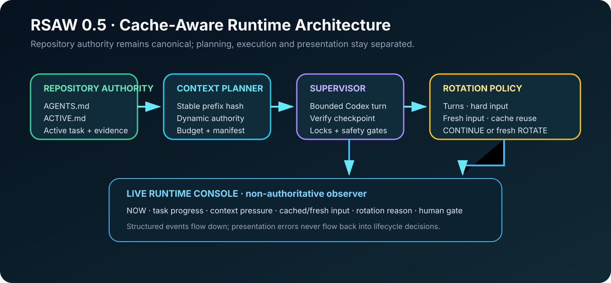
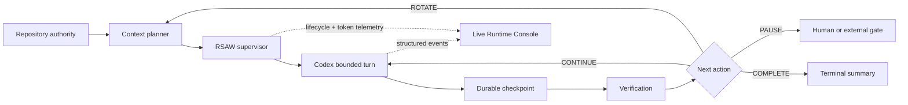
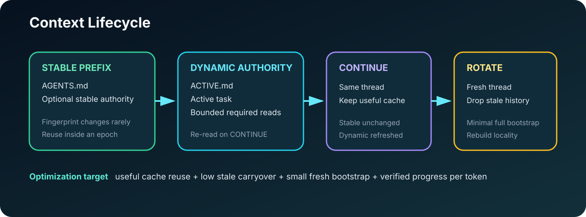
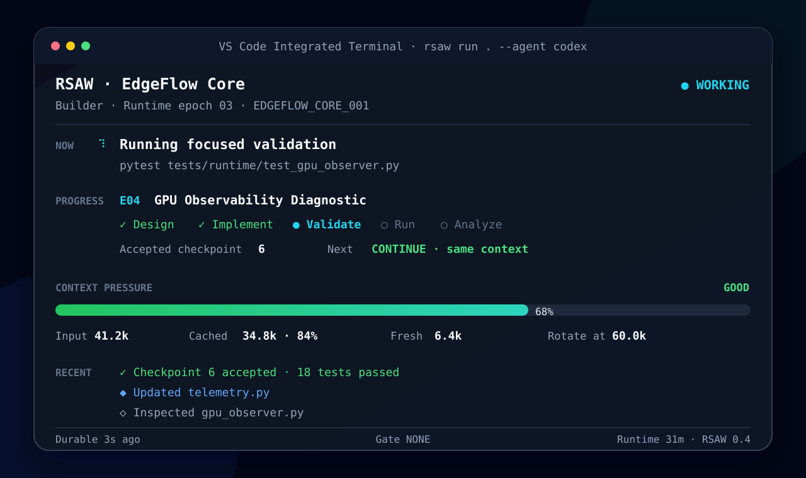

<p align="center">
  
</p>

<h1 align="center">Repository-State Agent Workflow</h1>

<p align="center">
  <strong>Persistent workstreams. Cache-aware contexts. Live operator visibility.</strong>
</p>

<p align="center">
  RSAW keeps durable project memory in the repository, builds an explicit minimal
  context plan, reuses a Codex thread only while cache locality remains useful,
  rotates automatically at real boundaries, and shows the entire run in a clear
  terminal-native console.
</p>

<p align="center">
  <a href="https://github.com/hanklin9188/repository-state-agent-workflow/actions/workflows/ci.yml"></a>
  <a href="LICENSE"></a>
  <a href="pyproject.toml"></a>
  
  
  
  
</p>

<p align="center">
  <a href="#two-minute-start">Start</a> ·
  <a href="#the-operating-model">Operating model</a> ·
  <a href="#cache-aware-context-planning">Context planning</a> ·
  <a href="#deterministic-rotation-policy">Rotation</a> ·
  <a href="#live-runtime-console">Live console</a> ·
  <a href="#evidence-and-claim-boundaries">Evidence</a> ·
  <a href="README.zh-TW.md">繁體中文</a>
</p>

---

## What RSAW is

**RSAW is a repository-first operating model and runtime supervisor for long-running
coding and research agents.**

The repository stores durable memory. Agent contexts are bounded, replaceable workers.
For every verified checkpoint, RSAW deterministically chooses one action:

- **CONTINUE** — reuse the current thread for tightly coupled work;
- **ROTATE** — start a fresh context while the workstream keeps running;
- **PAUSE** — stop at a genuine human or external gate;
- **COMPLETE** — close the workstream.

Version 0.5 adds a cache-aware context planner and a deterministic rotation policy on
top of the 0.4 Live Runtime Console.

> **The workstream persists. Context is planned, measured, and replaceable.**

<p align="center">
  
</p>

---

## The problem

A long agent chat quietly becomes an accidental project database:

```text
old source snapshots
+ failed attempts
+ obsolete decisions
+ raw command output
+ completed tasks
+ current work
```

Keeping everything forever increases stale-context traffic. Starting fresh after every
step avoids staleness but repeatedly rereads policy, reconstructs the repository, and
throws away useful prefix/cache locality.

RSAW separates four lifetimes:

| Layer | Typical lifetime | Responsibility |
|---|---:|---|
| `AGENTS.md` | months | stable policy, authority, safety |
| Workstream | days–weeks | long-range state machine |
| Task checkpoint | hours–days | one durable, verifiable unit |
| Context epoch | bounded | tightly coupled model turns |

The optimization target is not “maximize cached tokens” or “always start fresh.” It is:

```text
useful cache reuse
+ low stale-context carryover
+ small fresh bootstrap after rotation
+ verified progress per token
```

---

## Two-minute start

### 1. Install

```bash
python -m pip install   git+https://github.com/hanklin9188/repository-state-agent-workflow.git
```

Automatic mode also requires an authenticated local Codex CLI.

### 2. Initialize a repository

```bash
cd /path/to/your-project
rsaw init .
```

Initialization is additive. Existing `AGENTS.md`, `ACTIVE.md`, task files, and project
logic are not overwritten unless `--force` is explicit.

### 3. Verify authority and inspect the context plan

```bash
rsaw verify .
rsaw context .
rsaw doctor . --agent codex
rsaw status .
```

Use a budget gate when the repository has adopted a reviewed budget:

```bash
rsaw context . --strict
```

### 4. Preview the operator UI without launching Codex

```bash
rsaw preview . --seconds 6
```

### 5. Run the workstream

```bash
rsaw run . --agent codex
```

Interactive terminals, including the VS Code Integrated Terminal, receive the Live
Runtime Console. CI, redirected output, JSON mode, quiet mode, and non-TTY execution
fall back to plain logs.

```bash
rsaw run . --agent codex --no-tui   # explicit plain output
rsaw run . --agent codex --tui      # force the dashboard
```

---

## The operating model



The planner and UI are observers/supporting layers. Repository verification and the
continuation state machine remain authoritative.

---

## Cache-aware context planning

`rsaw context .` builds a deterministic manifest from repository authority:

1. stable prefix — normally `AGENTS.md` and optional stable workstream authority;
2. dynamic authority — `ACTIVE.md` and the active task;
3. bounded required reads — only explicit files, deduplicated and repository-local.

<p align="center">
  
</p>

Each document records:

- repository-relative path;
- category;
- bytes and approximate tokens;
- SHA-256 content hash.

The plan exposes separate stable and dynamic fingerprints. A continued thread is told
to reread dynamic authority but not reload the stable prefix unless its fingerprint
changed. A fresh epoch receives the full ordered bootstrap.

Default planning controls:

```json
{
  "runtime": {
    "context": {
      "bootstrap_token_budget": 15000,
      "max_files": 12,
      "max_file_bytes": 262144,
      "include_workstream_spec": false,
      "enforce_budget": false
    }
  }
}
```

Budget enforcement is opt-in for compatibility. Inspection is always available.
See [Context Planning](docs/context-planning.md).

---

## Deterministic rotation policy

RSAW preserves mandatory role/scientific boundaries, then evaluates runtime pressure
without asking a model to decide its own context lifetime.

Rotation reasons include:

| Reason | Meaning |
|---|---|
| `MAX_TURNS_PER_RUNTIME_EPOCH` | bounded turn count reached |
| `HARD_INPUT_TOKEN_PRESSURE` | latest input reached the hard threshold |
| `FRESH_INPUT_TOKEN_PRESSURE` | uncached/fresh input exceeded its budget |
| `LOW_CACHE_REUSE_AT_SOFT_LIMIT` | input crossed the soft threshold while reuse quality was poor |
| role/scientific boundary | repository state requires independence |

```json
{
  "runtime": {
    "rotation": {
      "soft_input_tokens": 48000,
      "hard_input_tokens": 60000,
      "max_fresh_input_tokens": 18000,
      "min_cache_reuse_ratio": 0.5
    }
  }
}
```

The policy uses provider-emitted usage only. It does not claim to measure the model's
complete context window. See [Cache-Aware Rotation](docs/cache-aware-rotation.md).

---

## Live Runtime Console

<p align="center">
  
</p>

The console answers five operator questions:

1. What is happening now?
2. How far has the current task advanced?
3. What will RSAW do next?
4. Is context/cache pressure healthy?
5. Does a human need to intervene?

| Area | Meaning |
|---|---|
| **NOW** | observable Codex file, command, tool, and validation activity |
| **PROGRESS** | workstream, task, role, epoch, checkpoint, next action |
| **CONTEXT** | hard/soft pressure, cache reuse, fresh-input pressure |
| **TOKEN COST** | input, cached, fresh, output, and per-checkpoint efficiency |
| **RECENT** | high-value events rather than raw JSONL |
| **FOOTER** | durable state, gate, runtime, and terminal status |

The UI never displays hidden chain-of-thought. Rendering failures are isolated and
cannot alter execution or lifecycle decisions. See [Live Terminal UI](docs/live-terminal-ui.md).

---

## Context and token metrics

The Codex adapter records provider-emitted:

- input tokens;
- cached input tokens;
- cache-write input tokens when provided;
- output tokens;
- reasoning-output tokens.

RSAW derives:

```text
fresh input = max(0, input - cached input)
cache reuse ratio = cached input / input
input per checkpoint = total input / accepted checkpoints
fresh input per checkpoint = fresh input / accepted checkpoints
```

Inspect the active plan and completed runs:

```bash
rsaw context . --json
rsaw report .
rsaw report . --json
```

The dashboard and reports are local observability. They do not add dashboard text to
model prompts or create extra model turns.

> **More observability for the human; less unnecessary context for the model.**

---

## Runtime safety

Automatic continuation does not weaken governance:

- verification runs before and after every supervised turn;
- successful turns must advance `ACTIVE.md`;
- single-supervisor locking prevents concurrent workstream ownership;
- human gates never infer approval;
- failed agent or formal runs are not silently retried;
- role and scientific boundaries stay fresh;
- turn, transition, context, and total-token limits bound execution;
- runtime logs remain ignored by default.

---

## CLI reference

| Command | Purpose |
|---|---|
| `rsaw init .` | add missing repository-state scaffolding |
| `rsaw verify .` | validate active authority and references |
| `rsaw context .` | inspect ordered context, fingerprints, and budget |
| `rsaw status .` | show active workstream and derived action |
| `rsaw next .` | derive CONTINUE / ROTATE / PAUSE / COMPLETE |
| `rsaw prompt .` | render a minimal manual-mode prompt |
| `rsaw doctor . --agent codex` | verify the Codex adapter |
| `rsaw preview .` | preview the Live Console without an agent |
| `rsaw run . --agent codex` | supervise the workstream |
| `rsaw report .` | report context and checkpoint efficiency |

---

## Configuration

The complete `.rsaw/config.json` remains intentionally small. The 0.4 flat
`rotate_input_tokens` field remains accepted for backward compatibility, while 0.5
uses explicit `rotation` and `context` sections in new repositories.

See [Migration 0.4 → 0.5](docs/migration-v4-to-v5.md).

---

## Evidence and claim boundaries

Documented evidence currently includes:

- cross-version CI and focused runtime/TUI tests;
- deterministic context-plan and rotation-policy tests;
- a Desk Code Agent bootstrap-footprint case study;
- an EdgeFlow RSAW 0.1/0.2 retrospective matched replay;
- prospective runtime telemetry support.

Claim boundaries:

- token estimates based on characters/4 are estimates, not billing;
- the Live Console itself does not save model tokens;
- a deterministic policy is not automatically an optimal policy;
- cache reuse is useful only while the carried context remains relevant;
- universal cost or quality improvements require matched prospective evaluation.

See [Runtime Evaluation](docs/runtime-evaluation.md) and the
[Token-Efficient Runtime design](docs/token-efficient-runtime.md).

---

## Documentation

- [Getting Started](docs/getting-started.md)
- [Architecture](docs/architecture.md)
- [Context Planning](docs/context-planning.md)
- [Cache-Aware Rotation](docs/cache-aware-rotation.md)
- [Token-Efficient Runtime](docs/token-efficient-runtime.md)
- [Live Terminal UI](docs/live-terminal-ui.md)
- [Runtime Supervisor](docs/runtime-supervisor.md)
- [Codex Adapter](docs/codex-adapter.md)
- [Migration 0.4 → 0.5](docs/migration-v4-to-v5.md)
- [Research Methodology](docs/research-methodology.md)
- [Company Adoption](docs/company-adoption.md)

---

## Current limitations

- automatic execution currently targets the local Codex CLI;
- provider usage fields depend on the installed Codex version;
- context token counts are approximate until provider tokenization is available;
- cache-aware defaults are operating policies, not universal optima;
- strict budgets require project-specific calibration;
- a fresh read-only Codex session can inspect repository state, but concurrent writers
  must not modify the same workstream.

---

## Contributing

```bash
git clone https://github.com/hanklin9188/repository-state-agent-workflow.git
cd repository-state-agent-workflow
python -m pip install -e '.[dev]'
ruff check .
pytest -q
rsaw verify .
rsaw context . --strict
rsaw run . --dry-run
```

RSAW is MIT licensed. Markdown and Git remain the durable authority; the runtime,
context planner, and console are replaceable execution layers.
