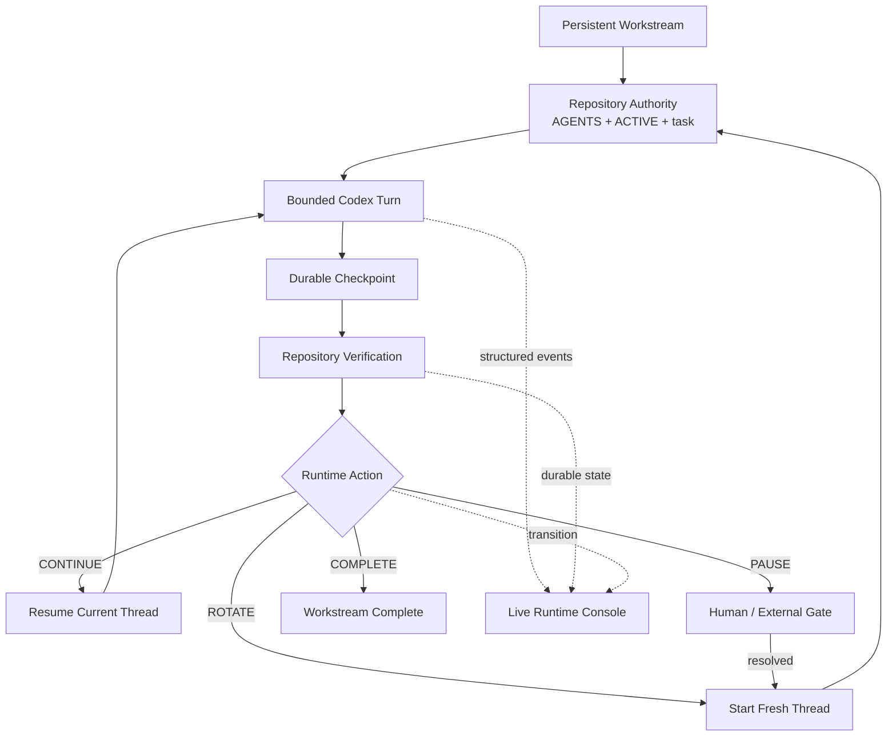

<p align="center">
  
</p>

<h1 align="center">Repository-State Agent Workflow</h1>

<p align="center">
  <strong>Persistent workstreams. Replaceable contexts. Live operator visibility.</strong>
</p>

<p align="center">
  RSAW keeps durable agent state in the repository, reuses context only while it
  remains useful, rotates Codex automatically at real boundaries, and presents
  the whole run in a clear terminal-native console.
</p>

<p align="center">
  <a href="https://github.com/hanklin9188/repository-state-agent-workflow/actions/workflows/ci.yml"></a>
  <a href="LICENSE"></a>
  <a href="pyproject.toml"></a>
  
  
  
</p>

<p align="center">
  <a href="#two-minute-start">Start</a> ·
  <a href="#the-live-runtime-console">Live console</a> ·
  <a href="#runtime-state-machine">State machine</a> ·
  <a href="#context-and-token-discipline">Context discipline</a> ·
  <a href="#evidence-and-claim-boundaries">Evidence</a> ·
  <a href="#documentation">Documentation</a> ·
  <a href="README.zh-TW.md">繁體中文</a>
</p>

---

## What RSAW is

**RSAW is a repository-first operating model and runtime supervisor for long-running
coding and research agents.**

The repository stores durable project memory. Agent contexts are temporary workers.
The supervisor decides whether the next checkpoint should:

- **CONTINUE** in the same Codex thread;
- **ROTATE** into a fresh context;
- **PAUSE** at a real human or external gate; or
- **COMPLETE** the workstream.

Version 0.4 adds the missing operator layer: an in-place Live Terminal console that
shows what the agent is doing, how the workstream is advancing, when context is
being reused or replaced, and whether human intervention is required.

> **The workstream persists. The model context remains bounded and replaceable.**

<p align="center">
  
</p>

The dashboard is designed for normal terminals, including the **VS Code Integrated
Terminal**. Codex continues to execute through structured JSON events in the
background; RSAW turns those events into an operator-facing runtime view instead of
printing raw JSONL.

---

## The problem

A long agent conversation quietly becomes an accidental state database:

```text
old source snapshots
+ failed attempts
+ obsolete decisions
+ raw command output
+ completed tasks
+ current work
```

Keeping that conversation forever creates stale-context pressure. Starting fresh
after every task avoids staleness, but repeatedly reconstructs the repository,
re-reads the same files, and replays handoffs.

RSAW separates four lifetimes:

| Layer | Typical lifetime | Responsibility |
|---|---:|---|
| `AGENTS.md` | months | stable policy, authority, and safety |
| Workstream | days–weeks | long-range project state machine |
| Task checkpoint | hours–days | one durable, verifiable unit of work |
| Context epoch | bounded | one or more tightly coupled agent turns |

This lets RSAW preserve useful prefix/cache locality inside a bounded epoch, while
removing obsolete context at role, scientific, review, or token-pressure boundaries.

---

## Two-minute start

### 1. Install

```bash
python -m pip install \
  git+https://github.com/hanklin9188/repository-state-agent-workflow.git
```

Automatic mode also requires an authenticated local Codex CLI.

### 2. Initialize a Git repository

```bash
cd /path/to/your-project
rsaw init .
```

Initialization is additive by default. Existing `AGENTS.md`, `ACTIVE.md`, and task
systems are not overwritten unless `--force` is explicit.

### 3. Verify authority and runtime compatibility

```bash
rsaw verify .
rsaw doctor . --agent codex
rsaw status .
```

### 4. Preview the interface without launching Codex

```bash
rsaw preview .
```

The preview is deterministic and non-destructive. It does not modify repository
state or start an agent.

### 5. Run the workstream

```bash
rsaw run . --agent codex
```

In an interactive terminal, RSAW opens the Live Runtime Console. In CI, redirected
output, JSON mode, quiet mode, and other non-TTY environments, it automatically
falls back to plain log-oriented output.

```bash
# Explicit plain output for debugging or automation
rsaw run . --agent codex --no-tui

# Force the dashboard when terminal detection is unusual
rsaw run . --agent codex --tui
```

---

## The Live Runtime Console

The default console is structured around five operator questions:

1. **What is happening now?**
2. **How far has the current work advanced?**
3. **What will RSAW do next?**
4. **Is context/cache pressure healthy?**
5. **Does the human need to intervene?**

### What it shows

| Area | Meaning |
|---|---|
| **NOW** | observable Codex activity such as reading, editing, commands, tools, and validation |
| **PROGRESS** | active task, inferred workstream phase when trustworthy, accepted checkpoints, and next lifecycle action |
| **CONTEXT PRESSURE** | latest-turn input relative to RSAW's configured rotation threshold |
| **TOKEN COST** | input, cached input, fresh/uncached input, output, and cache-reuse ratio |
| **RECENT** | the most useful recent validation, edit, command, checkpoint, transition, or failure events |
| **FOOTER** | last durable state, human-gate status, and elapsed runtime |

The UI never displays hidden chain-of-thought. Reasoning events are reduced to a
neutral observable status such as `Analyzing repository state`.

### Responsive layouts

The renderer selects an expanded or compact layout from the current terminal size.
Resizing the VS Code terminal does not change lifecycle state and should not produce
scrolling dashboard frames.

### Restrained motion

Animation communicates state rather than decorating it:

- a subtle heartbeat shows that the supervisor is alive;
- one spinner identifies active work;
- context pressure interpolates smoothly;
- accepted checkpoints become visible immediately;
- ROTATE briefly shows the old and new context epochs;
- PAUSE, FAILED, and COMPLETE switch to unambiguous terminal states.

The presentation layer is downstream from execution. If rendering fails, the
supervisor and Codex turn continue under existing fail-closed lifecycle rules.

---

## Runtime state machine



### `CONTINUE`

Use the same Codex thread when the next checkpoint has the same role, objective,
subsystem, evidence domain, and safety boundary.

Typical bounded Builder epoch:

```text
design → implementation → focused validation → local repair
```

### `ROTATE`

Keep the workstream active, but replace the model context. Rotation is mandatory at
role changes, formal execution/analysis boundaries, fresh review, major decision
boundaries, or configured context pressure.

### `PAUSE`

Stop only for a genuine gate:

- formal authorization;
- credentials or interactive privilege;
- destructive or irreversible action;
- unresolved scientific or architecture decision;
- external work that must complete first.

RSAW never infers approval. In an interactive terminal, the dashboard temporarily
releases the screen so the exact gate response can be entered through the existing
supervisor flow.

### `COMPLETE`

The workstream is terminal only when repository state explicitly declares
`COMPLETE`. The console then shows a final summary of available checkpoints, epochs,
turns, token totals, and runtime.

---

## Context and token discipline

RSAW does **not** optimize for the smallest number of cached tokens. Cached input can
be useful when the prefix still belongs to the current task. The target is:

```text
useful cache reuse
+ low stale-context carryover
+ small fresh bootstrap after rotation
```

The Codex adapter records provider-emitted usage:

- input tokens;
- cached input tokens;
- cache-write input tokens;
- output tokens;
- reasoning-output tokens.

The dashboard derives:

```text
fresh input = max(0, input - cached input)
context pressure = latest-turn input / configured rotation threshold
```

`Context pressure` is **not** presented as the model's total context-window
utilization. It is an RSAW operating signal against the configured rotation policy.

Default limits remain conservative and configurable:

```json
{
  "runtime": {
    "max_turns_per_epoch": 6,
    "rotate_input_tokens": 60000,
    "max_total_input_tokens": 5000000,
    "max_transitions": 100
  }
}
```

Inspect measured runs with:

```bash
rsaw report .
rsaw report . --json
```

### Zero intentional model-token overhead

The Live Runtime Console consumes existing repository state and runtime events
locally. Dashboard text is never appended to Codex prompts and does not intentionally
add model input, output, bootstrap, or context epochs.

> **More observability for the human; less unnecessary context for the model.**

---

## Repository contract

`rsaw init .` creates only missing files:

```text
AGENTS.md
ACTIVE.md
.rsaw/
├── config.json
└── .gitignore
docs/
├── agents/
│   └── repository-state-workflow.md
├── workstreams/
│   └── W-000-bootstrap.md
├── tasks/
│   └── T-000-bootstrap.md
├── checkpoints/
├── decisions/
└── handoffs/
    └── archive/
```

Runtime logs live under `.rsaw/runtime/` and remain ignored by default.

---

## Quality and safety

Automatic continuation must not become automatic carelessness.

| Guardrail | Effect |
|---|---|
| Verification before and after every turn | malformed authority stops the supervisor |
| `ACTIVE.md` must advance | a successful-looking but state-free turn fails closed |
| Safe Codex sandbox by default | RSAW never enables dangerous bypass automatically |
| Explicit human gates | credentials, authorization, and irreversible choices are never inferred |
| No silent retry | failed evidence is not replaced automatically |
| Single-supervisor lock | prevents two runtimes racing one repository |
| Turn, token, and transition limits | prevents unbounded controller loops |
| Fresh role/scientific boundaries | preserves review and evidence independence |
| Presentation isolation | UI failure cannot change lifecycle semantics |
| Non-TTY fallback | logs and CI remain stable and free of live-render control sequences |

Validation tiers remain:

- **V0** — syntax, lint, and exact tests during editing;
- **V1** — focused task-checkpoint validation;
- **V2** — relevant epoch or phase closure;
- **V3** — fresh independent review for critical claims.

> **Validation is a gate, not the product.**

---

## CLI

| Command | Purpose |
|---|---|
| `rsaw init .` | initialize missing repository-state files and runtime config |
| `rsaw verify .` | validate `ACTIVE.md` and referenced authority |
| `rsaw status .` | show workstream, task, role, gate, and next action |
| `rsaw next .` | deterministically derive CONTINUE / ROTATE / PAUSE / COMPLETE |
| `rsaw prompt .` | render a minimal manual-mode prompt |
| `rsaw checkpoint .` | archive the active handoff |
| `rsaw footprint .` | estimate repository bootstrap context |
| `rsaw doctor . --agent codex` | verify the local Codex adapter |
| `rsaw preview .` | preview the Live Runtime Console without launching Codex |
| `rsaw run . --agent codex` | supervise the workstream with live TTY observability |
| `rsaw run . --no-tui` | use plain log-oriented output |
| `rsaw run . --dry-run` | inspect the next action without launching Codex |
| `rsaw report .` | summarize measured transitions and token usage |

Manual, agent-neutral mode remains available to any tool that can read a repository:

```bash
rsaw prompt .
rsaw next .
```

---

## Evidence and claim boundaries

### RSAW 0.1 bootstrap case study

A documented Desk Code Agent migration changed the deterministic fresh-session
bootstrap estimate from **33,348** to **2,967** tokens: an estimated **91.1%**
reduction.

**Boundary:** this is a `BOOTSTRAP_CONTEXT_ESTIMATE`, not provider billing, total task
cost, or causal quality evidence.

### EdgeFlow RSAW 0.1 vs 0.2 matched replay

A retrospective matched replay over five real EdgeFlow tasks estimated:

| Metric | RSAW 0.1 | RSAW 0.2 |
|---|---:|---:|
| Fresh sessions / context epochs | 5 | 2 |
| Repository-context traffic | 53,444 | 20,972 conservative |
| Delta-only traffic | — | 19,848 |
| Estimated reduction | — | **60.8%–62.9%** |
| Repeated-read reduction | — | **98.1%–99.0%** |

The structured v2 handoff was 20.1% larger. Quality non-inferiority and provider
billing savings were not causally evaluated.

Read the [EdgeFlow case study](docs/case-studies/edgeflow-rsaw-v1-v2.md).

### RSAW 0.3/0.4 prospective status

The automatic runtime records real Codex usage, fresh/resumed turns, epochs,
checkpoints, transitions, gates, and wall-clock outcomes. Version 0.4 makes those
signals visible; it does not alter their meaning.

No universal token, billing, wall-time, or quality improvement is claimed before a
matched prospective study.

---

## Where RSAW fits

RSAW complements rather than replaces:

- GitHub Issues, Linear, Jira, or internal trackers;
- CI/CD and code review;
- architecture decision records;
- access control, secrets management, and sandboxing;
- experiment schedulers and cluster systems;
- incident management.

Use your existing tracker for planning. Use RSAW as the repository-local continuity,
context-lifecycle, and runtime-observability contract for the active workstream.

---

## Scientific and ML work

RSAW preserves fresh boundaries even with automatic rotation:

```text
Preregistration
→ ROTATE
Formal execution
→ ROTATE
Scientific analysis
→ ROTATE
Independent review
```

The supervisor automates context replacement. It does not merge roles, infer formal
authorization, or weaken evidence independence.

See [Scientific and ML Workflows](docs/scientific-and-ml-workflows.md).

---

## Documentation

- [Getting Started](docs/getting-started.md)
- [Live Terminal UI](docs/live-terminal-ui.md)
- [Runtime Supervisor](docs/runtime-supervisor.md)
- [Codex Adapter](docs/codex-adapter.md)
- [Continuation Gate](docs/continuation-gate.md)
- [Architecture](docs/architecture.md)
- [Migration 0.2 → 0.3](docs/migration-v2-to-v3.md)
- [Runtime Evaluation](docs/runtime-evaluation.md)
- [Company Adoption](docs/company-adoption.md)
- [Research Methodology](docs/research-methodology.md)
- [FAQ](docs/faq.md)

---

## Current limitations

- Automatic execution currently targets the local Codex CLI; the core/manual
  workflow remains agent-neutral.
- The Live Runtime Console presents observable structured events, not every detail of
  the native Codex TUI.
- Phase visualization is shown only when a workstream exposes a trustworthy bounded
  phase list and the current phase can be matched unambiguously.
- RSAW cannot create a new ChatGPT web conversation.
- A paused supervisor cannot invent credentials, privilege, authorization, or a
  scientific decision.
- Token thresholds are operating guardrails, not universal optima.
- Existing case studies do not establish universal cost or quality gains.

---

## Contributing

```bash
git clone https://github.com/hanklin9188/repository-state-agent-workflow.git
cd repository-state-agent-workflow
python -m pip install -e '.[dev]'
ruff check .
pytest -q
rsaw verify .
rsaw preview .
rsaw run . --dry-run
```

The project is MIT licensed and intentionally repository-first: Markdown and Git
remain the authority; the runtime and console are optional execution and
observability layers rather than a project-management platform.
