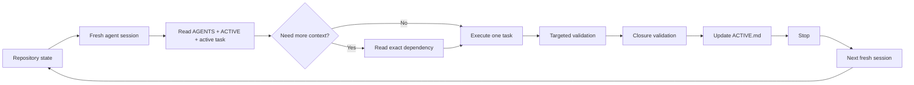

<p align="center">
  
</p>

<h1 align="center">Repository-State Agent Workflow</h1>

<p align="center">
  <strong>Make the repository remember, so the agent does not have to.</strong>
</p>

<p align="center">
  A Markdown-first operating model and small CLI for low-context, high-quality coding-agent work.
  It replaces hidden conversational continuity with versioned repository state, bounded sessions,
  progressive disclosure, and evidence-gated validation.
</p>

<p align="center">
  <a href="https://github.com/hanklin9188/repository-state-agent-workflow/actions/workflows/ci.yml"></a>
  <a href="LICENSE"></a>
  <a href="pyproject.toml"></a>
  
</p>

<p align="center">
  <a href="#five-minute-start">Quick start</a> ·
  <a href="#real-world-adoption-evidence">Adoption evidence</a> ·
  <a href="docs/company-adoption.md">Company adoption</a> ·
  <a href="docs/research-methodology.md">Research methodology</a> ·
  <a href="README.zh-TW.md">繁體中文</a>
</p>

---

## The idea in one minute

Long-running coding-agent conversations become an accidental state store. They accumulate stale source snapshots, old logs, failed attempts, completed tasks, obsolete decisions, and repeated project explanations. Every later call must reason through that mixture again.

Repository-State Agent Workflow (RSAW) moves continuity into inspectable, version-controlled artifacts:

| Artifact | Responsibility | Update pattern |
|---|---|---|
| `AGENTS.md` | Stable policy, build rules, safety, validation, working conventions | Rarely |
| `ACTIVE.md` | Tiny current handoff: where we are, what is active, what happens next | At meaningful task boundaries |
| `docs/tasks/<task>.md` | The active task contract and acceptance criteria | Once per bounded task |
| Git, ADRs, tests, reports, artifacts | Durable decisions and evidence | When evidence changes |

A fresh agent reads the minimum, executes one bounded task, validates it, updates `ACTIVE.md`, and stops.



## Why this matters

### For engineering organizations

- **Auditable continuity** — current state is visible in Git rather than hidden in one person's or one model's chat history.
- **Agent portability** — Codex, Claude Code, Cursor, or an internal agent can resume from the same repository contract.
- **Bounded change surface** — one substantial task per session limits accidental scope growth.
- **Predictable reviews** — reviewers receive the spec, diff, tests, and evidence—not a long debugging transcript.
- **Operational control** — long-running jobs, blockers, stop conditions, and next actions are explicit.
- **Lower context exposure** — agents do not need broad historical documents or proprietary logs unless the active task requires them.

See [Company Adoption and Governance](docs/company-adoption.md).

### For research and evaluation

RSAW is also an experimental framework for studying coding-agent state management. It makes hypotheses measurable instead of treating “better context” as a vague claim.

Candidate research questions include:

1. Does bounded repository-backed state reduce repeated context traffic?
2. Does it preserve or improve fresh-session task continuity?
3. Does it reduce stale-state errors and repeated investigation?
4. Does role-separated review preserve engineering quality?
5. Which task classes benefit, and where does the workflow add overhead?

The repository includes a preregistration-oriented methodology, metrics, threats to validity, and a case-study template. It does **not** claim universal token or quality improvements from a single project.

See [Research Methodology](docs/research-methodology.md) and [Case Study Template](docs/case-study-template.md).

---

## Real-world adoption evidence

### Desk Code Agent — preliminary V1 result

Desk Code Agent adopted RSAW to replace a broad mandatory project bootstrap with the three-file fresh-session contract: `AGENTS.md`, `ACTIVE.md`, and one active task specification.

| Metric | Previous workflow | RSAW V1 | Difference |
|---|---:|---:|---:|
| Fresh-session bootstrap estimate | 33,348 | **2,967** | **-30,381** |
| Relative reduction | — | — | **91.10%** |

RSAW V1 bootstrap composition:

- `AGENTS.md`: 1,639 estimated tokens
- `ACTIVE.md`: 432 estimated tokens
- active task: 896 estimated tokens
- `rsaw verify`: PASS

**Interpretation:** this is a `BOOTSTRAP_CONTEXT_ESTIMATE`. It measures the deterministic fresh-session bootstrap footprint under the two policies. It is **not** measured provider billing savings, cached-input savings, total task-context reduction, or evidence that engineering quality improved by 91.10%.

V2 closure and task-level continuity/quality measurements are still pending. Read the [full Desk Code Agent case study](docs/case-studies/desk-code-agent-rsaw-v1-bootstrap.md) or the [machine-readable result](data/case-studies/desk-code-agent-rsaw-v1.json).

---

## Five-minute start

### 1. Install from source

```bash
git clone https://github.com/hanklin9188/repository-state-agent-workflow.git
cd repository-state-agent-workflow
python -m pip install -e '.[dev]'
```

### 2. Scaffold an existing repository

```bash
rsaw init /path/to/your-project
cd /path/to/your-project
```

The initializer is conservative: it creates missing workflow files and does not overwrite existing project state unless `--force` is explicitly used.

### 3. Verify the handoff contract

```bash
rsaw verify .
rsaw footprint .
```

### 4. Start a fresh agent session

```text
Work in this repository.

Read only:
1. AGENTS.md
2. ACTIVE.md
3. the active task spec referenced by ACTIVE.md

Execute exactly the active task using progressive disclosure.
Reuse verified repository evidence and do not repeat completed work.
Use targeted validation while iterating and closure validation only when stable.
When complete or blocked, update ACTIVE.md and stop.
```

The same prompt can be rendered from repository state:

```bash
rsaw prompt . --role builder
```

---

## Core operating principles

### 1. Repository state is authoritative

```text
Repository state > conversation history
```

If a chat transcript conflicts with an accepted decision, executable contract, task spec, or current handoff, the repository wins.

### 2. One substantial task per session

A session normally stops at task completion, verification, a major blocker, a long-running-only wait, a reviewer handoff, or a decision boundary.

### 3. Progressive disclosure

Start with three files. Read source, tests, ADRs, reports, and logs only when the active task requires them.

### 4. Evidence-gated quality

Less context does not mean less validation. RSAW uses staged engineering validation:

| Tier | Stage | Typical checks |
|---|---|---|
| `V0` | Edit loop | Syntax, lint, one targeted test |
| `V1` | Task stability | Task-specific suite, focused integration |
| `V2` | Task closure | Full relevant tests, package and result checks |
| `V3` | Critical or release work | Fresh reviewer, standards review, spec review |

### 5. Role-separated sessions

| Role | Reads | Delivers |
|---|---|---|
| **Builder** | Policy, active state, task, exact code dependencies | Implementation and focused evidence |
| **Reviewer** | Fresh context, spec, diff, tests, known limitations | Independent correctness and compliance review |
| **Decision** | Evidence checkpoint and governing constraints | Architecture or scientific decision |

For medium-reasoning models, major decisions use two passes: evidence decomposition first, decision synthesis second.

---

## CLI reference

The included `rsaw` command is intentionally small and deterministic.

```bash
# Add the workflow to a repository without overwriting existing files
rsaw init .

# Check ACTIVE.md, task references, compactness, next action, and role
rsaw verify .

# Estimate the fresh-session context footprint
rsaw footprint .

# Preserve a meaningful handoff boundary
rsaw archive . --label T-042-complete

# Render minimal role-specific prompts
rsaw prompt . --role builder
rsaw prompt . --role reviewer
rsaw prompt . --role decision
```

The CLI is a guardrail, not an orchestration platform. Markdown and Git remain the canonical state.

---

## Context economics

The primary savings mechanism is not merely “reading fewer files.” It is shortening the lifetime of obsolete context across repeated model calls.

Illustrative calculation—not a pricing guarantee:

```text
Long-session average context:        180k tokens/call
Bounded-task average context:          25k tokens/call
Calls:                                    30

Long-session context traffic:        5.40M tokens
Bounded-task context traffic:        0.75M tokens
Illustrative reduction:              86.1%
```

Actual monetary savings depend on model pricing, cache behavior, tool output, retries, and task shape. The workflow should be evaluated on quality and continuity as well as token volume.

See [Token Economics](docs/token-economics.md), [Evaluation](docs/evaluation.md), and [RSAW Case Studies](docs/case-studies/README.md).

---

## Adoption paths

### Individual repository

Use `rsaw init`, customize the three core artifacts, and run the verifier in CI.

### Engineering team

Map existing GitHub Issues, Linear tickets, or internal specs to the active task contract. Keep the external tracker; RSAW does not replace it.

### Research or ML repository

Add frozen protocols, immutable evidence, authorization boundaries, and separate execution/result-review sessions. The included experiment template demonstrates this specialization.

### Monorepo

Use a stable root policy plus scoped subdirectory policies and task specs. Keep one canonical `ACTIVE.md` per independently operated agent workstream, not one giant global diary.

---

## Research-ready evaluation

A credible before/after study should record at least:

- fresh-session bootstrap tokens;
- routine working-set tokens;
- task completion and closure-validation results;
- repeated-work rate;
- stale-state error rate;
- handoff success without hidden chat context;
- reviewer findings and escaped defects;
- elapsed time and human intervention;
- task type, repository size, model, and reasoning mode.

Use paired tasks or matched workstreams where practical, separate development from evaluation, and publish failures and limitations. See the full [Research Methodology](docs/research-methodology.md).

---

## How this differs from adjacent approaches

| Approach | Strength | Limitation RSAW addresses |
|---|---|---|
| One long conversation | Rich immediate history | Hidden, growing, stale, and hard to hand off |
| Conversation summary | Compact | Potentially lossy and not independently executable |
| Vector/RAG memory | Flexible retrieval | Retrieval quality and staleness become hidden dependencies |
| Issue tracker only | Excellent planning and accountability | Usually lacks agent bootstrap, evidence pointers, and stop-state contract |
| Agent orchestration framework | Automation and parallelism | Can become another opaque state owner |
| **RSAW** | Explicit, versioned, tool-agnostic continuity | Requires disciplined maintenance of small repository artifacts |

RSAW can complement any of these approaches. It is not a replacement for issue tracking, retrieval, or agent orchestration.

---

## Examples

- [Software feature](examples/software-project/) — streaming parser implementation
- [ML experiment](examples/ml-experiment/) — frozen holdout execution
- [Data pipeline](examples/data-pipeline/) — dual-write migration
- [Research repository](examples/research-repo/) — bounded scientific ticket

Each example contains its own `AGENTS.md`, `ACTIVE.md`, and active task.

---

## Documentation

### Start here

- [Concepts](docs/concepts.md)
- [Architecture](docs/architecture.md)
- [Adoption Guide](docs/adoption-guide.md)
- [Company Adoption and Governance](docs/company-adoption.md)
- [Research Methodology](docs/research-methodology.md)

### Operating model

- [Session Lifecycle](docs/session-lifecycle.md)
- [Progressive Disclosure](docs/progressive-disclosure.md)
- [Validation Tiers](docs/validation-tiers.md)
- [Agent Roles](docs/agent-roles.md)
- [Long-Running Work](docs/long-running-work.md)
- [Scientific and ML Workflows](docs/scientific-and-ml-workflows.md)

### Evaluation and migration

- [Desk Code Agent V1 Case Study](docs/case-studies/desk-code-agent-rsaw-v1-bootstrap.md)
- [Case Studies Index](docs/case-studies/README.md)
- [Token Economics](docs/token-economics.md)
- [Evaluation](docs/evaluation.md)
- [Case Study Template](docs/case-study-template.md)
- [Migration Playbook](docs/migration-playbook.md)
- [Anti-Patterns](docs/anti-patterns.md)
- [FAQ](docs/faq.md)
- [References](docs/references.md)

---

## Status and non-goals

**Status:** Alpha reference implementation. The methodology, templates, examples, verifier, context-footprint estimator, archive helper, and prompt renderer are usable; broader empirical validation remains an open research and adoption effort.

This project is deliberately **not**:

- an autonomous project manager;
- an agent vendor or model wrapper;
- a replacement for GitHub Issues, Linear, Jira, or existing engineering governance;
- an automatic summarization service;
- a database of private conversations;
- a claim that every task fits in one session;
- a reason to weaken testing or human review.

The design stays inspectable: Markdown, Git, deterministic checks, and project-owned evidence.

---

## Contributing

Contributions are welcome, especially:

- measured adoption case studies;
- monorepo and multi-agent examples;
- deterministic workflow checks;
- failure reports where repository state was insufficient;
- improvements that keep the system tool-agnostic and lightweight.

See [CONTRIBUTING.md](CONTRIBUTING.md) and [Code of Conduct](CODE_OF_CONDUCT.md).

## Citation

See [CITATION.cff](CITATION.cff). If you publish an evaluation, cite both this repository and the specific workflow version/commit used.

## License

MIT. See [LICENSE](LICENSE).
