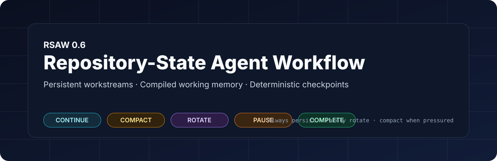
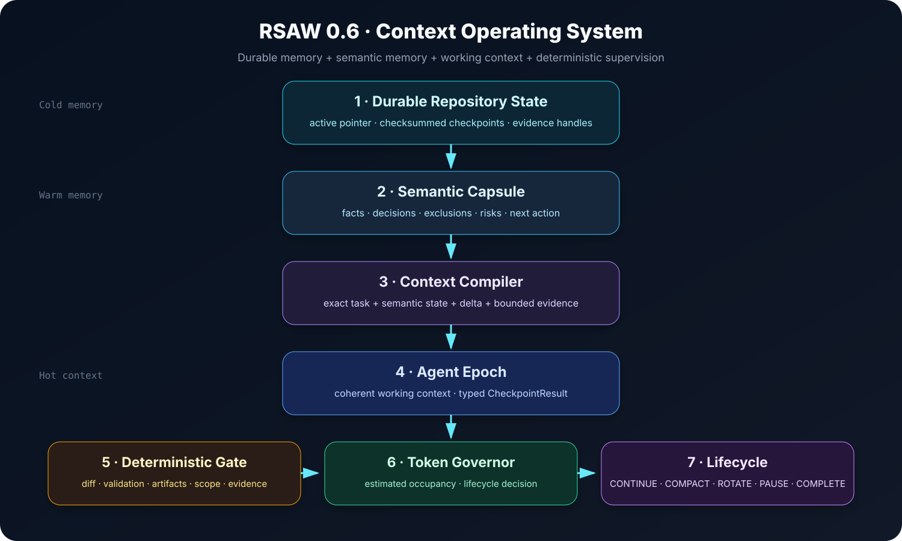
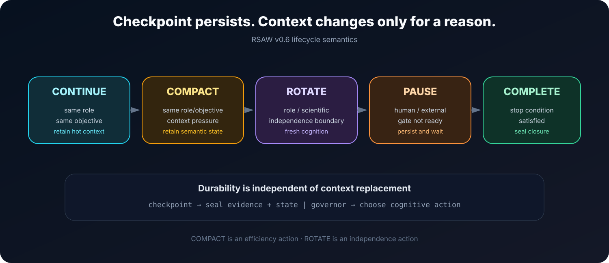
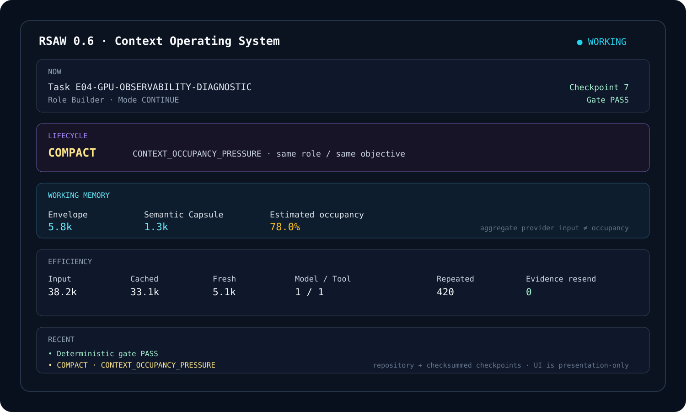

<p align="center">
  
</p>

# Repository-State Agent Workflow (RSAW)

**Persistent workstreams. Compiled working memory. Deterministic checkpoints.**

RSAW is a repository-backed runtime for long-lived coding and research agents. It keeps durable project truth outside model context, compiles only the working memory required for the next checkpoint, and separates **persistence** from **cognitive context replacement**.

> **Persist aggressively. Infer sparingly. Rotate selectively.**

[繁體中文](README.zh-TW.md) · [Architecture](docs/v06-context-operating-system.md) · [EdgeFlow migration](docs/edgeflow-v06-migration.md) · [Changelog](CHANGELOG.md)

---

## Why v0.6 exists

The RSAW v3 matched evaluation exposed a specific failure mode: repository state itself was small, but checkpoint administration, model-owned bookkeeping, aggressive rotation, repeated tool loops, and fresh-context rediscovery made the runtime expensive and reduced task success.

Observed v3 evidence included:

- 45 commands in No-RSAW vs 130 under RSAW v3;
- 68 agent messages vs 126;
- 50 model-mediated `ACTIVE.md` reads;
- 24 model-mediated `advance.py` executions;
- aggressive fresh-context creation;
- CP-03 and CP-04 showing that selective context replacement could save input, while CP-01 and CP-02 administrative overhead erased those savings.

v0.6 changes the architecture rather than merely adjusting rotation thresholds.

<p align="center">
  
</p>

---

## The v0.6 architecture

```text
Durable Repository State
        │
        ├── immutable checkpoints + checksums
        ├── ACTIVE compatibility pointer
        └── evidence handles
        │
        ▼
Semantic Capsule
facts · decisions · exclusions · risks · evidence refs
        │
        ▼
Context Compiler
exact task contract + semantic state + delta + bounded evidence
        │
        ▼
Agent Epoch
coherent working context for one role/objective chain
        │
        ▼
Typed CheckpointResult
        │
        ▼
Deterministic Gate
actual changes · validations · artifacts · scope · evidence
        │
        ▼
Token Governor
CONTINUE · COMPACT · ROTATE · PAUSE · COMPLETE
```

The final design principle is:

```text
Checkpoint = durability boundary
Epoch      = cognitive context boundary
```

They are deliberately not the same thing.

---

## Five lifecycle actions

<p align="center">
  
</p>

### `CONTINUE`

Use the same agent context when role, objective, and working state remain coherent.

### `COMPACT`

Replace an expensive hot context **without requesting cognitive independence**. RSAW seals a checkpoint and Semantic Capsule, compiles a minimal same-role envelope, and starts a fresh compact context.

### `ROTATE`

Use a fresh independent context when cognitive separation is itself required: Builder → Reviewer, Runner → Analyst, formal scientific boundaries, major specification changes, or runtime corruption.

### `PAUSE`

Persist a real human/external gate instead of busy-polling or bypassing authority.

### `COMPLETE`

Close only when the durable stop condition is satisfied.

---

## What changed from v0.4 and v0.5

| Capability | v0.4 | v0.5 | v0.6 |
|---|---:|---:|---:|
| Live terminal observability | ✓ | ✓ | ✓ upgraded |
| Stable/dynamic context planning | — | ✓ | ✓ |
| Cache-aware prompt ordering | — | ✓ | ✓ |
| Semantic Capsule | — | — | **✓** |
| Compiled Context Envelope | — | partial | **✓** |
| Supervisor-owned ACTIVE advancement | — | — | **✓** |
| Typed checkpoint result | — | — | **✓** |
| Immutable checksummed checkpoints | — | — | **✓** |
| Evidence handles | — | — | **✓** |
| Read-if-changed | — | partial fingerprints | **✓** |
| Delta context | — | — | **✓** |
| `COMPACT` distinct from `ROTATE` | — | — | **✓** |
| Estimated context occupancy | — | — | **✓** |
| Bounded reviewer manifest | — | — | **✓** |
| Model/tool/repeated-input telemetry | partial | partial | **✓** |

---

## Deterministic supervision

In v0.6 supervised mode the model is **not** the state machine.

The agent must not edit `ACTIVE.md` or run `advance.py`. It performs semantic work and returns a typed `rsaw.checkpoint-result.v1` JSON result. The Supervisor then:

1. inspects actual repository changes;
2. verifies allowed-write scope when declared;
3. checks that required validation commands actually occurred in the event stream;
4. verifies artifact existence/checksums;
5. seals bounded evidence handles;
6. updates/prunes the Semantic Capsule;
7. writes an immutable checkpoint and SHA-256 sidecar;
8. atomically advances the durable active pointer;
9. asks the Token Governor for the next lifecycle action.

Invalid advancement fails closed.

---

## Three memory levels

### Cold — durable repository memory

`.rsaw/state/` stores checksummed checkpoints, active pointers, evidence, envelopes, review manifests, and Semantic Capsule snapshots.

### Warm — Semantic Capsule

A bounded structured memory containing only high-value future-working information:

- observed facts;
- accepted decisions;
- excluded hypotheses and why they were rejected;
- evidence references;
- unresolved risks;
- high-value code relations;
- validation status;
- next exact action.

Capsule pruning is field-aware; RSAW does not ask the LLM to free-form summarize the entire history whenever the capsule grows.

### Hot — agent working context

A coherent short-term context retained while useful. Hot context may survive many checkpoints.

---

## Context Compiler

The compiler produces a sealed `rsaw.context-envelope.v1` instead of replaying old conversation history.

Priority tiers:

1. **Exact** — objective, task contract, acceptance/safety constraints, critical source/evidence.
2. **Structured** — Semantic Capsule facts, decisions, exclusions, risks, validation state.
3. **References** — long logs, full diffs, historical transcripts, and other material available through immutable evidence handles.

Default engineering budgets:

```json
{
  "targetEnvelopeTokens": 6000,
  "hardEnvelopeTokens": 12000,
  "maxExactEvidenceTokens": 7000,
  "maxSemanticCapsuleTokens": 2500,
  "maxValidationSummaryTokens": 1000
}
```

These are defaults, not universal optima.

---

## Provider token economics

RSAW distinguishes:

- logical prompt/context size;
- total provider input;
- cached provider input;
- fresh/uncached provider input;
- estimated working-context occupancy;
- repeated-input tokens;
- evidence re-send tokens;
- model calls;
- tool calls.

A high cache-hit ratio can still produce a very large cumulative bill if the runtime invokes the model too often. Therefore the primary efficiency quantity is:

```text
total provider input / successful checkpoint
```

Aggregate provider input is telemetry; **it is not used as a proxy for actual context occupancy**.

---

## Bounded independent review

A fresh Reviewer receives a `rsaw.review-manifest.v1` containing the claim, acceptance criteria, changed files, bounded evidence, validation status, known risks, and source revision.

The Reviewer does **not** inherit the Builder's hidden reasoning history. Full-repository rediscovery is an explicit escalation, not the default.

Goal:

> **Independent, but not ignorant.**

---

## Live Runtime Console v0.6

<p align="center">
  
</p>

The terminal UI shows runtime state rather than hidden reasoning:

- current task / role / checkpoint;
- `CONTINUE`, `COMPACT`, `ROTATE`, `PAUSE`, or `COMPLETE`;
- deterministic gate status;
- Context Envelope and Semantic Capsule size;
- estimated occupancy;
- input / cached / fresh tokens;
- model and tool calls;
- repeated-input and evidence-resend telemetry;
- recent durable lifecycle events.

The UI remains presentation-only. Rendering failures never own or advance workstream state.

---

## Install

```bash
python -m pip install --upgrade \
  "git+https://github.com/hanklin9188/repository-state-agent-workflow.git@v0.6.0"
```

Verify:

```bash
python - <<'PY'
from importlib.metadata import version
import repo_state_agent

print(repo_state_agent.__version__)
print(version("repository-state-agent-workflow"))
PY
```

Expected after the v0.6.0 release tag is installed:

```text
0.6.0
0.6.0
```

---

## Existing repository migration

Do not force-reinitialize an existing RSAW repository.

Preview migration first:

```bash
rsaw migrate . --to 0.6 --json
```

Then apply:

```bash
rsaw migrate . --to 0.6 --apply
```

Migration preserves `ACTIVE.md` byte-for-byte and writes a backup of the old configuration before enabling v0.6 runtime semantics.

Then validate:

```bash
rsaw verify .
rsaw compile . --mode FRESH --json
rsaw run . --dry-run
rsaw acceptance . --horizon all
rsaw preview-v6 . --seconds 8
```

See [EdgeFlow migration](docs/edgeflow-v06-migration.md) for a worktree-safe upgrade sequence.

---

## CLI

v0.6 keeps the established CLI and adds:

```bash
# Existing commands remain available
rsaw init .
rsaw verify .
rsaw status .
rsaw footprint .
rsaw context .
rsaw doctor .

# v0.6 commands
rsaw migrate . --to 0.6
rsaw migrate . --to 0.6 --apply
rsaw compile . --mode FRESH
rsaw compile . --mode CONTINUE
rsaw compile . --mode COMPACT
rsaw compile . --mode REVIEW
rsaw acceptance . --horizon all
rsaw preview-v6 .

# After migration enables v6
rsaw run . --agent codex
rsaw run . --agent codex --no-tui
rsaw report . --json
```

Repositories that have not enabled `runtime.v6.enabled` continue to use the legacy v0.5 runtime path, providing a migration path rather than a clean-break rewrite.

---

## Acceptance gates

Implementation is not considered promoted merely because unit tests pass.

### Correctness

- no matched semantic-success regression versus No-RSAW;
- durable checkpoints recover correctly;
- independent review remains available;
- deterministic gates reject invalid advancement;
- no model-owned ACTIVE mutation is required.

### Efficiency

- eliminate model-mediated `advance.py` calls;
- eliminate normal model ACTIVE rereads;
- materially reduce model/tool calls per successful checkpoint;
- measure repeated evidence/input;
- no short-horizon input/success regression;
- medium-horizon improvement;
- clear long-horizon advantage.

### Lifecycle

- checkpoint without rotation;
- `COMPACT != ROTATE`;
- Builder → Reviewer forces rotation;
- same-role coherent work defaults to continue;
- aggregate per-turn input is never context occupancy.

### Observability

Record provider usage, cached/fresh split, inference/tool count, estimated occupancy, evidence re-send, and archived transition reasons.

---

## Evaluation horizons

```text
Short   4 checkpoints   → prove administrative non-regression
Medium 12–16            → locate break-even and compaction benefit
Long   32–64            → interruption/recovery/review/human-gate advantage
```

Promotion targets for the medium regime include at least 20% lower total and cached input per success, at least 15% lower uncached input per success, zero manual relay, and matched semantic success. These are **targets**, not currently claimed measured results.

The long-horizon target is clear separation in total/repeated input per success while preserving success, recovery, and stale-state safety.

---

## Claim boundary

v0.6 can be validated for implementation correctness, deterministic lifecycle behavior, migration safety, packaging, and synthetic acceptance behavior.

It must **not** claim causal token or success improvements until a matched prospective benchmark is run on real agent workstreams. In particular, projected improvements derived from the old v3 failure analysis are hypotheses until measured.

This separation between implementation evidence and empirical performance claims is intentional.

---

## Development

```bash
python -m pip install -e '.[dev]'
ruff check .
pytest -q
rsaw verify .
rsaw compile . --mode FRESH --json
rsaw run . --dry-run
rsaw acceptance . --horizon all
python scripts/check_markdown_links.py .
python -m build
```

CI runs on Python 3.10, 3.12, and 3.13.

---

## License

MIT
