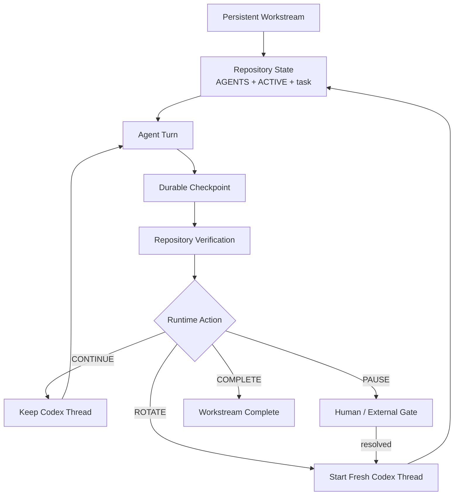

<p align="center">
  
</p>

<h1 align="center">Repository-State Agent Workflow</h1>

<p align="center">
  <strong>Run the workstream. Rotate the context.</strong>
</p>

<p align="center">
  Repository-backed continuity, bounded model context, automatic Codex rotation,
  and evidence-gated quality for long-running software and research work.
</p>

<p align="center">
  <a href="https://github.com/hanklin9188/repository-state-agent-workflow/actions/workflows/ci.yml"></a>
  <a href="LICENSE"></a>
  <a href="pyproject.toml"></a>
  
  
</p>

<p align="center">
  <a href="#two-minute-start">Two-minute start</a> ·
  <a href="#what-changed-in-03">What changed</a> ·
  <a href="#runtime-state-machine">State machine</a> ·
  <a href="#quality-and-safety">Quality</a> ·
  <a href="#measured-results">Evidence</a> ·
  <a href="README.zh-TW.md">繁體中文</a>
</p>

---

## What is RSAW?

**RSAW** is a repository-first operating model and small runtime for coding and
research agents.

The repository stores durable project memory. Model contexts are temporary
workers.

RSAW 0.3 adds the missing execution layer to the repository-state design:

- **CONTINUE** — keep the current Codex thread for the next tightly coupled task;
- **ROTATE** — close the current context and automatically start a fresh Codex thread;
- **PAUSE** — stop only for a real human or external gate;
- **COMPLETE** — close the workstream.

A role change such as Builder → Runner or Runner → Analyst no longer requires a
human to copy a generated prompt into another chat. The supervisor performs the
rotation while the workstream remains active.

> **The workstream is persistent. The model context is bounded and replaceable.**

---

## The problem

A long agent conversation becomes an accidental state database:

```text
old source snapshots
+ failed attempts
+ obsolete decisions
+ raw logs
+ completed tasks
+ current work
```

Always starting fresh solves stale-context growth, but can also repeat bootstrap,
file reads, subsystem reconstruction, and handoff overhead after every task.

RSAW separates four lifetimes:

| Layer | Lifetime | Responsibility |
|---|---:|---|
| `AGENTS.md` | months | stable policy and safety |
| Workstream | days–weeks | long-range state machine |
| Task checkpoint | hours–days | one verifiable unit of work |
| Context epoch | bounded | one or more closely coupled agent turns |

The repository carries continuity. The runtime decides whether the next task
should reuse or replace the model context.

---

## Two-minute start

### 1. Install

```bash
python -m pip install \
  git+https://github.com/hanklin9188/repository-state-agent-workflow.git
```

You also need an authenticated Codex CLI for automatic runtime mode.

### 2. Initialize any Git repository

```bash
cd /path/to/your-project
rsaw init .
```

The initializer creates only missing files. It does not overwrite an existing
`AGENTS.md`, `ACTIVE.md`, or project task system unless `--force` is explicit.

### 3. Check the repository and Codex adapter

```bash
rsaw verify .
rsaw doctor . --agent codex
rsaw status .
```

### 4. Start the long-lived workstream

```bash
rsaw run . --agent codex
```

That is the normal 0.3 experience.

RSAW will:

1. read repository authority;
2. launch Codex for the active task;
3. verify that a durable checkpoint was written;
4. continue the same thread or rotate automatically;
5. pause only when `ACTIVE.md` declares a human/external gate;
6. stop when the workstream declares `COMPLETE`.

### Manual, tool-agnostic mode

The original Markdown-first workflow remains available:

```bash
rsaw prompt .
rsaw next .
```

Manual mode works with any agent that can read a repository. Automatic rotation
currently ships with a Codex CLI adapter.

---

## What `rsaw init .` creates

```text
AGENTS.md
ACTIVE.md
.rsaw/
├── config.json
└── .gitignore
docs/
├── agents/
│   └── repository-state-workflow.md
├── workstreams/
│   └── W-000-bootstrap.md
├── tasks/
│   └── T-000-bootstrap.md
├── checkpoints/
├── decisions/
└── handoffs/
    └── archive/
```

Runtime logs are stored under `.rsaw/runtime/` and ignored by default.

---

## Runtime state machine



### `CONTINUE`

Use the same Codex thread when the next task has the same role, objective,
subsystem, evidence domain, and safety boundary.

Typical Builder epoch:

```text
design → implementation → focused integration → smoke → readiness
```

### `ROTATE`

The workstream keeps running, but RSAW starts a fresh Codex thread. Rotation is
mandatory for role changes, formal execution/analysis boundaries, fresh review,
major decisions, major debugging closure, or context pressure.

### `PAUSE`

Pause is reserved for real gates:

- exact formal authorization;
- interactive `sudo` or credentials;
- destructive or irreversible action;
- unresolved scientific/architecture fork;
- long-running external work that must finish first.

In an interactive terminal, `rsaw run` can accept the exact human response,
start a fresh gate-resolution turn, verify the resulting repository state, and
then rotate automatically.

### `COMPLETE`

The workstream is terminal only when repository state explicitly declares
`COMPLETE`.

---

## Quality and safety

Automatic continuation must not become automatic carelessness.

RSAW 0.3 enforces these guardrails:

| Guardrail | Effect |
|---|---|
| Repository verification before and after every turn | malformed handoffs stop the supervisor |
| `ACTIVE.md` must advance | a successful-looking but state-free turn fails closed |
| Safe Codex sandbox by default | no dangerous bypass is enabled by RSAW |
| Human gates remain explicit | authorization and destructive choices are never inferred |
| No automatic retry after agent failure | failed evidence is not silently replaced |
| Single-supervisor lock | prevents two runtimes from racing one workstream |
| Turn, transition, and token budgets | prevents an unbounded workstream loop |
| Mandatory fresh role boundaries | preserves review and scientific independence |
| Runtime logs ignored by default | token/event telemetry does not pollute Git |

### Validation tiers

- **V0** — syntax, lint, and exact tests during editing;
- **V1** — focused task-checkpoint validation;
- **V2** — one relevant epoch or phase closure;
- **V3** — fresh independent review for critical work.

> **Validation is a gate, not the product.**

RSAW does not weaken validation to reduce context. It removes repeated history
and repeated work while preserving the evidence required by the active claim.

---

## Token-aware rotation

The Codex adapter consumes JSONL events and records provider-emitted usage:

- input tokens;
- cached input tokens;
- cache-write input tokens;
- output tokens;
- reasoning output tokens.

Default runtime limits are conservative and configurable in `.rsaw/config.json`:

```json
{
  "runtime": {
    "max_turns_per_epoch": 6,
    "rotate_input_tokens": 60000,
    "max_total_input_tokens": 5000000,
    "max_transitions": 100
  }
}
```

When token pressure or turn count reaches the configured boundary, the
supervisor rotates before the repository workstream itself stops.

Inspect the latest measured run:

```bash
rsaw report .
rsaw report . --json
```

The report includes fresh/resumed turns, runtime epochs, checkpoints,
transitions, and tokens per successful checkpoint.

---

## CLI

| Command | Purpose |
|---|---|
| `rsaw init .` | initialize missing workstream files and runtime config |
| `rsaw verify .` | validate `ACTIVE.md` and referenced authority |
| `rsaw status .` | show workstream, task, role, gate, and runtime action |
| `rsaw next .` | deterministically derive CONTINUE / ROTATE / PAUSE / COMPLETE |
| `rsaw prompt .` | render a minimal manual-mode prompt |
| `rsaw checkpoint .` | archive the active handoff |
| `rsaw footprint .` | estimate repository bootstrap context |
| `rsaw doctor . --agent codex` | verify the Codex runtime adapter |
| `rsaw run . --agent codex` | supervise the workstream and rotate automatically |
| `rsaw run . --dry-run` | inspect the next action without launching Codex |
| `rsaw report .` | summarize measured runtime and token usage |

Common options:

```bash
rsaw run . --agent codex --model <model>
rsaw run . --max-turns-per-epoch 4 --rotate-input-tokens 50000
rsaw run . --no-interactive-gates
```

RSAW never enables Codex's dangerous sandbox bypass. `--approve-for-me` is an
explicit opt-in and still uses Codex's approval reviewer and workspace-write
sandbox.

---

## Measured results

### RSAW 0.1 bootstrap case study

A documented Desk Code Agent migration changed the deterministic fresh-session
bootstrap estimate from **33,348** to **2,967** tokens: an estimated **91.1%**
reduction.

Claim boundary: this is a `BOOTSTRAP_CONTEXT_ESTIMATE`, not provider billing,
full-task token reduction, or causal quality evidence.

### EdgeFlow RSAW 0.1 vs 0.2 matched replay

A retrospective matched replay over five real EdgeFlow tasks estimated:

| Metric | RSAW 0.1 | RSAW 0.2 |
|---|---:|---:|
| Fresh sessions / context epochs | 5 | 2 |
| Repository-context traffic | 53,444 | 20,972 conservative |
| Delta-only traffic | — | 19,848 |
| Estimated reduction | — | **60.8%–62.9%** |
| Repeated-read reduction | — | **98.1%–99.0%** |

The structured v2 handoff was 20.1% larger. Quality non-inferiority and provider
billing savings were not causally evaluated.

Read the [EdgeFlow case study](docs/case-studies/edgeflow-rsaw-v1-v2.md).

### RSAW 0.3 evaluation status

The runtime now records prospective Codex usage and transition events, enabling a
stronger comparison of:

```text
chat-as-memory
vs always-fresh RSAW 0.1
vs bounded epochs RSAW 0.2
vs automatic supervisor RSAW 0.3
```

No universal 0.3 token or quality improvement is claimed before matched
prospective evaluation.

---

## Where RSAW fits

RSAW complements rather than replaces:

- GitHub Issues, Linear, Jira, or internal trackers;
- CI/CD and code review;
- architecture decision records;
- access control, secrets management, and sandboxing;
- experiment schedulers and cluster systems;
- incident management.

Use your existing tracker for planning. Use RSAW as the repository-local
continuity and runtime contract for the active agent workstream.

---

## Scientific and ML work

RSAW keeps fresh boundaries even when automatic rotation is enabled:

```text
Preregistration
→ ROTATE
Formal execution
→ ROTATE
Scientific analysis
```

The supervisor automates the context replacement. It does not merge roles or
weaken evidence independence.

See [Scientific and ML Workflows](docs/scientific-and-ml-workflows.md).

---

## Documentation

- [Getting Started](docs/getting-started.md)
- [Runtime Supervisor](docs/runtime-supervisor.md)
- [Codex Adapter](docs/codex-adapter.md)
- [Continuation Gate](docs/continuation-gate.md)
- [Architecture](docs/architecture.md)
- [Migration 0.2 → 0.3](docs/migration-v2-to-v3.md)
- [Runtime Evaluation](docs/runtime-evaluation.md)
- [Company Adoption](docs/company-adoption.md)
- [Research Methodology](docs/research-methodology.md)
- [FAQ](docs/faq.md)

---

## Current limitations

- Automatic runtime mode currently supports local Codex CLI; the core/manual
  workflow remains agent-neutral.
- RSAW cannot create a new ChatGPT web conversation. It rotates local Codex
  threads through `codex exec`.
- A paused supervisor cannot invent credentials, privilege, authorization, or a
  scientific decision.
- Token budgets are operating guardrails, not universal optimal thresholds.
- One repository case study does not establish universal cost or quality gains.

---

## Contributing

```bash
git clone https://github.com/hanklin9188/repository-state-agent-workflow.git
cd repository-state-agent-workflow
python -m pip install -e '.[dev]'
ruff check .
pytest -q
rsaw verify .
rsaw run . --dry-run
```

The project is MIT licensed and intentionally small: Markdown and Git remain the
authority; the supervisor is an optional execution layer rather than a project
management platform.
