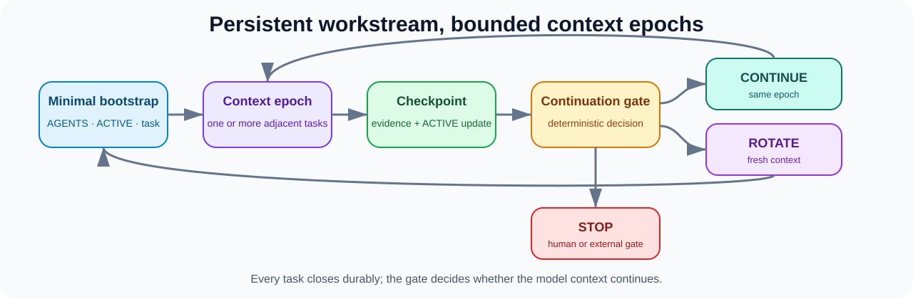

<p align="center">
  
</p>

<h1 align="center">Repository-State Agent Workflow</h1>

<p align="center">
  <strong>Make the repository remember, so the agent does not have to.</strong>
</p>

<p align="center">
  A Markdown-first operating model and small CLI for low-context, high-quality coding-agent work.<br/>
  Continuity lives in versioned repository files — not in a hidden, ever-growing chat history.
</p>

<p align="center">
  <a href="https://github.com/hanklin9188/repository-state-agent-workflow/actions/workflows/ci.yml"></a>
  <a href="LICENSE"></a>
  <a href="pyproject.toml"></a>
  
</p>

<p align="center">
  <a href="#what-is-rsaw">What is RSAW</a> ·
  <a href="#how-it-works">How it works</a> ·
  <a href="#quick-start">Quick start</a> ·
  <a href="#measured-results">Measured results</a> ·
  <a href="docs/company-adoption.md">Company adoption</a> ·
  <a href="README.zh-TW.md">繁體中文</a>
</p>

---

## What is RSAW?

**RSAW (Repository-State Agent Workflow)** is a way of running coding agents — Claude Code, Cursor, Codex, aider, or any other — where the **Git repository itself is the agent's memory**.

Instead of one endless conversation that slowly fills with stale code snippets, old logs, and forgotten decisions, every RSAW session:

1. **starts fresh** and reads only three small Markdown files (typically ~3K tokens, not ~30K+);
2. **does exactly one bounded task**, pulling in extra files only when that task needs them;
3. **validates the result** against explicit evidence gates;
4. **writes the next state back into the repository** (`ACTIVE.md`) and stops.

The next session — human or agent, today or next month, in any tool — picks up from the repository, not from a chat transcript.

> **Repository state is authoritative. Conversation history is disposable.**

The project ships as a methodology (Markdown templates and conventions), a small deterministic CLI (`rsaw`) that verifies and measures the setup, and worked examples for software, ML, data, and research repositories.

---

## The problem

Long-running agent conversations become accidental state stores. They accumulate stale source snapshots, failed attempts, completed tasks, obsolete decisions, and repeated project explanations — and every later model call must reason through that mixture again. The context is hidden, unversioned, and impossible to hand off.

RSAW replaces that hidden continuity with a small, auditable repository contract:

| Problem with chat-as-memory | RSAW response |
|---|---|
| Growing conversation history | Fresh, bounded sessions |
| Current state hidden in the chat | Versioned `ACTIVE.md` handoff |
| Broad mandatory project preload | Three-file bootstrap + progressive disclosure |
| Repeated investigation of the same things | Durable evidence and an explicit next action |
| Validation weakened to save context | Staged V0–V3 evidence gates |
| Reviewer contaminated by builder history | Fresh, role-separated reviewer sessions |

---

## How it works

A session starts small, expands only when the active task requires evidence, validates the result, records the next state, and stops.

<p align="center">
  
</p>

### The three-file bootstrap

Every fresh session reads exactly three artifacts — nothing else is preloaded:

| Artifact | Responsibility | Update pattern |
|---|---|---|
| `AGENTS.md` | Stable policy: safety, build rules, validation, navigation | Rarely |
| `ACTIVE.md` | Tiny current handoff: state, blocker, next action, stop condition | At meaningful boundaries |
| `docs/tasks/<task>.md` | One bounded task and its acceptance criteria | Once per task |

Git history, ADRs, tests, reports, and artifacts remain durable evidence — read only when the active task needs them (**progressive disclosure**).

### What a handoff looks like

`ACTIVE.md` is deliberately tiny. A real handoff reads like this:

```markdown
# Active Handoff

## Active Task
ID: T-042
Spec: docs/tasks/T-042-streaming-parser.md

## Current State
- Chunk boundary handling implemented and unit-tested.
- Integration test for multi-frame input still failing.

## Blockers
None.

## Next Exact Action
Fix frame reassembly in src/parser/stream.py; rerun tests/test_stream.py.

## Stop Condition
All parser tests pass and ACTIVE.md points to the next task.
```

Any fresh session — in any tool — can pick this up and continue with zero conversation history.

---

## Quick start

### 1. Install

```bash
git clone https://github.com/hanklin9188/repository-state-agent-workflow.git
cd repository-state-agent-workflow
python -m pip install -e '.[dev]'
```

### 2. Add RSAW to an existing repository

```bash
rsaw init /path/to/your-project
cd /path/to/your-project
```

The initializer is conservative: it creates missing workflow files and never overwrites existing project state unless `--force` is explicitly used.

### 3. Verify the handoff and measure the footprint

```bash
rsaw verify .      # validate ACTIVE.md and task references
rsaw footprint .   # estimate fresh-session bootstrap context
```

### 4. Start a fresh agent session

Paste this into any coding agent:

```text
Work in this repository.

Read only:
1. AGENTS.md
2. ACTIVE.md
3. the active task spec referenced by ACTIVE.md

Execute exactly the active task using progressive disclosure.
Reuse verified repository evidence and do not repeat completed work.
Use targeted validation while iterating and closure validation only when stable.
When complete or blocked, update ACTIVE.md and stop.
```

Or render the role-specific prompt directly:

```bash
rsaw prompt . --role builder
```

---

## Measured results

### Desk Code Agent — preliminary V1 result

Desk Code Agent replaced a broad mandatory project bootstrap with the RSAW three-file contract (`AGENTS.md`, `ACTIVE.md`, and one active task specification):

| Metric | Previous workflow | RSAW V1 | Change |
|---|---:|---:|---:|
| Fresh-session bootstrap estimate (tokens) | 33,348 | **2,967** | **−30,381** |
| Relative reduction | — | — | **91.1%** |

<details>
<summary>Bootstrap component breakdown</summary>

| RSAW bootstrap component | Estimated tokens |
|---|---:|
| `AGENTS.md` | 1,639 |
| `ACTIVE.md` | 432 |
| Active task | 896 |
| **Total** | **2,967** |

`rsaw verify`: **PASS**

</details>

> **Claim boundary:** this is a `BOOTSTRAP_CONTEXT_ESTIMATE`. It is not measured provider billing savings, cached-input savings, full-task context reduction, or evidence that engineering quality improved by 91.1%.

V2 closure and task-level continuity/quality measurements remain pending. Read the [full case study](docs/case-studies/desk-code-agent-rsaw-v1-bootstrap.md), browse the [case-study index](docs/case-studies/README.md), or use the [machine-readable result](data/case-studies/desk-code-agent-rsaw-v1.json).

---

## Operating model

### Core principles

1. **Repository state is authoritative** — accepted decisions, executable contracts, task state, and evidence outrank old chat history.
2. **One substantial task per session** — stop at completion, closure, a major blocker, reviewer handoff, or decision boundary.
3. **Progressive disclosure** — read exact source, tests, ADRs, reports, and logs only when the active task requires them.
4. **Evidence-gated quality** — smaller context never justifies weaker validation.
5. **Role separation** — builder, reviewer, and decision sessions use different, bounded context.

### Validation tiers

| Tier | Stage | Typical checks |
|---|---|---|
| `V0` | Edit loop | Syntax, lint, one targeted test |
| `V1` | Task stability | Task-specific suite, focused integration |
| `V2` | Task closure | Full relevant tests, package and result checks |
| `V3` | Critical or release work | Fresh reviewer, standards review, spec review |

### Session roles

| Role | Reads | Delivers |
|---|---|---|
| **Builder** | Policy, active state, task, exact dependencies | Implementation and focused evidence |
| **Reviewer** | Fresh context, spec, diff, tests, limitations | Independent correctness and compliance review |
| **Decision** | Evidence checkpoint and governing constraints | Architecture or scientific decision |

For medium-reasoning models, major decisions use two passes: evidence decomposition, then decision synthesis.

---

## CLI

```bash
rsaw init .                            # Add the workflow conservatively
rsaw verify .                          # Validate ACTIVE and task references
rsaw footprint .                       # Estimate fresh bootstrap context
rsaw archive . --label T-042-complete  # Archive a meaningful boundary
rsaw prompt . --role builder           # Render a minimal builder prompt
rsaw prompt . --role reviewer          # Render a fresh reviewer prompt
rsaw prompt . --role decision          # Render a decision prompt
```

The CLI is a deterministic guardrail, not an orchestration platform. Markdown and Git remain the canonical state.

---

## How RSAW compares

| Approach | Strength | Limitation RSAW addresses |
|---|---|---|
| One long conversation | Rich immediate history | Hidden, growing, stale, difficult to hand off |
| Conversation summary | Compact | Potentially lossy and not independently executable |
| Vector/RAG memory | Flexible retrieval | Retrieval quality and staleness become hidden dependencies |
| Issue tracker only | Strong planning and accountability | Usually lacks agent bootstrap, evidence pointers, and stop contract |
| Agent orchestration framework | Automation and parallelism | Can become another opaque state owner |
| **RSAW** | Explicit, versioned, tool-agnostic continuity | Requires disciplined maintenance of small repository artifacts |

RSAW complements issue trackers, retrieval systems, and orchestrators; it does not require replacing them.

---

## Adoption paths

| Setting | Recommended adoption |
|---|---|
| Individual repository | Run `rsaw init`, customize the three core artifacts, add verification to CI |
| Engineering team | Map Issues/Linear/Jira tasks to bounded task contracts; keep the existing tracker |
| Research or ML repository | Add frozen protocols, immutable evidence, explicit authorization, separate execution/review sessions |
| Monorepo | Use stable root policy plus scoped policies and one `ACTIVE.md` per independently operated workstream |

See the [Adoption Guide](docs/adoption-guide.md), [Company Adoption and Governance](docs/company-adoption.md), and [Migration Playbook](docs/migration-playbook.md).

---

## Examples

Each example is a self-contained mini-repository with its own `AGENTS.md`, `ACTIVE.md`, and active task:

- [Software feature](examples/software-project/) — streaming parser implementation
- [ML experiment](examples/ml-experiment/) — frozen holdout execution
- [Data pipeline](examples/data-pipeline/) — dual-write migration
- [Research repository](examples/research-repo/) — bounded scientific ticket

---

## Evaluation and research

RSAW treats lower context as a hypothesis to test — not a quality result by itself. A credible study should measure bootstrap and routine working-set context; cached and uncached inputs where provider accounting is available; task completion and closure validation; repeated work and stale-state errors; fresh-session handoff success; independent review findings and escaped defects; and elapsed time and human intervention. The primary unit should normally be a task or matched task stream, not an individual model call.

Start with the [Desk Code Agent V1 case study](docs/case-studies/desk-code-agent-rsaw-v1-bootstrap.md), the [Evaluation guide](docs/evaluation.md), the [Research Methodology](docs/research-methodology.md), and the [Case Study Template](docs/case-study-template.md). The illustrative [token-economics](docs/token-economics.md) examples are not pricing guarantees, and one repository must not be generalized to all models, agents, or organizations.

---

## Documentation

| Start here | Operate the workflow | Evaluate and extend |
|---|---|---|
| [Concepts](docs/concepts.md) | [Session Lifecycle](docs/session-lifecycle.md) | [Case Studies Index](docs/case-studies/README.md) |
| [Architecture](docs/architecture.md) | [Progressive Disclosure](docs/progressive-disclosure.md) | [Evaluation](docs/evaluation.md) |
| [Adoption Guide](docs/adoption-guide.md) | [Validation Tiers](docs/validation-tiers.md) | [Research Methodology](docs/research-methodology.md) |
| [Company Adoption](docs/company-adoption.md) | [Agent Roles](docs/agent-roles.md) | [Token Economics](docs/token-economics.md) |
| [Migration Playbook](docs/migration-playbook.md) | [Long-Running Work](docs/long-running-work.md) | [Anti-Patterns](docs/anti-patterns.md) |
| | [Scientific & ML Workflows](docs/scientific-and-ml-workflows.md) | [FAQ](docs/faq.md) · [References](docs/references.md) |

---

## Status and non-goals

**Status:** Alpha reference implementation. The methodology, templates, examples, verifier, footprint estimator, archive helper, and prompt renderer are usable; broader empirical validation remains open.

RSAW is deliberately **not**: an autonomous project manager; a model vendor wrapper; a replacement for GitHub Issues, Linear, Jira, retrieval, or orchestration; an automatic conversation summarizer; a database of private conversations; a claim that every task fits in one session; or a reason to weaken tests or human review.

The design stays inspectable: Markdown, Git, deterministic checks, and project-owned evidence.

---

## Contributing, citation, and license

Contributions are welcome, especially measured adoption studies, deterministic workflow checks, monorepo examples, and failure reports. See [CONTRIBUTING.md](CONTRIBUTING.md) and the [Code of Conduct](CODE_OF_CONDUCT.md).

For research use, see [CITATION.cff](CITATION.cff) and cite the specific RSAW version or commit used.

MIT License. See [LICENSE](LICENSE).
