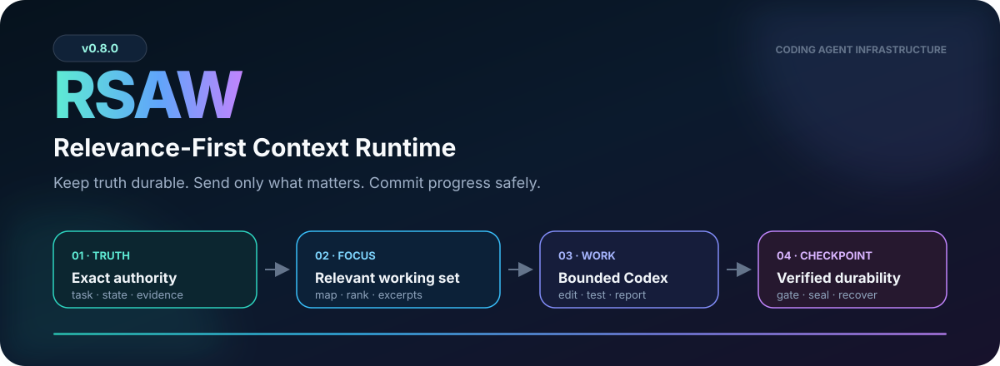
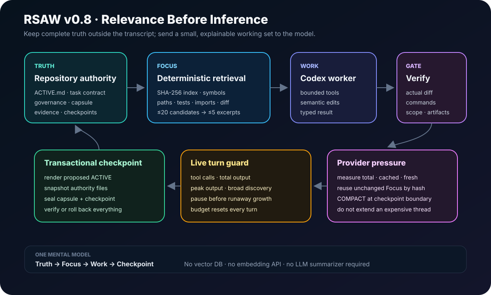
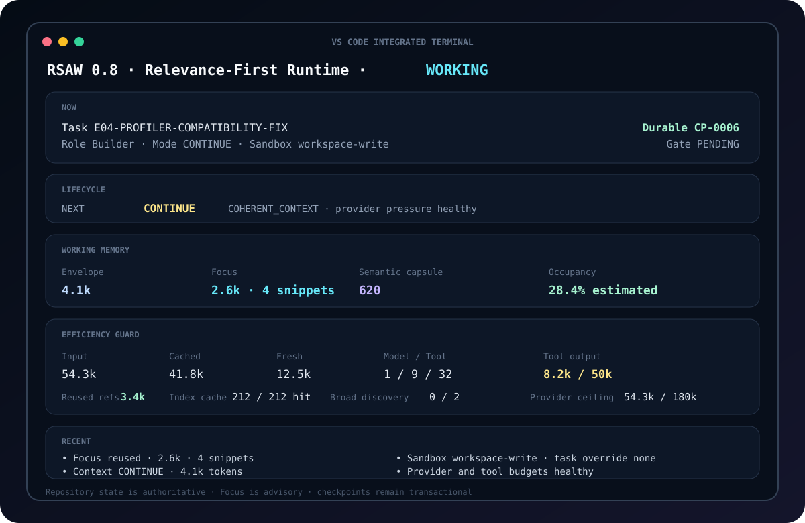

<p align="center">
  
</p>

<h1 align="center">Repository-State Agent Workflow</h1>

<p align="center">
  <strong>Keep truth durable. Send only what matters. Commit progress safely.</strong>
</p>

<p align="center">
  
  
  
  
  
</p>

<p align="center">
  <a href="README.zh-TW.md">繁體中文</a> ·
  <a href="docs/relevance-first-context.md">Design</a> ·
  <a href="docs/edgeflow-v080-deployment.md">EdgeFlow deployment</a> ·
  <a href="docs/releases/v080-relevance-first-context.md">Release notes</a> ·
  <a href="CHANGELOG.md">Changelog</a>
</p>

---

## What RSAW does

RSAW is a repository-backed runtime for long-running coding and research agents.
Codex remains the semantic worker. RSAW deterministically manages the parts that should
not depend on model memory:

- exact task and repository authority;
- relevance-first working context;
- checksummed checkpoints and evidence;
- `CONTINUE`, `COMPACT`, `ROTATE`, `PAUSE`, and `COMPLETE` lifecycle decisions;
- Human Gates and task-scoped sandboxes;
- tool, output, and provider-context budgets;
- recovery after interruption or a rejected transition.

The operating model is intentionally small:

```text
Truth → Focus → Work → Checkpoint
```

> **The model may forget. The repository must not.**

---

## Start in 60 seconds

### Install

```bash
python -m pip install --upgrade \
  "git+https://github.com/hanklin9188/repository-state-agent-workflow.git@v0.8.0"
```

### Existing RSAW repository

```bash
rsaw upgrade . --apply
rsaw preflight .
rsaw start .
```

### New repository

```bash
rsaw init .
rsaw preflight .
rsaw start .
```

Daily use is one command:

```bash
rsaw start .
```

To inspect exactly what code RSAW selected before starting the model:

```bash
rsaw focus .
rsaw focus . --show-content
```

---

## Why v0.8 exists

A small bootstrap prompt does not guarantee a small agent session. A worker can still
search broadly, read many files, accumulate large tool results, and resend that growing
transcript on every model call. Much of that traffic may appear as cached input, but it is
still oversized context.

v0.8 moves the main optimization **before** the model turn:

| Earlier approach | v0.8 approach |
|---|---|
| Tell the worker not to search broadly | Prepare a relevant working set first |
| Stop runaway tools after they grow | Reduce the need for discovery loops |
| Treat prompt cache as efficiency | Measure total, cached, and fresh input separately |
| Pack or summarize the whole repository | Retrieve many candidates, send a few exact excerpts |
| Add another model for summarization | Use deterministic checkpoints and Semantic Capsules |

The existing live budgets remain as a final brake, not the primary retrieval strategy.

---

## Relevance-First Context

<p align="center">
  
</p>

### Truth

Exact repository authority remains unchanged: `ACTIVE.md`, the active task contract,
stable governance, the bounded Semantic Capsule, and required evidence handles.

### Focus

Before a fresh model context, RSAW builds a local, content-addressed index and selects a
small working set using explainable signals:

- exact paths named by the task;
- symbols and file names;
- current Git changes;
- rejecting or regression tests;
- direct imports and nearby dependencies;
- task vocabulary and required source ranges.

The default Focus budget is:

```json
{
  "mapTokens": 900,
  "focusTokens": 3000,
  "maxSnippets": 5,
  "candidateLimit": 20,
  "snippetLines": 64
}
```

The index uses SHA-256 content identity. Unchanged files are reused without reparsing.
No vector database, embedding API, or LLM summarizer is required.

### Work

Codex receives Truth plus Focus. Broad repository discovery becomes an exception for a
specific unresolved question, not the default first action.

### Checkpoint

RSAW verifies the real diff, validation commands, allowed-write scope, artifacts, evidence,
and successor task before committing state transactionally.

---

## Three context controls, one simple mental model

```text
1. Focus first      select the smallest useful code working set
2. Bound the turn   cap tool calls, output, and broad discovery
3. Compact later    replace an expensive hot context at a safe checkpoint
```

Provider-context pressure triggers `COMPACT` before the next coherent turn when either of
these defaults is exceeded:

```json
{
  "maxProviderInputTokens": 180000,
  "maxCachedInputTokens": 120000
}
```

This does not recover tokens already spent. It prevents an expensive transcript from being
reused indefinitely.

---

## Operator experience

<p align="center">
  
</p>

The terminal displays observable runtime state, not hidden reasoning:

| Panel | What it answers |
|---|---|
| **NOW** | Which task, role, sandbox, and durable checkpoint are active? |
| **LIFECYCLE** | Will RSAW continue, compact, rotate, pause, or complete? |
| **WORKING MEMORY** | How large are the envelope, Focus, and Semantic Capsule? |
| **EFFICIENCY GUARD** | How much provider and tool traffic is accumulating? |
| **RECENT** | Which durable runtime events just occurred? |

Expected operator states such as `PAUSED` and `COMPLETE` exit cleanly. Automation can retain
machine-oriented status codes with `--strict-exit-codes`.

---

## RSAW or direct Codex?

| Use direct Codex | Use RSAW + Codex |
|---|---|
| One small, disposable task | Multi-checkpoint workstream |
| No special authority | Human Gate or one-shot execution |
| No recovery requirement | Interrupted work must resume safely |
| Manual context is enough | Repository state must remain authoritative |
| No role boundary | Runner → Analyst or Builder → Reviewer separation |
| No audit requirement | Evidence, sandbox, and operator actions must be durable |

RSAW is not intended to make a five-minute edit more complicated. It is intended to remove
the human-supervisor burden when work outlives one chat session.

---

## What v0.8 deliberately does not add

- no whole-repository prompt;
- no mandatory vector database;
- no embedding service in the default path;
- no LLM summarizer in the critical path;
- no raw runtime, evidence, artifact, secret, or environment indexing;
- no new lifecycle states beyond the existing five;
- no claim that prompt-cache hits equal context reduction;
- no universal claim that RSAW already beats every coding agent.

The design stays small enough to inspect, test, and reproduce.

---

## Safety and authority

RSAW preserves the v0.7.1 safety boundary:

- checkpoint advancement is transactional and rolls back on failed verification;
- evidence handles are Supervisor-owned;
- Human Gate changes are audited;
- `danger-full-access` is exact-task scoped and re-resolved every turn;
- sandbox-class changes force a fresh context boundary;
- one-shot execution remains one-shot even if a checkpoint fails;
- diagnostic or capability-smoke output does not become scientific evidence.

Focus is advisory context. It never replaces authorization, validation, evidence, or
interference checks.

---

## Validation

The v0.8 release gate includes:

- **121 passing tests**;
- Python compile validation;
- repository verification;
- FRESH / CONTINUE / COMPACT context tests;
- deterministic Focus selection and token ceilings;
- content-hash cache reuse and one-file invalidation;
- sensitive/runtime/evidence/artifact exclusion;
- provider-pressure compaction;
- 4 / 16 / 64-checkpoint lifecycle acceptance;
- Markdown link validation;
- package build and isolated installation in CI.

A deterministic fixture with one implementation, one rejecting test, one supporting module,
and 36 distractor modules produced:

```text
baseline context      36,712 tokens
selected Focus           252 tokens
mechanism reduction    99.31%
target implementation      kept
target rejecting test      kept
second index build      43/43 cache hits
```

This is a **mechanism test**, not a universal provider-cost or task-success claim. Real
promotion requires matched evaluation against direct Codex and previous RSAW versions.
See [validation details](docs/validation/V080_RELEASE_VALIDATION.md).

---

## EdgeFlow deployment

EdgeFlow should upgrade only at a durable boundary:

```bash
python3 -m venv /home/hank/.venvs/rsaw-v080
/home/hank/.venvs/rsaw-v080/bin/python -m pip install --upgrade \
  "git+https://github.com/hanklin9188/repository-state-agent-workflow.git@v0.8.0"

rsaw upgrade . --apply
rsaw focus . --rebuild
rsaw verify .
rsaw preflight .
```

The existing exact-task GPU sandbox remains separate from Focus Context. Deployment does
not authorize or execute an EdgeFlow diagnostic. Follow the complete
[EdgeFlow v0.8.0 deployment guide](docs/edgeflow-v080-deployment.md).

---

## Daily commands

| Goal | Command |
|---|---|
| Start supervised work | `rsaw start .` |
| Inspect selected code | `rsaw focus .` |
| Show selected excerpts | `rsaw focus . --show-content` |
| Check readiness | `rsaw preflight .` |
| Show active state | `rsaw status .` |
| Inspect efficiency | `rsaw report .` |
| Preview compiled context | `rsaw compile . --mode FRESH` |
| Normalize ACTIVE | `rsaw state normalize .` |
| Inspect Human Gate | `rsaw gate show .` |
| Inspect sandbox | `rsaw sandbox show .` |

<details>
<summary><strong>Operator controls</strong></summary>

```bash
rsaw gate clear . --reason "prerequisite restored" --yes

rsaw sandbox set . \
  --task current \
  --mode danger-full-access \
  --reason "reviewed task boundary" \
  --yes

rsaw sandbox clear . \
  --task current \
  --reason "reviewed boundary closed" \
  --yes
```

</details>

---

## Documentation

- [Relevance-First Context](docs/relevance-first-context.md)
- [EdgeFlow v0.8.0 deployment](docs/edgeflow-v080-deployment.md)
- [v0.8.0 release notes](docs/releases/v080-relevance-first-context.md)
- [v0.8.0 validation](docs/validation/V080_RELEASE_VALIDATION.md)
- [GPU sandbox incident](docs/incidents/2026-08-15-edgeflow-gpu-sandbox.md)
- [Architecture](docs/architecture.md)
- [Concepts](docs/concepts.md)
- [Adoption guide](docs/adoption-guide.md)
- [Changelog](CHANGELOG.md)
- [Roadmap](ROADMAP.md)

---

## Development

```bash
python -m pip install -e '.[dev]'
ruff format --check .
ruff check .
pytest -q
rsaw verify .
rsaw focus . --json
rsaw compile . --mode FRESH --json
rsaw acceptance . --horizon all --json
python scripts/benchmark_relevance.py
python scripts/check_markdown_links.py .
python -m build
```

CI validates Python 3.10, 3.12, and 3.13 plus a clean isolated wheel installation.

## License

MIT
