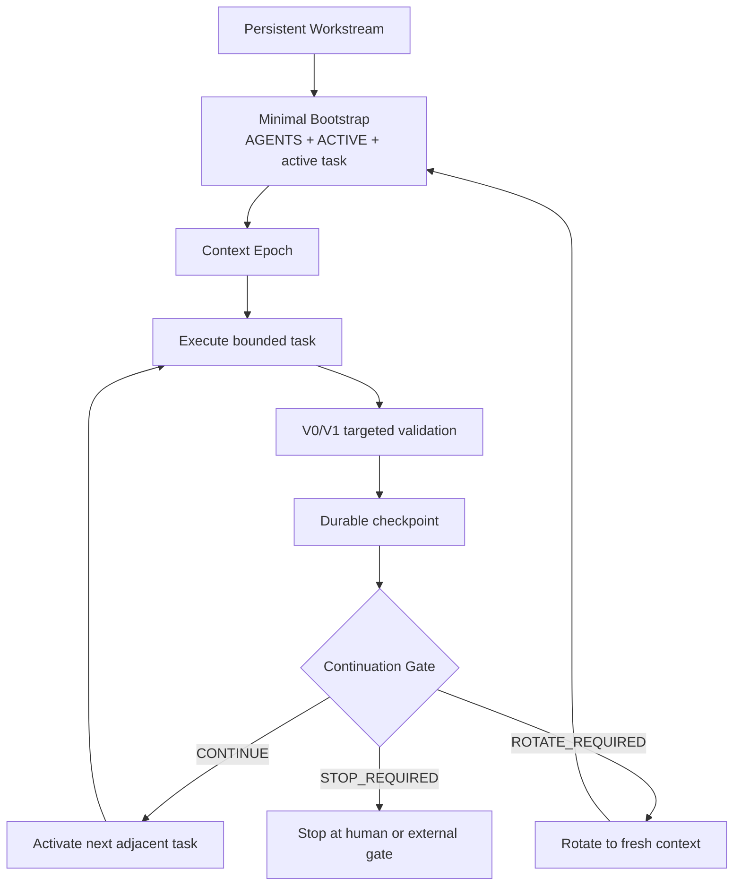

<p align="center">
  
</p>

<h1 align="center">Repository-State Agent Workflow</h1>

<p align="center">
  <strong>Long-lived workstreams. Bounded model context.</strong>
</p>

<p align="center">
  Keep project continuity in Git, let closely related tasks share context, and rotate before stale history becomes a liability.
</p>

<p align="center">
  <a href="https://github.com/hanklin9188/repository-state-agent-workflow/actions/workflows/ci.yml"></a>
  <a href="LICENSE"></a>
  <a href="pyproject.toml"></a>
  
  
</p>

<p align="center">
  <a href="#60-second-start">60-second start</a> ·
  <a href="#how-rsaw-02-works">How it works</a> ·
  <a href="#continue-or-rotate">Continue or rotate</a> ·
  <a href="#cli">CLI</a> ·
  <a href="#measured-results">Measured results</a> ·
  <a href="README.zh-TW.md">繁體中文</a>
</p>

---

## What is RSAW?

**RSAW** is a repository-first operating model for coding and research agents.

The repository stores the durable project memory. A model context is temporary working memory.

Unlike an always-fresh workflow, RSAW 0.2 can keep one context alive across several closely coupled tasks. Unlike one endless chat, it checkpoints every task and uses an explicit **Continuation Gate** to decide when the context may continue and when it must rotate.

```text
Persistent workstream
        ↓
bounded task
        ↓
durable checkpoint
        ↓
Continuation Gate
   ┌───────────────┴───────────────┐
CONTINUE                      ROTATE / STOP
same context                  fresh context or human gate
```

### The design goal

| Need | RSAW response |
|---|---|
| Make progress across days or weeks | Persistent workstream in the repository |
| Avoid re-explaining the project | `AGENTS.md` + `ACTIVE.md` + active task |
| Avoid rebooting context after every tiny step | Context epochs can contain multiple adjacent tasks |
| Avoid stale, giant conversations | Explicit rotation rules and context budgets |
| Preserve quality | V0–V3 evidence gates |
| Keep formal research defensible | Mandatory fresh boundaries for execution, analysis, review, and major decisions |

> **Project continuity is persistent. Model context is disposable.**

---

## 60-second start

RSAW requires no daemon, database, hosted service, API key, or model integration.

### 1. Install

```bash
python -m pip install git+https://github.com/hanklin9188/repository-state-agent-workflow.git
```

For contributors:

```bash
git clone https://github.com/hanklin9188/repository-state-agent-workflow.git
cd repository-state-agent-workflow
python -m pip install -e '.[dev]'
```

### 2. Add RSAW to any repository

```bash
cd /path/to/your-project
rsaw init .
```

The initializer is conservative: it creates missing files and does not overwrite existing project state unless `--force` is explicit.

### 3. Verify and inspect

```bash
rsaw verify .
rsaw status .
rsaw footprint .
```

### 4. Start an agent

```bash
rsaw prompt .
```

Copy the rendered prompt into Codex, Claude Code, Cursor, aider, or another coding agent.

That is the complete setup.

<details>
<summary><strong>What <code>rsaw init .</code> creates</strong></summary>

```text
AGENTS.md
ACTIVE.md
docs/
├── agents/
│   └── repository-state-workflow.md
├── workstreams/
│   └── W-000-bootstrap.md
├── tasks/
│   └── T-000-bootstrap.md
├── checkpoints/
├── decisions/
└── handoffs/
    └── archive/
```

</details>

Read the [Getting Started guide](docs/getting-started.md) for the first real task.

---

## How RSAW 0.2 works

RSAW has four durable layers.

| Layer | Purpose | Typical lifetime |
|---|---|---:|
| `AGENTS.md` | Stable policy, safety, validation, rotation rules | Months |
| Workstream spec | Long-range state machine and milestone | Days to weeks |
| `ACTIVE.md` | Tiny current frontier and gate state | Every checkpoint |
| Task spec | One verifiable unit of work | Hours to days |

The model works inside a **Context Epoch**: one bounded context that may finish one or more adjacent tasks.



### Workstream

A workstream is the long-lived roadmap: a feature line, migration, release train, research program, or experiment series.

### Task

A task is still bounded and independently checkable. Crossing a task boundary always creates a durable checkpoint—even when the same context continues.

### Context Epoch

A context epoch can contain several adjacent tasks when they share the same:

- role;
- hypothesis or objective;
- subsystem;
- evidence domain;
- safety boundary.

### Checkpoint

A checkpoint records accepted facts, evidence pointers, the next task, and the gate decision. It replaces conversational continuity with versioned state.

### Continuation Gate

The gate returns one of:

| Result | Meaning |
|---|---|
| `CONTINUE` | The next task is ready and belongs in the same context epoch |
| `ROTATE_REQUIRED` | Start a fresh context before the next task |
| `STOP_REQUIRED` | A human gate, external job, or other hard stop is active |

```bash
rsaw next .
```

---

## Continue or rotate

RSAW does not let the model guess indefinitely. `ACTIVE.md` records an explicit decision, and the CLI applies deterministic safety rules.

### Continue in the same context when

- the role is unchanged;
- the next task is already specified;
- the task stays in the same subsystem and objective;
- no formal independence requirement exists;
- no human gate or long-running-only wait exists;
- context pressure remains acceptable.

Typical example:

```text
feature design
→ implementation
→ targeted integration
→ smoke test
```

### Rotate to a fresh context when

- Builder → Reviewer, Runner, Analyst, or Decision;
- preregistration → formal execution;
- formal execution → scientific analysis;
- a major debugging episode has ended;
- the governing hypothesis or specification changed;
- waiting on a long-running job is the only remaining action;
- a human authorization, credential, `sudo`, or destructive action is required;
- working context approaches the repository budget.

Recommended defaults:

```text
Target context epoch: 20K–40K tokens
Rotation recommended: 50K–60K
Routine hard ceiling: ~80K
```

These are operating guardrails, not universal model limits.

See [Context Epochs](docs/context-epochs.md) and the [Continuation Gate](docs/continuation-gate.md).

---

## `ACTIVE.md` at a glance

```markdown
# Active Handoff

## Workstream
ID: W-042
Spec: docs/workstreams/W-042-checkout.md

## Context Epoch
ID: E-042-build
Role: Builder

## Active Task
ID: T-108
Spec: docs/tasks/T-108-checkout-smoke.md

## Current State
- Checkout API implemented.
- Focused tests pass.

## Next Exact Action
Run the integration smoke and freeze the execution commit.

## Continuation Gate
Decision: CONTINUE_ALLOWED
Reason: The next task uses the same role and checkout subsystem.

## Next Task
ID: T-109
Spec: docs/tasks/T-109-checkout-readiness.md

## Next Session Role
Builder
```

After the checkpoint:

```bash
rsaw verify .
rsaw next .
```

If the next task changes role to Reviewer, `rsaw next` forces rotation even if `ACTIVE.md` accidentally says continue.

---

## Two operating styles, one format

### Classic always-fresh

Set the gate to:

```text
Decision: ROTATE_REQUIRED
```

This preserves RSAW 0.1 behavior: one substantial task per fresh context.

### Persistent workstream

Set:

```text
Decision: CONTINUE_ALLOWED
```

and provide a ready next task. RSAW continues only when safety rules agree.

Existing 0.1 repositories remain supported; the new workstream and epoch fields are optional until migrated.

---

## Universal prompt

After initialization, this prompt is normally enough for every new context:

```text
Work in this repository.

Resume the active RSAW workstream from repository state.
Read only:
1. AGENTS.md
2. ACTIVE.md
3. the active task referenced by ACTIVE.md

Use progressive disclosure.
At every task checkpoint, persist evidence, update ACTIVE.md, and run `rsaw next .`.
Continue only when the gate returns CONTINUE; otherwise stop or rotate.
Do not reconstruct conversation history.
```

Or simply render the current role and mode:

```bash
rsaw prompt .
```

---

## CLI

| Command | Purpose |
|---|---|
| `rsaw init .` | Add the plug-and-play workstream scaffold without overwriting existing files |
| `rsaw verify .` | Validate ACTIVE, task, workstream, roles, paths, and gate consistency |
| `rsaw status .` | Show the current workstream, epoch, task, role, and human gate |
| `rsaw next .` | Evaluate whether to continue, rotate, or stop |
| `rsaw prompt .` | Render an automatic role-aware prompt |
| `rsaw prompt . --mode fresh` | Force a fresh-context prompt |
| `rsaw prompt . --role reviewer` | Render a fresh reviewer prompt |
| `rsaw checkpoint .` | Archive the current handoff checkpoint |
| `rsaw footprint .` | Estimate the bootstrap context footprint |
| `rsaw archive . --label ...` | Archive `ACTIVE.md` at a meaningful boundary |

The CLI is a deterministic guardrail—not an autonomous project manager or orchestration platform.

---

## Validation without the rabbit hole

RSAW 0.2 aligns validation with context epochs.

| Tier | When | Typical checks |
|---|---|---|
| `V0` | Edit loop | Syntax, lint, one exact targeted test |
| `V1` | Task checkpoint | Focused task or integration suite |
| `V2` | Context-epoch / phase closure | One full relevant closure validation |
| `V3` | Critical claim, release, or major fork | Fresh independent review |

**Validation is a gate, not the product.** New validation should answer an observed threat to the current claim or an explicit contract—not hypothetical possibilities.

See [Validation Tiers](docs/validation-tiers.md).

---

## Scientific and ML work

Persistent engineering contexts do **not** remove scientific independence boundaries.

Always rotate between:

```text
Preregistration
→ fresh Formal Runner
→ fresh Scientific Analyst
→ fresh Decision / follow-up design
```

Long-running training or benchmarking should be handed off with job ID, revision, command, artifact location, and completion condition. Do not keep a model context open just to poll.

See [Scientific & ML Workflows](docs/scientific-and-ml-workflows.md) and [Long-Running Work](docs/long-running-work.md).

---

## Measured results

### Desk Code Agent — preliminary RSAW 0.1 result

| Metric | Previous workflow | RSAW 0.1 | Change |
|---|---:|---:|---:|
| Fresh-session bootstrap estimate | 33,348 tokens | **2,967 tokens** | **−91.1%** |

> **Claim boundary:** this is a `BOOTSTRAP_CONTEXT_ESTIMATE`. It is not provider billing savings, cached-input savings, full-task token reduction, or evidence that quality improved by 91.1%.

RSAW 0.2 adds the next research question: when should adjacent tasks retain context, and when should the system rotate? The repository does **not** yet claim a measured 0.2 token saving.

Read the [case study](docs/case-studies/desk-code-agent-rsaw-v1-bootstrap.md), [evaluation guide](docs/evaluation.md), and [research methodology](docs/research-methodology.md).

---

## Where RSAW fits

| Setting | Example workstream |
|---|---|
| Software engineering | Feature design → implementation → smoke → readiness |
| Refactor / migration | Interface freeze → staged migration → regression closure |
| ML engineering | Data pipeline → training setup → evaluation readiness |
| Research | Preregistration → formal run → independent analysis |
| Data systems | Backfill → dual-write → verification → cutover |
| Release engineering | Build → package → release review → publication |

RSAW complements GitHub Issues, Linear, Jira, retrieval, and agent orchestrators. It does not require replacing them.

---

## Documentation

| Start here | Operate RSAW | Research and adoption |
|---|---|---|
| [Getting Started](docs/getting-started.md) | [Context Epochs](docs/context-epochs.md) | [Evaluation](docs/evaluation.md) |
| [Concepts](docs/concepts.md) | [Continuation Gate](docs/continuation-gate.md) | [Research Methodology](docs/research-methodology.md) |
| [Architecture](docs/architecture.md) | [Session Lifecycle](docs/session-lifecycle.md) | [Case Studies](docs/case-studies/README.md) |
| [Adoption Guide](docs/adoption-guide.md) | [Validation Tiers](docs/validation-tiers.md) | [Company Adoption](docs/company-adoption.md) |
| [Migration 0.1 → 0.2](docs/migration-v1-to-v2.md) | [Scientific Workflows](docs/scientific-and-ml-workflows.md) | [Token Economics](docs/token-economics.md) |
| [Anti-Patterns](docs/anti-patterns.md) | [Long-Running Work](docs/long-running-work.md) | [FAQ](docs/faq.md) |

---

## Status and non-goals

**Status:** Alpha reference implementation, version 0.2.0.

RSAW is deliberately not:

- an autonomous project manager;
- a hosted memory service;
- a replacement for Git, CI, code review, Issues, Linear, or Jira;
- a guarantee that every task should continue in one context;
- a reason to weaken tests or human review;
- a claim of universal token savings without matched evaluation.

The design stays inspectable: Markdown, Git, small deterministic checks, and project-owned evidence.

---

## Contributing, citation, and license

Contributions are welcome—especially measured comparisons of always-persistent, always-fresh, and adaptive context-epoch workflows.

See [CONTRIBUTING.md](CONTRIBUTING.md), [CITATION.cff](CITATION.cff), and [LICENSE](LICENSE).
