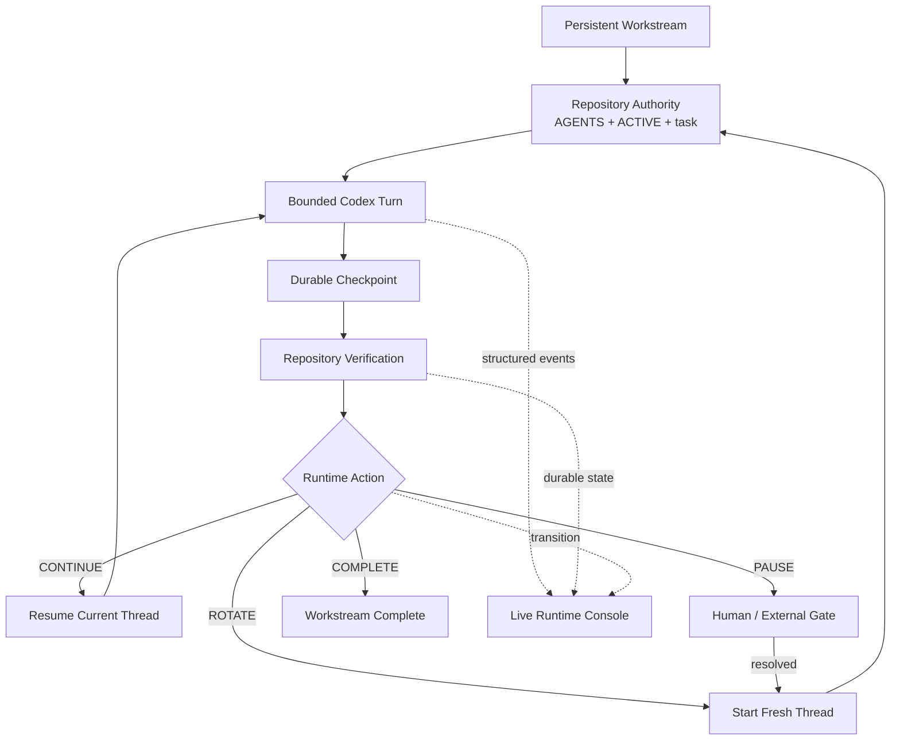

<p align="center">
  
</p>

<h1 align="center">Repository-State Agent Workflow</h1>

<p align="center">
  <strong>工作流持續存在，模型 context 可被替換，執行狀態即時可見。</strong>
</p>

<p align="center">
  RSAW 將長期 agent 狀態放回 repository，只在 context 仍然有價值時重用，
  在真正的邊界自動 ROTATE，並直接在 VS Code Integrated Terminal 顯示清楚的
  Live Runtime Console。
</p>

<p align="center">
  <a href="https://github.com/hanklin9188/repository-state-agent-workflow/actions/workflows/ci.yml"></a>
  <a href="LICENSE"></a>
  <a href="pyproject.toml"></a>
  
  
</p>

<p align="center">
  <a href="#兩分鐘開始">開始</a> ·
  <a href="#live-runtime-console">Live Console</a> ·
  <a href="#runtime-狀態機">狀態機</a> ·
  <a href="#contextcache-與-token-紀律">Token / Cache</a> ·
  <a href="#證據與-claim-boundary">證據</a> ·
  <a href="README.md">English</a>
</p>

---

## RSAW 是什麼？

**RSAW 是一套 repository-first 的長任務 agent 工作模型與 runtime supervisor。**

Repository 保存 durable project memory；model context 只是可替換的暫時 worker。
Supervisor 會在每個 durable checkpoint 後決定：

- **CONTINUE**：沿用目前 Codex thread；
- **ROTATE**：結束目前 context，自動建立 fresh context；
- **PAUSE**：只在真正需要人類或外部條件時停止；
- **COMPLETE**：結束整個 workstream。

0.4 新增 Live Runtime Console，讓你不再查看 JSONL 或 `tail -f`，而是在
VS Code Terminal 直接看到目前工作、進度、context 壓力、token/cache、
rotation、human gate 與最終結果。

> **Workstream 持續存在；model context 保持 bounded、可替換。**

<p align="center">
  
</p>

---

## RSAW 解決的問題

長時間 agent 對話會逐漸變成一個意外的 state database：

```text
舊的 source snapshot
+ 失敗嘗試
+ 已過時決策
+ raw command output
+ 已完成任務
+ 當前工作
```

永遠不換 context，會持續攜帶 stale information；每個 task 都 fresh，又會重複
bootstrap、讀檔、理解 subsystem 與 handoff。

RSAW 將不同狀態拆成四種生命週期：

| 層級 | 典型生命週期 | 責任 |
|---|---:|---|
| `AGENTS.md` | 月 | 穩定政策、權限與安全 |
| Workstream | 天至週 | 長期工作狀態機 |
| Task checkpoint | 小時至天 | 一個可驗證、可追蹤的 durable unit |
| Context epoch | bounded | 一個或多個高度相關的 agent turns |

因此，同一個 bounded epoch 內可以保留有用 cache；到了角色、正式實驗、分析、
review 或 token 壓力邊界，再清掉已失去價值的 context。

---

## 兩分鐘開始

### 1. 安裝

```bash
python -m pip install \
  git+https://github.com/hanklin9188/repository-state-agent-workflow.git
```

自動 runtime mode 另外需要已登入的本機 Codex CLI。

### 2. 初始化 repository

```bash
cd /path/to/your-project
rsaw init .
```

預設只建立缺少的檔案，不會覆寫既有 `AGENTS.md`、`ACTIVE.md` 或 task system。

### 3. 驗證

```bash
rsaw verify .
rsaw doctor . --agent codex
rsaw status .
```

### 4. 不啟動 Codex，先預覽 UI

```bash
rsaw preview .
```

Preview 不修改 repository，也不啟動 agent。

### 5. 啟動 workstream

```bash
rsaw run . --agent codex
```

互動式 TTY（包含 VS Code Integrated Terminal）會顯示 Live Runtime Console。
CI、redirect、JSON、quiet、dry-run 等 non-TTY 情況會自動回到 plain log output。

```bash
# 強制使用原本 plain log
rsaw run . --agent codex --no-tui

# terminal detection 特殊時強制開啟 dashboard
rsaw run . --agent codex --tui
```

---

## Live Runtime Console

主畫面只回答五個問題：

1. **現在正在做什麼？**
2. **目前做到哪裡？**
3. **下一步是 CONTINUE、ROTATE、PAUSE 還是 COMPLETE？**
4. **context/cache 壓力是否健康？**
5. **現在是否需要人類介入？**

### 主要資訊層級

| 區塊 | 意義 |
|---|---|
| **NOW** | 可觀測的讀檔、修改、command、tool、validation 等 Codex activity |
| **PROGRESS** | active task、可信的 phase、accepted checkpoints 與下一個 lifecycle action |
| **CONTEXT PRESSURE** | 最新 turn input 相對於 RSAW rotation threshold 的比例 |
| **TOKEN COST** | input、cached、fresh/uncached、output 與 cache reuse |
| **RECENT** | 最近最重要的 validation、edit、command、checkpoint、transition 或 failure |
| **FOOTER** | 最新 durable state、human gate 與 runtime |

UI 不會顯示 hidden chain-of-thought。Reasoning event 只會呈現為像
`Analyzing repository state` 這類不洩漏內部推理的狀態。

### Responsive layout

Terminal 足夠大時使用 expanded view；Terminal 拉低或變窄時自動切成 compact
view。畫面在原地更新，不會每次 refresh 都新增一整頁 log。

### 克制的動畫

動畫只用來表達狀態改變：

- heartbeat：Supervisor 還在運作；
- 單一 spinner：目前 active work；
- context pressure 平滑更新；
- checkpoint accepted 提示；
- ROTATE 顯示舊 epoch → 新 epoch；
- PAUSE、FAILED、COMPLETE 切成明確 terminal state。

TUI 永遠是 execution 下游。即使 renderer 發生錯誤，也不能改變 lifecycle 或
讓正在執行的 Codex turn 失敗。

---

## Runtime 狀態機



### CONTINUE

下一個 checkpoint 與目前角色、目標、subsystem、evidence domain、安全邊界高度
相關時，沿用同一個 Codex thread，保留有用 prefix/cache。

### ROTATE

Workstream 繼續，但 context 被替換。角色切換、正式執行與分析、fresh review、
重大決策或 context pressure 都可以形成 rotation boundary。

### PAUSE

只保留給真正 gate：formal authorization、credentials、sudo、不可逆操作、
scientific/architecture decision 或必要外部工作。

### COMPLETE

只有 repository state 明確宣告 `COMPLETE` 才終止 workstream，並顯示 checkpoint、
epoch、turn、token 與 runtime summary。

---

## Context、Cache 與 Token 紀律

RSAW 的目標不是「cached token 越少越好」。相關 context 的 cache reuse 是有價值的。
真正要追求的是：

```text
有用的 cache reuse
+ 低 stale-context carryover
+ rotation 後的小型 fresh bootstrap
```

Codex adapter 會保存 provider usage：

- input tokens；
- cached input tokens；
- cache-write input tokens；
- output tokens；
- reasoning-output tokens。

Dashboard 另外計算：

```text
fresh input = max(0, input - cached input)
context pressure = latest-turn input / configured rotation threshold
```

`Context pressure` 不是模型完整 context-window utilization，而是 RSAW 對照 rotation
policy 的 operating signal。

預設設定：

```json
{
  "runtime": {
    "max_turns_per_epoch": 6,
    "rotate_input_tokens": 60000,
    "max_total_input_tokens": 5000000,
    "max_transitions": 100
  }
}
```

### TUI 不增加 model token

Dashboard 只在本機消費既有 repository state 與 runtime event。UI 文字不會加入
Codex prompt，因此不應刻意增加 input、output、bootstrap 或 context epoch。

> **Human 看得更多，model 攜帶的無用 context 更少。**

---

## Quality 與 Safety

| Guardrail | 作用 |
|---|---|
| turn 前後 repository verification | state malformed 時 fail closed |
| `ACTIVE.md` 必須前進 | 看似成功但沒有 durable state 的 turn 失敗 |
| 預設安全 Codex sandbox | RSAW 不自動啟用 dangerous bypass |
| explicit human gate | 不推測 authorization、credential 或不可逆決策 |
| no silent retry | 失敗 evidence 不被自動覆蓋 |
| single-supervisor lock | 防止兩個 runtime 同時改同一 workstream |
| turn/token/transition limits | 防止無界 supervisor loop |
| fresh role/scientific boundaries | 維持 review 與科學獨立性 |
| presentation isolation | UI 失敗不能改變 lifecycle |
| non-TTY fallback | CI/log 不會被 ANSI live rendering 污染 |

---

## CLI

| Command | 功能 |
|---|---|
| `rsaw init .` | 建立缺少的 repository-state files 與 config |
| `rsaw verify .` | 驗證 `ACTIVE.md` 與 references |
| `rsaw status .` | 顯示 workstream、task、role、gate、action |
| `rsaw next .` | 決定 CONTINUE / ROTATE / PAUSE / COMPLETE |
| `rsaw prompt .` | 產生 minimal manual-mode prompt |
| `rsaw checkpoint .` | archive active handoff |
| `rsaw footprint .` | 估算 bootstrap context |
| `rsaw doctor . --agent codex` | 檢查 Codex adapter |
| `rsaw preview .` | 不啟動 Codex，預覽 Live Runtime Console |
| `rsaw run . --agent codex` | 啟動 supervisor 與 Live TUI |
| `rsaw run . --no-tui` | 使用 plain log output |
| `rsaw run . --dry-run` | 不啟動 Codex，只看下一步 action |
| `rsaw report .` | 彙整 transition 與 token telemetry |

Agent-neutral manual mode 仍然保留：

```bash
rsaw prompt .
rsaw next .
```

---

## 證據與 Claim Boundary

### RSAW 0.1 bootstrap case study

Desk Code Agent 的 deterministic fresh-session bootstrap estimate 從 **33,348**
降到 **2,967** tokens，估計減少 **91.1%**。

這是 `BOOTSTRAP_CONTEXT_ESTIMATE`，不是 provider billing、完整 task token 或 causal
quality evidence。

### EdgeFlow RSAW 0.1 vs 0.2 matched replay

五個真實 EdgeFlow tasks 的 retrospective replay：

| Metric | RSAW 0.1 | RSAW 0.2 |
|---|---:|---:|
| Fresh sessions / epochs | 5 | 2 |
| Repository-context traffic | 53,444 | 20,972 conservative |
| Delta-only traffic | — | 19,848 |
| Estimated reduction | — | **60.8%–62.9%** |
| Repeated-read reduction | — | **98.1%–99.0%** |

品質 non-inferiority 與 provider billing savings 尚未被 causal evaluation 證明。

詳見 [EdgeFlow case study](docs/case-studies/edgeflow-rsaw-v1-v2.md)。

### RSAW 0.3 / 0.4

Automatic runtime 已能記錄真實 Codex usage、fresh/resumed turns、epochs、
checkpoints、transitions、gates 與 wall-clock。0.4 讓這些訊號更容易被人看懂，
但不改變其科學意義。

在 matched prospective study 完成前，不宣稱 universal token、billing、wall-time 或
quality improvement。

---

## Documentation

- [Getting Started](docs/getting-started.md)
- [Live Terminal UI](docs/live-terminal-ui.md)
- [Runtime Supervisor](docs/runtime-supervisor.md)
- [Codex Adapter](docs/codex-adapter.md)
- [Continuation Gate](docs/continuation-gate.md)
- [Architecture](docs/architecture.md)
- [Runtime Evaluation](docs/runtime-evaluation.md)
- [Company Adoption](docs/company-adoption.md)
- [Research Methodology](docs/research-methodology.md)
- [FAQ](docs/faq.md)

---

## 目前限制

- automatic runtime 目前以 local Codex CLI 為第一個 adapter；manual core 仍然
  agent-neutral；
- Live Console 呈現 structured observable events，不是複製 native Codex TUI；
- 只有當 workstream phase 有明確 bounded list，且 current phase 能唯一匹配時，
  才顯示 phase timeline；
- RSAW 無法建立 ChatGPT web conversation；
- PAUSE 不能自行產生 credential、privilege、authorization 或 scientific decision；
- token threshold 是 operating guardrail，不是 universal optimum；
- 既有 case study 不能證明所有 repository 都有相同節省。

---

## Contributing

```bash
git clone https://github.com/hanklin9188/repository-state-agent-workflow.git
cd repository-state-agent-workflow
python -m pip install -e '.[dev]'
ruff check .
pytest -q
rsaw verify .
rsaw preview .
rsaw run . --dry-run
```

RSAW 採 MIT License。Markdown 與 Git 仍是 authority；Runtime Supervisor 與 Live
Console 是 optional execution / observability layer，而不是 project-management platform。
