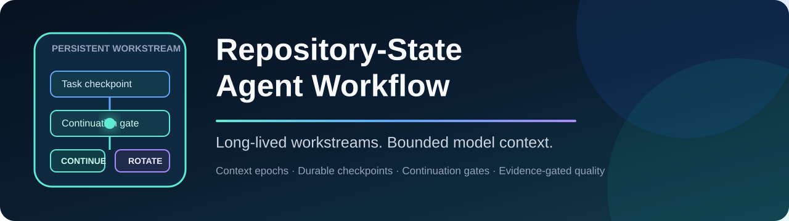
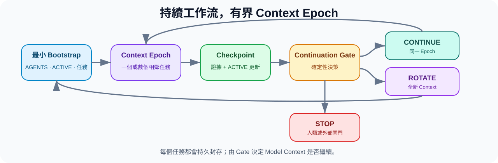

<p align="center">
  
</p>

<h1 align="center">Repository-State Agent Workflow</h1>

<p align="center">
  <strong>讓 Repository 記住專案，而不是要求 Agent 用聊天記錄記住專案。</strong>
</p>

<p align="center">
  一套 Markdown-first、工具無關的 Coding Agent 工作方法與小型 CLI。<br/>
  Continuity 存放在可版本控制的 Repository 檔案中，而不是隱藏且不斷膨脹的聊天歷史裡。
</p>

<p align="center">
  <a href="https://github.com/hanklin9188/repository-state-agent-workflow/actions/workflows/ci.yml"></a>
  <a href="LICENSE"></a>
  <a href="pyproject.toml"></a>
  
</p>

<p align="center">
  <a href="README.md">English</a> ·
  <a href="#什麼是-rsaw">什麼是 RSAW</a> ·
  <a href="#運作方式">運作方式</a> ·
  <a href="#快速開始">快速開始</a> ·
  <a href="#實測結果">實測結果</a> ·
  <a href="docs/company-adoption.md">公司導入</a>
</p>

---

## 什麼是 RSAW？

**RSAW（Repository-State Agent Workflow）** 是一種運行 Coding Agent（Claude Code、Cursor、Codex、aider 等任何工具）的方法：**讓 Git Repository 本身成為 Agent 的記憶**。

不再依賴一條無止盡的對話——那種慢慢塞滿過時程式碼片段、舊 log 和被遺忘決策的聊天——每個 RSAW Session 都會：

1. **從零開始**，只讀三個小的 Markdown 檔案（通常約 3K tokens，而不是 30K+）；
2. **只執行一個 Bounded Task**，只有該任務需要時才讀取額外檔案；
3. **依明確的 Evidence Gate 驗證結果**；
4. **把下一步狀態寫回 Repository**（`ACTIVE.md`），然後停止。

下一個 Session——無論是人或 Agent、今天或下個月、用任何工具——都從 Repository 接手，而不是從聊天記錄接手。

> **Repository State 是正式狀態；Conversation History 可以被丟棄。**

本專案包含三個部分：方法論（Markdown templates 與慣例）、一個小型 deterministic CLI（`rsaw`，用來驗證與量測設定），以及軟體、ML、資料與研究 Repository 的完整範例。

---

## 要解決的問題

長時間運行的 Agent 對話會變成「意外的 State Store」：過時的 source 快照、失敗嘗試、已完成任務、過期決策與重複的專案背景不斷累積，之後每次 model call 都得重新處理這些混合內容。這些 Context 是隱藏的、沒有版本控制的，也無法交接。

RSAW 把這種隱藏的 continuity 換成小而可稽核的 Repository Contract：

| 用聊天當記憶的問題 | RSAW 的做法 |
|---|---|
| Conversation 持續膨脹 | Fresh、Bounded Session |
| 目前狀態藏在聊天裡 | 可版本控制的 `ACTIVE.md` handoff |
| 每次都要廣泛預載專案 | 三檔 Bootstrap + Progressive Disclosure |
| 重複調查同樣的事情 | Durable Evidence + 明確的 Next Action |
| 為了省 Context 而減少驗證 | V0–V3 分級 Evidence Gate |
| Reviewer 被 Builder 歷史污染 | Fresh、Role-Separated 的 Review Session |

---

## 運作方式

每個 Session 從最小 Context 開始，只有 Active Task 需要證據時才擴充，驗證結果、寫回狀態，然後停止。

<p align="center">
  
</p>

### 三檔 Bootstrap

每個 Fresh Session 只讀這三份 Artifact，其他一律不預載：

| Artifact | 責任 | 更新頻率 |
|---|---|---|
| `AGENTS.md` | 穩定政策：安全、建置、驗證與導航規則 | 很少更新 |
| `ACTIVE.md` | 極小的當前 handoff：狀態、blocker、下一步、停止條件 | 每個重要邊界 |
| `docs/tasks/<task>.md` | 一個 bounded task 與其 acceptance criteria | 每張 task 一次 |

Git 歷史、ADR、測試、報告與 artifacts 仍是 durable evidence——但只有 Active Task 需要時才讀取（**Progressive Disclosure**）。

### Handoff 實際長什麼樣子

`ACTIVE.md` 刻意保持極小。一份真實的 handoff 讀起來像這樣：

```markdown
# Active Handoff

## Active Task
ID: T-042
Spec: docs/tasks/T-042-streaming-parser.md

## Current State
- Chunk boundary 處理已實作並通過單元測試。
- 多 frame 輸入的整合測試仍失敗。

## Blockers
無。

## Next Exact Action
修正 src/parser/stream.py 的 frame reassembly；重跑 tests/test_stream.py。

## Stop Condition
所有 parser 測試通過，且 ACTIVE.md 指向下一張 task。
```

任何 Fresh Session——用任何工具——都能在完全沒有聊天歷史的情況下接手繼續。

---

## 快速開始

### 1. 安裝

```bash
git clone https://github.com/hanklin9188/repository-state-agent-workflow.git
cd repository-state-agent-workflow
python -m pip install -e '.[dev]'
```

### 2. 套用到既有專案

```bash
rsaw init /path/to/your-project
cd /path/to/your-project
```

Initializer 是保守的：只建立缺少的 Workflow 檔案，除非明確使用 `--force`，否則絕不覆蓋既有專案狀態。

### 3. 驗證 Handoff 並量測 Footprint

```bash
rsaw verify .      # 驗證 ACTIVE.md 與 task references
rsaw footprint .   # 估算 Fresh-Session Bootstrap Context
```

### 4. 啟動 Fresh Agent Session

把這段貼進任何 Coding Agent：

```text
Work in this repository.

Read only:
1. AGENTS.md
2. ACTIVE.md
3. the active task spec referenced by ACTIVE.md

Execute exactly the active task using progressive disclosure.
Reuse verified repository evidence and do not repeat completed work.
Use targeted validation while iterating and closure validation only when stable.
When complete or blocked, update ACTIVE.md and stop.
```

也可以直接產生角色 Prompt：

```bash
rsaw prompt . --role builder
```

---

## 實測結果

### Desk Code Agent — V1 初步結果

Desk Code Agent 將原本要求 Fresh Session 廣泛預載專案的政策，改成 RSAW 三檔 Bootstrap（`AGENTS.md`、`ACTIVE.md` 與一份 active task spec）：

| 指標 | 舊 Workflow | RSAW V1 | 差異 |
|---|---:|---:|---:|
| Fresh-session bootstrap estimate（tokens） | 33,348 | **2,967** | **−30,381** |
| 相對下降 | — | — | **91.1%** |

<details>
<summary>Bootstrap 組成明細</summary>

| RSAW Bootstrap 組成 | Estimated tokens |
|---|---:|
| `AGENTS.md` | 1,639 |
| `ACTIVE.md` | 432 |
| Active task | 896 |
| **總計** | **2,967** |

`rsaw verify`：**PASS**

</details>

> **Claim boundary：**這筆結果標記為 `BOOTSTRAP_CONTEXT_ESTIMATE`。它不是 provider billing savings、cached-input savings、完整 task context reduction，也不是「工程品質提升 91.1%」的證據。

V2 closure 與 task-level continuity / quality measurements 仍在進行。可閱讀[完整 Case Study](docs/case-studies/desk-code-agent-rsaw-v1-bootstrap.md)、[Case Studies Index](docs/case-studies/README.md)或[機器可讀結果](data/case-studies/desk-code-agent-rsaw-v1.json)。

---

## Operating Model

### 五個核心原則

1. **Repository State 是正式狀態**——accepted decision、executable contract、task state 與 evidence 優先於舊聊天。
2. **一個 Session 對應一個主要任務**——任務完成、closure、重大 blocker、reviewer handoff 或 decision boundary 時就停止。
3. **Progressive Disclosure**——只有 Active Task 需要時，才讀精確的 source、test、ADR、report 或 log。
4. **Evidence-Gated Quality**——較小的 Context 永遠不能成為降低驗證強度的理由。
5. **Role Separation**——Builder、Reviewer、Decision Session 使用不同且 bounded 的 Context。

### Validation Tiers

| Tier | 時機 | 典型驗證 |
|---|---|---|
| `V0` | 修改迴圈 | Syntax、lint、單一 targeted test |
| `V1` | Task 穩定 | Task-specific suite、focused integration |
| `V2` | Task closure | Full relevant tests、package/result checks |
| `V3` | Critical / release | Fresh reviewer、Standards Review、Spec Review |

### Session Roles

| Role | 讀取內容 | 交付內容 |
|---|---|---|
| **Builder** | Policy、active state、task、精確依賴 | Implementation 與 focused evidence |
| **Reviewer** | Fresh context、spec、diff、tests、limitations | 獨立的 correctness / compliance review |
| **Decision** | Evidence checkpoint 與 governing constraints | Architecture 或 scientific decision |

Medium-reasoning 模型處理重大決策時採兩段式：先做 evidence decomposition，再做 decision synthesis。

---

## CLI

```bash
rsaw init .                            # 保守地加入 Workflow
rsaw verify .                          # 驗證 ACTIVE 與 task references
rsaw footprint .                       # 估算 Fresh Bootstrap Context
rsaw archive . --label T-042-complete  # 封存重要邊界
rsaw prompt . --role builder           # 產生 Builder Prompt
rsaw prompt . --role reviewer          # 產生 Fresh Reviewer Prompt
rsaw prompt . --role decision          # 產生 Decision Prompt
```

CLI 是 deterministic guardrail，不是 orchestration platform；Markdown 與 Git 才是 canonical state。

---

## 與其他做法的比較

| 做法 | 優點 | RSAW 補上的缺口 |
|---|---|---|
| 一條長 Conversation | 即時歷史豐富 | 隱藏、持續膨脹、容易 stale、難交接 |
| Conversation Summary | 精簡 | 可能有資訊損失，且無法獨立執行 |
| Vector / RAG Memory | Retrieval 彈性高 | Retrieval 品質與 staleness 成為隱藏依賴 |
| 只用 Issue Tracker | 規劃與責任清楚 | 通常缺少 Agent bootstrap、evidence pointer 與 stop contract |
| Agent Orchestration Framework | 自動化與平行化 | 可能成為另一個不透明的 state owner |
| **RSAW** | 明確、版本化、工具無關的 continuity | 需要有紀律地維護小型 Repository artifacts |

RSAW 可以與 issue tracker、retrieval system 與 orchestrator 共存，不要求取代它們。

---

## 導入方式

| 情境 | 建議作法 |
|---|---|
| 個人 Repository | 執行 `rsaw init`、調整三份核心 artifacts、把 verifier 加入 CI |
| 工程團隊 | 將 Issues / Linear / Jira 對應到 bounded task contract，保留既有 tracker |
| Research / ML Repository | 增加 frozen protocol、immutable evidence、明確授權與分離的 execution/review session |
| Monorepo | 使用穩定 root policy、scoped policy，以及每個獨立 workstream 一份 `ACTIVE.md` |

見 [Adoption Guide](docs/adoption-guide.md)、[Company Adoption and Governance](docs/company-adoption.md)與 [Migration Playbook](docs/migration-playbook.md)。

---

## 範例

每個範例都是獨立的迷你 Repository，各自帶有 `AGENTS.md`、`ACTIVE.md` 與 active task：

- [Software feature](examples/software-project/) — streaming parser implementation
- [ML experiment](examples/ml-experiment/) — frozen holdout execution
- [Data pipeline](examples/data-pipeline/) — dual-write migration
- [Research repository](examples/research-repo/) — bounded scientific ticket

---

## 評估與研究

RSAW 將「降低 Context」視為需要驗證的 hypothesis，而不是品質結果本身。可信的研究至少應量測：bootstrap 與 routine working-set context；provider 可提供時的 cached / uncached input；task completion 與 closure validation；repeated work 與 stale-state error；fresh-session handoff success；independent review finding 與 escaped defect；以及 elapsed time 與 human intervention。主要 experimental unit 通常應是 task 或 matched task stream，而不是單一 model call。

建議從 [Desk Code Agent V1 Case Study](docs/case-studies/desk-code-agent-rsaw-v1-bootstrap.md)、[Evaluation](docs/evaluation.md)、[Research Methodology](docs/research-methodology.md)與 [Case Study Template](docs/case-study-template.md)開始。示意性的 [Token Economics](docs/token-economics.md) 計算不是價格保證；單一 Repository 的結果也不能直接推廣到所有模型、Agent 或組織。

---

## 文件導航

| 開始導入 | 操作 Workflow | 評估與擴充 |
|---|---|---|
| [Concepts](docs/concepts.md) | [Session Lifecycle](docs/session-lifecycle.md) | [Case Studies Index](docs/case-studies/README.md) |
| [Architecture](docs/architecture.md) | [Progressive Disclosure](docs/progressive-disclosure.md) | [Evaluation](docs/evaluation.md) |
| [Adoption Guide](docs/adoption-guide.md) | [Validation Tiers](docs/validation-tiers.md) | [Research Methodology](docs/research-methodology.md) |
| [Company Adoption](docs/company-adoption.md) | [Agent Roles](docs/agent-roles.md) | [Token Economics](docs/token-economics.md) |
| [Migration Playbook](docs/migration-playbook.md) | [Long-Running Work](docs/long-running-work.md) | [Anti-Patterns](docs/anti-patterns.md) |
| | [Scientific & ML Workflows](docs/scientific-and-ml-workflows.md) | [FAQ](docs/faq.md) · [References](docs/references.md) |

---

## 目前狀態與 Non-goals

**Status：Alpha reference implementation。**方法、templates、examples、verifier、footprint estimator、archive helper 與 prompt renderer 已可使用；更廣泛的跨專案實證仍是後續工作。

RSAW 刻意**不是**：自主 Project Manager；特定模型廠商的 wrapper；GitHub Issues、Linear、Jira、retrieval 或 orchestration 的替代品；自動 conversation summarizer；私人聊天記錄資料庫；「每個 task 都能塞進單一 session」的宣稱；或降低測試與人工 review 的理由。

設計保持可檢視：Markdown、Git、deterministic checks 與 project-owned evidence。

---

## 貢獻、引用與授權

歡迎貢獻，特別是 measured adoption study、deterministic workflow check、monorepo example 與失敗案例。見 [CONTRIBUTING.md](CONTRIBUTING.md) 與 [Code of Conduct](CODE_OF_CONDUCT.md)。

研究使用請參考 [CITATION.cff](CITATION.cff)，並引用實際使用的 RSAW version 或 commit。

MIT License。見 [LICENSE](LICENSE)。
