<p align="center">
  
</p>

<h1 align="center">Repository-State Agent Workflow</h1>

<p align="center">
  <strong>讓 Repository 記住專案，而不是要求 Agent 用 Conversation 記住專案。</strong>
</p>

<p align="center">
  一套 Markdown-first、工具無關的 Coding Agent 工作方法與小型 CLI。<br/>
  將 continuity 從隱藏的聊天歷史搬進可版本控制的 Repository State。
</p>

<p align="center">
  <a href="README.md">English</a> ·
  <a href="#五分鐘快速開始">快速開始</a> ·
  <a href="#真實專案導入數據">導入數據</a> ·
  <a href="#運作方式">運作方式</a> ·
  <a href="docs/company-adoption.md">公司導入</a>
</p>

---

## 為什麼需要 RSAW

長時間 Coding Agent conversation 很容易變成意外的 state store：舊 source、舊 log、失敗嘗試、已完成任務、過時決策與重複背景持續累積，後續每次 model call 都要重新處理這些內容。

RSAW 將隱藏的 conversation continuity 改成小而可稽核的 repository contract：

| 問題 | RSAW 的做法 |
|---|---|
| Conversation 持續膨脹 | 使用 Fresh、Bounded Session |
| 目前狀態藏在聊天裡 | 使用可版本控制的 `ACTIVE.md` |
| 每次都廣泛預載專案 | 三檔 Bootstrap + Progressive Disclosure |
| Agent 重複調查 | Durable evidence + 明確 next action |
| 為了省 Context 而減少驗證 | 保留 V0–V3 Evidence Gate |
| Reviewer 被 Builder 歷史污染 | 使用 Fresh、Role-Separated Review |

> **Repository State 是正式狀態；Conversation History 可以被丟棄。**

---

## 真實專案導入數據

### Desk Code Agent — V1 初步結果

Desk Code Agent 將原本要求 Fresh Session 廣泛讀取專案全域資料的政策，改成 RSAW 三檔 Bootstrap：`AGENTS.md`、`ACTIVE.md` 與一份 active task spec。

| 指標 | 舊 Workflow | RSAW V1 | 差異 |
|---|---:|---:|---:|
| Fresh-session bootstrap estimate | 33,348 | **2,967** | **-30,381** |
| 相對下降 | — | — | **91.10%** |

| RSAW Bootstrap 組成 | Estimated tokens |
|---|---:|
| `AGENTS.md` | 1,639 |
| `ACTIVE.md` | 432 |
| Active task | 896 |
| **總計** | **2,967** |

`rsaw verify`：**PASS**

> **Claim boundary：**這筆結果標記為 `BOOTSTRAP_CONTEXT_ESTIMATE`。它不是 provider billing savings、cached-input savings、完整 task context reduction，也不是「工程品質提升 91.10%」的證據。

V2 closure 與 task-level continuity / quality measurements 仍在進行。可閱讀[完整 Case Study](docs/case-studies/desk-code-agent-rsaw-v1-bootstrap.md)、[Case Studies Index](docs/case-studies/README.md)或[機器可讀結果](data/case-studies/desk-code-agent-rsaw-v1.json)。

---

## 運作方式

每個 Session 從最小 Context 開始；只有 active task 需要時才擴充證據；完成驗證、寫回狀態，然後停止。

```mermaid
flowchart LR
    subgraph BOOT["01 · Bootstrap"]
        direction TB
        R["📦 Repository State<br/>Git · ADR · Tests · Evidence"]
        S["✨ Fresh Agent Session"]
        B["📖 最小 Context<br/>AGENTS.md · ACTIVE.md · Active Task"]
        R --> S --> B
    end

    subgraph WORK["02 · Bounded Work"]
        direction TB
        D{"需要更多 Context？"}
        X["🔎 只讀一份精確依賴"]
        E["🛠️ 執行一個 Bounded Task"]
        D -- "需要" --> X --> E
        D -- "不需要" --> E
    end

    subgraph VERIFY["03 · Validation"]
        direction TB
        V["🧪 Targeted Validation"]
        C["✅ Closure Validation"]
        V --> C
    end

    subgraph HANDOFF["04 · Handoff"]
        direction TB
        H["📝 更新 ACTIVE.md"]
        T["⏹ Stop"]
        N["🔄 下一個 Fresh Session"]
        H --> T --> N
    end

    B --> D
    E --> V
    C --> H
    N -. "Continuity 留在 Git" .-> R

    classDef source fill:#0f172a,stroke:#38bdf8,color:#f8fafc,stroke-width:2px;
    classDef session fill:#ecfeff,stroke:#0891b2,color:#164e63,stroke-width:1.5px;
    classDef decision fill:#fff7ed,stroke:#f97316,color:#7c2d12,stroke-width:1.5px;
    classDef work fill:#f5f3ff,stroke:#8b5cf6,color:#4c1d95,stroke-width:1.5px;
    classDef verify fill:#f0fdf4,stroke:#22c55e,color:#14532d,stroke-width:1.5px;
    classDef handoff fill:#fdf2f8,stroke:#ec4899,color:#831843,stroke-width:1.5px;
    classDef stop fill:#f8fafc,stroke:#64748b,color:#0f172a,stroke-width:1.5px;

    class R source;
    class S,B,N session;
    class D decision;
    class X,E work;
    class V,C verify;
    class H handoff;
    class T stop;
```



### 三檔 Bootstrap

| Artifact | 責任 | 更新頻率 |
|---|---|---|
| `AGENTS.md` | 穩定政策、安全、建置、驗證與導航 | 低 |
| `ACTIVE.md` | 極小工作記憶：狀態、blocker、下一步、停止條件 | 每個重要邊界 |
| `docs/tasks/<task>.md` | 一個 bounded task 與其 acceptance criteria | 每張 task |

Git、ADR、測試、報告與 artifacts 仍是 durable evidence，但只有 active task 需要時才讀取。

---

## 五分鐘快速開始

### 1. 安裝

```bash
git clone https://github.com/hanklin9188/repository-state-agent-workflow.git
cd repository-state-agent-workflow
python -m pip install -e '.[dev]'
```

### 2. 套用到既有專案

```bash
rsaw init /path/to/your-project
cd /path/to/your-project
```

Initializer 預設只建立缺少的檔案，不會覆蓋既有專案狀態；只有明確使用 `--force` 才會覆蓋。

### 3. 驗證 Handoff 與 Context Footprint

```bash
rsaw verify .
rsaw footprint .
```

### 4. 啟動 Fresh Agent Session

```text
Work in this repository.

Read only:
1. AGENTS.md
2. ACTIVE.md
3. the active task spec referenced by ACTIVE.md

Execute exactly the active task using progressive disclosure.
Reuse verified repository evidence and do not repeat completed work.
Use targeted validation while iterating and closure validation only when stable.
When complete or blocked, update ACTIVE.md and stop.
```

也可直接產生角色 Prompt：

```bash
rsaw prompt . --role builder
```

---

## Operating Model

### 五個核心原則

1. **Repository State 是正式狀態**：accepted decision、executable contract、active task 與 evidence 優先於舊聊天。
2. **一個主要任務對應一個 Session**：任務完成、closure、重大 blocker、review handoff 或 decision boundary 就停止。
3. **Progressive Disclosure**：只有 active task 需要時，才讀精確 source、test、ADR、report 或 log。
4. **Evidence-Gated Quality**：較小 Context 不能成為降低驗證強度的理由。
5. **Role Separation**：Builder、Reviewer、Decision Session 使用不同且 bounded 的 Context。

### Validation Tiers

| Tier | 時機 | 典型驗證 |
|---|---|---|
| `V0` | 修改迴圈 | Syntax、lint、單一 targeted test |
| `V1` | Task 穩定 | Task-specific suite、focused integration |
| `V2` | Task closure | Full relevant tests、package/result checks |
| `V3` | Critical / release | Fresh reviewer、Standards Review、Spec Review |

### Session Roles

| Role | 讀取內容 | 交付內容 |
|---|---|---|
| **Builder** | Policy、active state、task、精確依賴 | Implementation 與 focused evidence |
| **Reviewer** | Fresh context、spec、diff、tests、limitations | 獨立 correctness / compliance review |
| **Decision** | Evidence checkpoint 與 governing constraints | Architecture 或 scientific decision |

Medium reasoning 處理重大決策時，先做 evidence decomposition，再做 decision synthesis。

---

## CLI

```bash
rsaw init .                            # 保守加入 Workflow
rsaw verify .                          # 驗證 ACTIVE 與 task references
rsaw footprint .                       # 估算 Fresh Bootstrap Context
rsaw archive . --label T-042-complete # 封存重要邊界
rsaw prompt . --role builder           # 產生 Builder Prompt
rsaw prompt . --role reviewer          # 產生 Fresh Reviewer Prompt
rsaw prompt . --role decision          # 產生 Decision Prompt
```

CLI 是 deterministic guardrail，不是大型 orchestration platform；Markdown 與 Git 才是 canonical state。

---

## 導入方式

| 情境 | 建議作法 |
|---|---|
| 個人 Repository | 執行 `rsaw init`、調整三份核心 artifacts、把 verifier 加入 CI |
| 工程團隊 | 將 Issues / Linear / Jira 對應到 bounded task contract，保留既有 tracker |
| Research / ML Repository | 增加 frozen protocol、immutable evidence、授權邊界與分離的 execution/review session |
| Monorepo | 使用穩定 root policy、scoped policy，以及每個獨立 workstream 一份 `ACTIVE.md` |

見 [Adoption Guide](docs/adoption-guide.md)、[Company Adoption and Governance](docs/company-adoption.md)與[Migration Playbook](docs/migration-playbook.md)。

---

## 評估與研究

RSAW 將「降低 Context」視為需要驗證的 hypothesis，而不是品質結果。可信的研究至少應量測：

- Bootstrap 與 routine working-set context；
- provider 可提供時的 cached / uncached input；
- task completion 與 closure validation；
- repeated work 與 stale-state error；
- fresh-session handoff success；
- independent review finding 與 escaped defect；
- elapsed time 與 human intervention。

主要 experimental unit 通常應是 task 或 matched task stream，而不是單一 model call。

建議從以下文件開始：

- [Desk Code Agent V1 Case Study](docs/case-studies/desk-code-agent-rsaw-v1-bootstrap.md)
- [Case Studies Index](docs/case-studies/README.md)
- [Evaluation](docs/evaluation.md)
- [Research Methodology](docs/research-methodology.md)
- [Case Study Template](docs/case-study-template.md)
- [Token Economics](docs/token-economics.md)

示意性的 token-economics 計算不是價格保證；單一 Repository 的結果也不能直接推廣到所有模型、Agent 或公司。

---

## 與其他做法的差異

| 做法 | 優點 | RSAW 關注的缺口 |
|---|---|---|
| 長 Conversation | 即時歷史完整 | Hidden、持續膨脹、容易 stale、難交接 |
| Conversation Summary | 精簡 | 可能有資訊損失，且不一定可獨立驗證 |
| Vector / RAG Memory | Retrieval 彈性高 | Retrieval quality 與 staleness 成為隱藏依賴 |
| Issue Tracker | 規劃與責任清楚 | 通常缺少 Agent bootstrap、evidence pointer 與 stop contract |
| Agent Orchestrator | 自動化與平行化 | 可能成為另一個不透明 state owner |
| **RSAW** | 明確、版本化、工具無關的 continuity | 需要維持小而準確的 Repository artifacts |

RSAW 可以與 tracker、retrieval system 與 orchestrator 共存，不要求取代它們。

---

## 範例

- [Software feature](examples/software-project/) — streaming parser implementation
- [ML experiment](examples/ml-experiment/) — frozen holdout execution
- [Data pipeline](examples/data-pipeline/) — dual-write migration
- [Research repository](examples/research-repo/) — bounded scientific ticket

每個範例都有自己的 `AGENTS.md`、`ACTIVE.md` 與 active task。

---

## 文件導航

### 開始導入

- [Concepts](docs/concepts.md)
- [Architecture](docs/architecture.md)
- [Adoption Guide](docs/adoption-guide.md)
- [Company Adoption and Governance](docs/company-adoption.md)
- [Migration Playbook](docs/migration-playbook.md)

### 操作 Workflow

- [Session Lifecycle](docs/session-lifecycle.md)
- [Progressive Disclosure](docs/progressive-disclosure.md)
- [Validation Tiers](docs/validation-tiers.md)
- [Agent Roles](docs/agent-roles.md)
- [Long-Running Work](docs/long-running-work.md)
- [Scientific and ML Workflows](docs/scientific-and-ml-workflows.md)

### 評估與擴充

- [Desk Code Agent V1 Case Study](docs/case-studies/desk-code-agent-rsaw-v1-bootstrap.md)
- [Case Studies Index](docs/case-studies/README.md)
- [Evaluation](docs/evaluation.md)
- [Research Methodology](docs/research-methodology.md)
- [Token Economics](docs/token-economics.md)
- [Case Study Template](docs/case-study-template.md)
- [Anti-Patterns](docs/anti-patterns.md)
- [FAQ](docs/faq.md)
- [References](docs/references.md)

---

## 目前狀態與 Non-goals

**Status：Alpha reference implementation。**方法、templates、examples、verifier、footprint estimator、archive helper 與 prompt renderer 已可使用；更廣泛的跨專案實證仍是後續工作。

RSAW 刻意不是：

- 自主 Project Manager；
- 特定模型廠商 Wrapper；
- GitHub Issues、Linear、Jira、retrieval 或 orchestration 的替代品；
- 自動 Conversation Summarizer；
- 私人聊天記錄資料庫；
- 宣稱每個 Task 都能塞進單一 Session；
- 降低測試或人工 Review 的理由。

設計保持可檢視：Markdown、Git、deterministic checks 與 project-owned evidence。

---

## 貢獻、引用與授權

歡迎提交 measured adoption study、deterministic workflow check、monorepo example 與失敗案例。見 [CONTRIBUTING.md](CONTRIBUTING.md) 與 [Code of Conduct](CODE_OF_CONDUCT.md)。

研究使用請參考 [CITATION.cff](CITATION.cff)，並引用實際使用的 RSAW version 或 commit。

MIT License。見 [LICENSE](LICENSE)。
