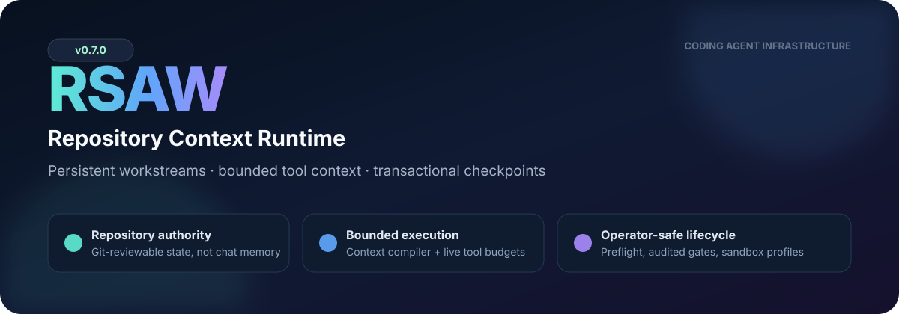
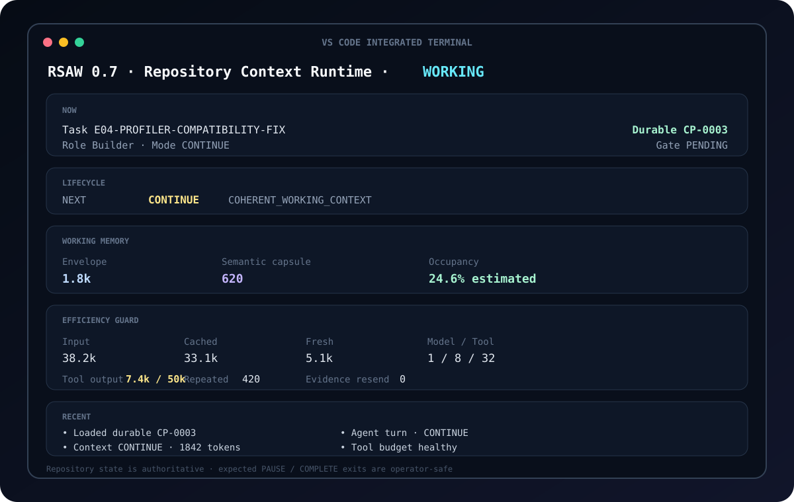
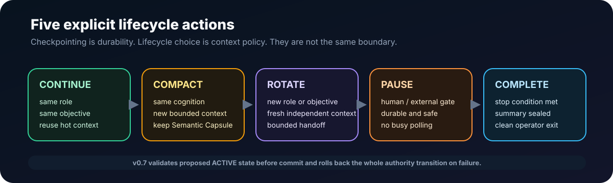

<p align="center">
  
</p>

<h1 align="center">Repository-State Agent Workflow</h1>

<p align="center">
  <strong>把專案真相留在 repository，只給 Agent 當下真正需要的 context，並以 transaction 安全封存每個 checkpoint。</strong>
</p>

<p align="center">
  
  
  
  
</p>

<p align="center">
  <a href="README.md">English</a> ·
  <a href="docs/edgeflow-v071-deployment.md">EdgeFlow 部署</a> ·
  <a href="docs/releases/v071-gpu-sandbox-boundary.md">v0.7 強化規格</a> ·
  <a href="CHANGELOG.md">Changelog</a>
</p>

---

## RSAW 是什麼？

RSAW 是一套為長時間 coding / research agent 設計的 **repository-backed runtime**。

它不打算取代 Codex，也不重做聊天介面。Codex 仍然負責真正的語意工程工作；RSAW 負責那些應由確定性程式管理的外層 runtime：

- 持久專案狀態與 checksummed checkpoints；
- 最小化 context 編譯；
- evidence 與 validation 綁定；
- `CONTINUE / COMPACT / ROTATE / PAUSE / COMPLETE`；
- Human Gate 與 sandbox 控制；
- 即時 tool/context budget；
- 中斷與失敗 transition 復原。

最核心的原則是：

> **模型可以忘記；repository 不可以。**

---

## 60 秒開始使用

### 安裝

```bash
python -m pip install --upgrade \
  "git+https://github.com/hanklin9188/repository-state-agent-workflow.git@v0.7.1"
```

### 已經使用 RSAW 的 repository

```bash
rsaw upgrade . --apply
rsaw preflight .
rsaw start .
```

### 新 repository

```bash
rsaw init .
rsaw preflight .
rsaw start .
```

平常只需要記住：

```bash
rsaw start .
```

它會自動完成 preflight、解析 Codex binary、套用目前 task 的 sandbox profile，然後啟動 Live Runtime Console。

---

## 使用者看到的是什麼？

<p align="center">
  
</p>

Terminal 顯示的是可觀測 runtime state，不是 hidden reasoning：

| 區域 | 回答的問題 |
|---|---|
| **NOW** | 現在是哪個 task、role、mode、durable checkpoint？ |
| **LIFECYCLE** | 下一步是 CONTINUE、COMPACT、ROTATE、PAUSE 還是 COMPLETE？ |
| **WORKING MEMORY** | Context Envelope 與 Semantic Capsule 多大？ |
| **EFFICIENCY GUARD** | provider input 與 tool output 是否正在失控增長？ |
| **RECENT** | 最近發生了哪些 durable runtime events？ |

新的 terminal 會直接載入 repository 裡已存在的 checkpoint，不會再明明有 `CP-0003` 卻顯示 `Checkpoint 0`。正常的 `PAUSED`、`COMPLETE`、`LIMIT_REACHED` 與 `DRY_RUN`，不論 TUI 或非 TUI operator 模式都會以 shell exit 0 結束；需要內部語意碼的自動化流程才使用 `--strict-exit-codes`。

---

## 為什麼需要 v0.7？

v0.7 不是憑空想出來的 feature list，而是把真實 EdgeFlow 上機時暴露的問題提升成永久 regression gates。

| 實際發生的問題 | v0.7 的處理方式 |
|---|---|
| 舊的 `~/.local/bin/rsaw` 蓋過 Conda 版本 | `preflight` 檢查 launcher / Python mismatch，並保留 module fallback |
| Human Gate、status 與 continuation 相互矛盾 | gate 操作改成 atomic、role-aware、verified、audited |
| 模型提供的 source path 被當成未知 evidence ID | evidence authority 明確改由 Supervisor 擁有 |
| Codex 回傳 `task_id`，parser 只接受 `id` | 同時支援 camelCase 與 snake_case task references |
| 新 TUI 永遠從 checkpoint 0 開始 | 啟動時讀取 repository-global durable checkpoint |
| ACTIVE 每次更新都增加空白行，最後超過 140 行 | canonical renderer 在 commit 前先驗證，重複更新保持 idempotent |
| checkpoint 已寫入，post-verify 才失敗 | 整個 authority transition 改成 transaction，失敗時完整 rollback |
| GPU task 每次都要重打 `danger-full-access` | sandbox profile 可依 task ID 持久設定 |
| 1–2k envelope 最後仍膨脹成巨大 provider context | 加入 live per-turn tool/output budget，阻止失控 rediscovery |
| started/completed events 重複計數 | 依 tool identity 去重 telemetry |

完整規格見：[v0.7 EdgeFlow-derived hardening](docs/releases/v071-gpu-sandbox-boundary.md)。

---

## 架構

<p align="center">
  
</p>

```text
Repository Authority
        ↓
Context Compiler
        ↓
Replaceable Agent Worker
        ↓
Typed CheckpointResult
        ↓
Deterministic Gate
        ↓
Transactional Commit
        ↓
Token / Tool Governor
        ↓
CONTINUE · COMPACT · ROTATE · PAUSE · COMPLETE
```

### 模型只做語意工作

Agent 讀取編譯後的 task context、修改程式、執行 validation，最後只回傳一個 typed `rsaw.checkpoint-result.v1`。

### Supervisor 管確定性工作

RSAW 會核對真實 diff、validation commands、artifacts、allowed-write scope、evidence、next task 與 lifecycle transition。模型不再自行修改 `ACTIVE.md`，也不再執行 advance script。

### State advancement 是 transaction

在接受 checkpoint 前，RSAW 會：

1. 先 render 並驗證 proposed `ACTIVE.md`；
2. snapshot 所有 authority files；
3. 寫入 capsule、checkpoint、checksum、review manifest 與 active pointer；
4. 再次驗證 repository；
5. 任一 invariant 失敗就完整 rollback。

失敗的 transition 不應留下半套 durable state。

---

## 五種 lifecycle

<p align="center">
  
</p>

| Action | 意義 |
|---|---|
| `CONTINUE` | 相同 role、相同 objective，保留目前 coherent context。 |
| `COMPACT` | 保留 semantic working memory，但換成新的 bounded context。 |
| `ROTATE` | role 或 objective 邊界需要認知獨立時，建立 fresh context。 |
| `PAUSE` | 持久保存真正的人類、外部、權限或安全 gate。 |
| `COMPLETE` | durable stop condition 真正滿足後才結束。 |

```text
Checkpoint = durability boundary
Context epoch = cognitive boundary
```

Checkpoint 並不等於一定要重開 context。

---

## Bounded working context

RSAW 同時控制兩種 context 成長來源。

### 1. Context Compiler

Context Envelope 只包含：

- stable governance；
- exact task contract；
- bounded Semantic Capsule；
- current delta；
- 必要的 exact evidence；
- 其他大型歷史內容只保留 reference。

預設 target 6k tokens，hard ceiling 12k。

### 2. Live tool budget

只有小 prompt 還不夠。Agent 仍可能自己全 repo 搜尋、一次讀很多檔案、把巨大 log 塞回 context。

v0.7 預設每一個 turn 使用：

```json
{
  "maxToolCallsPerTurn": 32,
  "maxToolOutputTokens": 50000,
  "maxSingleToolOutputTokens": 20000,
  "maxBroadDiscoveryCommands": 2,
  "enforce": true
}
```

超過限制時，RSAW 會要求 worker 停止，並以明確的 `TOOL_BUDGET_EXCEEDED:*` 進入 durable `PAUSED`。Budget 每個 agent turn 都會重新計算，不會跨 checkpoint 誤累積。

這些是工程 guardrails，不是所有專案都一定最優的 universal thresholds。

---

## 日常常用命令

| 目的 | Command |
|---|---|
| 正常開始工作 | `rsaw start .` |
| 不啟動 Agent，先完整檢查 | `rsaw preflight .` |
| 看 active state | `rsaw status .` |
| 看 token/runtime metrics | `rsaw report .` |
| 看下一個 context | `rsaw compile . --mode FRESH` |
| 正規化 ACTIVE 格式 | `rsaw state normalize .` |
| 預覽 Terminal UI | `rsaw preview .` |

所有命令都會出現在：

```bash
rsaw --help
python -m repo_state_agent --help
```

---

## 不再手動改 Human Gate

查看：

```bash
rsaw gate show . --json
```

外部 prerequisite 已真正恢復後再解除：

```bash
rsaw gate clear . \
  --reason "external prerequisite restored and verified" \
  --yes
```

RSAW 會建立 operator-action artifact、驗證新狀態，並根據 role boundary 自動選擇：

- 相同 role → `CONTINUE_ALLOWED`；
- role 改變 → `ROTATE_REQUIRED`。

若新 state 無效，原本的 `ACTIVE.md` 會被恢復。

---

## Task-specific sandbox profile

預設仍是 `workspace-write`。

確實需要 GPU/NVML 的受審查 task，可以設定：

```bash
rsaw sandbox set . \
  --task current \
  --mode danger-full-access \
  --reason "reviewed GPU/NVML boundary" \
  --yes

rsaw preflight .
rsaw start .
```

查看或移除：

```bash
rsaw sandbox show . --json
rsaw sandbox clear . --task current --reason "boundary closed" --yes
```

設定會綁定 task ID，且每個 Codex turn 前都重新解析。Sandbox class 改變時會強制建立 fresh context boundary，因此較寬鬆的 Runner 權限不會默默延續到下一個 Analyst 或 Builder。Set／clear 都必須提供 reason、建立 content-bound operator audit；audit 寫入失敗時設定會 rollback。 顯式 `--sandbox` 也只綁定 run 啟動時的 active task；進入下一個 task 後，會回到該 task 自己的 override 或 repository default。

---

## Host 能力不等於 worker sandbox 能力

`workspace-write` 裡看不到 GPU/NVML，不代表 WSL、driver 或主機 GPU 一定故障。必須分開驗證：

```text
host visibility  ≠  Codex worker-sandbox visibility
```

Capability smoke 只屬於 workflow infrastructure evidence，不能授權正式 retry、取代或消耗 experiment nonce、修改 sealed evidence，也不能成為科學結果。完整事故邊界見：[EdgeFlow GPU sandbox incident](docs/incidents/2026-08-15-edgeflow-gpu-sandbox.md)。

---

## Repository memory model

| 層級 | 內容 |
|---|---|
| **Cold** | Git history、task contracts、checksummed checkpoints、evidence handles |
| **Warm** | Semantic Capsule：facts、decisions、exclusions、risks、validation、next action |
| **Hot** | 一個 coherent epoch 的 model context 與 tool results |

真正 authority 在 repository；TUI、conversation 與模型記憶都不是最終真相。

---

## 安裝與升級

### 安裝正式版本

```bash
python -m pip install --upgrade \
  "git+https://github.com/hanklin9188/repository-state-agent-workflow.git@v0.7.1"
```

### 升級現有 repository

```bash
rsaw upgrade . --json
rsaw upgrade . --apply
rsaw state normalize .
rsaw preflight .
rsaw start .
```

Migration 會保留 `ACTIVE.md`，並建立 v0.6 config backup。完整的 process/lock、安全 gate、GPU sandbox、驗證與 rollback 流程見：[EdgeFlow v0.7 部署指南](docs/edgeflow-v071-deployment.md)。

---

## 安全邊界

RSAW 不會因為加了 Supervisor，就讓原本不安全的任務自動變安全。

- Human Gate 未解除前仍具 authority。
- one-shot experiment 不會因 checkpoint 失敗而可以重跑。
- `danger-full-access` 必須 task-scoped 且有獨立理由。
- failed / invalid / diagnostic artifacts 不能升格成 formal evidence。
- token 變少不能交換 semantic success regression。
- UI 只負責顯示，不擁有 lifecycle state。

---

## Evidence 與 claim boundary

v0.7 已驗證的範圍是：implementation behavior、transactional state safety、migration、packaging、operator controls、tool-budget enforcement 與 synthetic lifecycle coverage。

目前**不宣稱**對所有專案都能保證降低 provider tokens、wall time 或 failure rate。這些仍需 matched prospective evaluation。

正式應衡量：

```text
successful checkpoints
success rate
total / cached / fresh input per success
model and tool calls per success
tool-output and repeated-input traffic
compactions and rotations
manual relay and true human gates
wall time per success
recovery rediscovery commands
```

---

## 文件

- [EdgeFlow v0.7 部署](docs/edgeflow-v071-deployment.md)
- [v0.7 release hardening](docs/releases/v071-gpu-sandbox-boundary.md)
- [Architecture](docs/architecture.md)
- [Concepts](docs/concepts.md)
- [Adoption guide](docs/adoption-guide.md)
- [Codex adapter](docs/codex-adapter.md)
- [Anti-patterns](docs/anti-patterns.md)
- [Evaluation methodology](docs/context-epoch-evaluation.md)
- [Changelog](CHANGELOG.md)
- [Roadmap](ROADMAP.md)

---

## 開發驗證

```bash
python -m pip install -e '.[dev]'
ruff format --check .
ruff check .
pytest -q
rsaw verify .
rsaw compile . --mode FRESH --json
rsaw acceptance . --horizon all --json
python scripts/check_markdown_links.py .
python -m build
```

CI 驗證 Python 3.10、3.12、3.13，以及 clean isolated wheel installation。

## License

MIT
