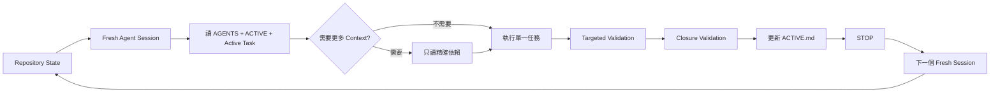

<p align="center">
  
</p>

<h1 align="center">Repository-State Agent Workflow</h1>

<p align="center">
  <strong>讓 Repository 記住專案，而不是要求 Agent 用 Conversation 記住專案。</strong>
</p>

<p align="center">
  一套 Markdown-first、工具無關的 Coding Agent 工作方法與小型 CLI，
  將長期狀態搬進 Git Repository，讓 Agent 可以使用較小 Context、Fresh Session、
  Progressive Disclosure 與 Evidence-Gated Validation 維持高品質開發。
</p>

<p align="center">
  <a href="README.md">English</a> ·
  <a href="#五分鐘快速開始">快速開始</a> ·
  <a href="docs/company-adoption.md">公司導入</a> ·
  <a href="docs/research-methodology.md">研究方法</a>
</p>

---

## 一分鐘理解核心概念

傳統長 Conversation 會逐漸累積舊 source、舊 log、失敗嘗試、完成的 ticket、過時決策與重複專案背景。這些內容會持續出現在後續模型呼叫中，增加 token、降低 signal-to-noise，也提高 Agent 誤用 stale state 的風險。

RSAW 將 continuity 拆成可版本控制的 Repository artifacts：

| Artifact | 責任 | 更新頻率 |
|---|---|---|
| `AGENTS.md` | 穩定規則、建置、測試、安全與工作慣例 | 低 |
| `ACTIVE.md` | 極小工作記憶：現在在哪、下一步做什麼 | 每個重要邊界 |
| `docs/tasks/<task>.md` | 單一 bounded task 的執行契約 | 每張 task |
| Git、ADR、測試、報告、artifact | 已發生的決策與證據 | 證據改變時 |

Fresh Agent 只讀最少資訊，完成一張任務、驗證、更新 `ACTIVE.md`，然後停止。



## 對公司與團隊的價值

- **可稽核交接**：目前狀態在 Git 裡，不藏在某位工程師或某個模型的聊天紀錄。
- **Agent 可替換**：Codex、Claude Code、Cursor 或內部 Agent 可以讀同一套 Repository contract。
- **限制變更範圍**：一個主要任務對應一個 session，降低 scope creep。
- **更乾淨的 Review**：Reviewer 讀 spec、diff、tests 與 evidence，不需要 Builder 的長 debugging transcript。
- **操作狀態明確**：長任務、blocker、stop condition 與 next action 都有明確紀錄。
- **降低資料暴露**：不需要預載整個歷史文件、客戶 log 或完整專案內容。

完整說明見 [公司導入與治理](docs/company-adoption.md)。

## 對專業研究的價值

RSAW 也可以作為 Coding Agent state management 的研究框架。它不先宣稱一定節省 token 或提升品質，而是提供可測量的假設與評估流程：

1. Repository-backed state 是否降低 repeated context traffic？
2. Fresh session 是否仍能正確延續任務？
3. 是否降低重複調查與 stale-state error？
4. Builder / Reviewer 分離是否維持工程品質？
5. 哪些 task 類型最受益，哪些情況反而增加負擔？

見 [研究方法](docs/research-methodology.md) 與 [Case Study Template](docs/case-study-template.md)。

---

## 五分鐘快速開始

### 安裝

```bash
git clone https://github.com/hanklin9188/repository-state-agent-workflow.git
cd repository-state-agent-workflow
python -m pip install -e '.[dev]'
```

### 套用到既有專案

```bash
rsaw init /path/to/your-project
cd /path/to/your-project
rsaw verify .
rsaw footprint .
```

Initializer 預設不會覆蓋既有檔案；只有明確使用 `--force` 才會覆蓋。

### 日常 Agent Prompt

```text
Work in this repository.

Read only:
1. AGENTS.md
2. ACTIVE.md
3. the active task spec referenced by ACTIVE.md

Execute exactly the active task using progressive disclosure.
Reuse verified repository evidence and do not repeat completed work.
Use targeted validation while iterating and closure validation only when stable.
When complete or blocked, update ACTIVE.md and stop.
```

也可直接產生角色 Prompt：

```bash
rsaw prompt . --role builder
rsaw prompt . --role reviewer
rsaw prompt . --role decision
```

---

## 五個核心原則

### 1. Repository State 是正式狀態

```text
Repository state > Conversation history
```

聊天內容與 accepted decision、executable contract、task spec 或 current handoff 衝突時，以 Repository 為準。

### 2. 一個主要任務約等於一個 Session

任務完成、驗證完成、遇到重大 blocker、只剩 long-running wait、需要 Reviewer 或進入 decision boundary 時，就更新 `ACTIVE.md` 並停止。

### 3. Progressive Disclosure

Fresh session 預設只讀三份文件。只有 active task 需要時才讀 source、test、ADR、report 或 log。

### 4. Evidence-Gated Quality

少 Context 不代表少驗證：

| Tier | 時機 | 驗證 |
|---|---|---|
| `V0` | 修改迴圈 | syntax、lint、單一 targeted test |
| `V1` | Task 穩定 | task-specific suite、focused integration |
| `V2` | Task closure | full relevant tests、package/result checks |
| `V3` | Critical/release | fresh reviewer、Standards review、Spec review |

### 5. Builder / Reviewer / Decision 分離

- **Builder**：實作與 focused evidence。
- **Reviewer**：Fresh session 讀 spec、diff 與 tests。
- **Decision**：處理 architecture 或 scientific fork。

Medium reasoning 遇到重大決策時，使用兩階段：先做 evidence decomposition，再做 decision synthesis。

---

## CLI

```bash
rsaw init .                            # 初始化 workflow
rsaw verify .                          # 驗證 ACTIVE 與引用
rsaw footprint .                       # 估算 bootstrap context
rsaw archive . --label T-042-complete # 封存重要 handoff
rsaw prompt . --role builder           # 產生角色 Prompt
```

CLI 只是 guardrail，不是新的大型 orchestration framework。Markdown 與 Git 才是 canonical state。

---

## Token 與 Context 經濟

真正的節省不是只少讀幾個檔案，而是縮短 obsolete context 在後續 model calls 中存在的時間。

概念計算，不是價格保證：

```text
長 Session 平均 Context：180K tokens/call
Bounded Task 平均 Context：25K tokens/call
Calls：30

長 Session Context Traffic：5.40M tokens
Bounded Task Context Traffic：0.75M tokens
概念下降：約 86.1%
```

實際費用仍取決於模型價格、cache、tool output、retry 與任務類型。更重要的指標還包括 task continuity、stale-state error、重複工作與 review 品質。

---

## 適用情境

- 大型 side project
- 公司產品與 SaaS feature
- Monorepo 與大型 refactor
- ML experiment
- Data pipeline
- Research repository
- Benchmark / release engineering
- 長時間 CI、training 或 cloud job

範例：

- [Software feature](examples/software-project/)
- [ML experiment](examples/ml-experiment/)
- [Data pipeline](examples/data-pipeline/)
- [Research repository](examples/research-repo/)

---

## 與其他做法的差異

| 做法 | 優點 | RSAW 關注的缺口 |
|---|---|---|
| 長 Conversation | 即時歷史完整 | Context 持續膨脹、難交接、容易 stale |
| Conversation Summary | 精簡 | 可能有資訊損失，且不一定可執行驗證 |
| Vector/RAG Memory | 彈性 retrieval | retrieval 與 staleness 變成隱藏依賴 |
| Issue Tracker | 規劃與責任清楚 | 通常缺少 Agent bootstrap、evidence pointer、stop contract |
| Agent Orchestrator | 自動化與平行化 | 可能成為另一個不透明狀態來源 |
| **RSAW** | 明確、版本化、工具無關 | 需要團隊維持小而準確的 Repository artifacts |

RSAW 可以與 Issue Tracker、RAG、Agent Orchestrator 共存，不要求取代它們。

---

## 目前狀態

**Alpha reference implementation**。方法、templates、examples、verifier、context footprint estimator、archive helper 與 prompt renderer 已可使用；跨專案的大規模實證仍是後續研究與 adoption 工作。

它不是：

- 自主 Project Manager；
- 特定 Agent 廠商 wrapper；
- GitHub Issues / Linear / Jira 的替代品；
- 自動 Conversation Summarizer；
- 私人聊天記錄資料庫；
- 降低測試與人工 Review 的理由。

---

## 文件

- [Concepts](docs/concepts.md)
- [Architecture](docs/architecture.md)
- [Adoption Guide](docs/adoption-guide.md)
- [Company Adoption](docs/company-adoption.md)
- [Research Methodology](docs/research-methodology.md)
- [Session Lifecycle](docs/session-lifecycle.md)
- [Progressive Disclosure](docs/progressive-disclosure.md)
- [Validation Tiers](docs/validation-tiers.md)
- [Agent Roles](docs/agent-roles.md)
- [Token Economics](docs/token-economics.md)
- [Evaluation](docs/evaluation.md)
- [Migration Playbook](docs/migration-playbook.md)
- [FAQ](docs/faq.md)

## 貢獻與授權

歡迎提交 adoption case study、monorepo 範例、deterministic checks 與失敗案例。見 [CONTRIBUTING.md](CONTRIBUTING.md) 與 [Code of Conduct](CODE_OF_CONDUCT.md)。

MIT License。見 [LICENSE](LICENSE)。
