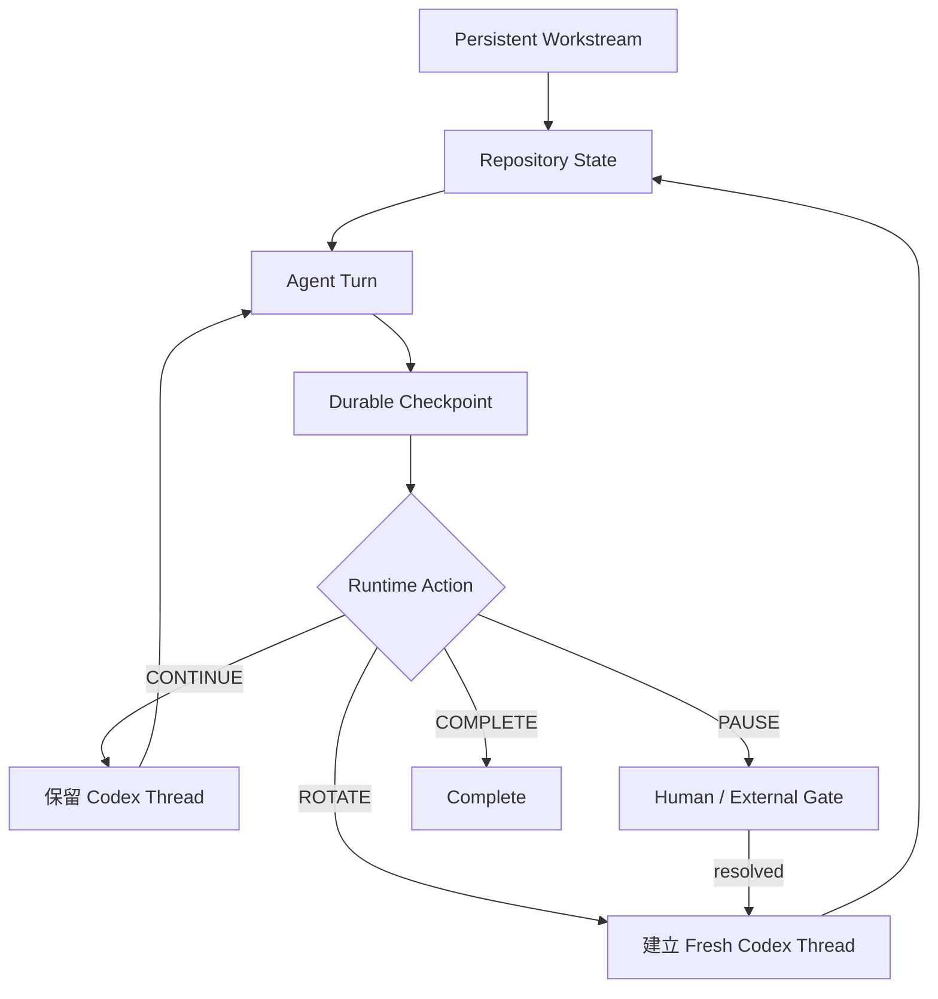

<p align="center">
  
</p>

<h1 align="center">Repository-State Agent Workflow</h1>

<p align="center"><strong>讓 Workstream 持續運作，讓 Context 在需要時自動更換。</strong></p>

<p align="center">
  以 Repository 保存長期狀態，以有界 Context Epoch 執行工作，並由 Runtime
  Supervisor 自動延續或更換 Codex Context。
</p>

<p align="center">
  <a href="README.md">English</a> ·
  <a href="#兩分鐘開始">兩分鐘開始</a> ·
  <a href="#runtime-狀態機">狀態機</a> ·
  <a href="#品質與安全">品質與安全</a> ·
  <a href="#目前證據">目前證據</a>
</p>

---

## RSAW 是什麼？

**RSAW** 是一套 Repository-first 的 Agent 工作方式與小型 Runtime。

Repository 保存可版本控制的專案記憶；Model Context 只是可以替換的短期工作記憶。

0.3 版補上 v2 最後缺少的一層：**自動執行 Context Rotation**。

- **CONTINUE**：下一個高度相關 Task 沿用同一個 Codex Thread；
- **ROTATE**：Workstream 不停，自動建立新的 Codex Thread；
- **PAUSE**：只有真人或外部動作必要時才暫停；
- **COMPLETE**：Workstream 正式完成。

因此 Builder → Runner、Runner → Analyst 不再需要使用者人工複製下一份 Prompt。
Supervisor 會在保留 Repository State 的同時，自動換成 Fresh Context。

> **長期持續的是 Workstream，不是無限膨脹的聊天。**

---

## 為什麼需要它？

長 Conversation 很容易變成混合狀態：

```text
舊 Source
+ 失敗嘗試
+ 過期決策
+ Raw Logs
+ 已完成 Tasks
+ 現在的工作
```

每個 Task 都 Fresh 可以清除舊 Context，但也會反覆讀相同檔案、重建相同
Subsystem mental model、增加 Handoff 與 Bootstrap 成本。

RSAW 將生命週期拆開：

| 層級 | 生命週期 | 責任 |
|---|---:|---|
| `AGENTS.md` | 月 | 穩定政策與安全規則 |
| Workstream | 天到週 | 長期研究或開發狀態機 |
| Task Checkpoint | 小時到天 | 一個可驗證工作單位 |
| Context Epoch | 有界 | 一個或數個高度耦合的 Agent Turns |

---

## 兩分鐘開始

### 1. 安裝

```bash
python -m pip install \
  git+https://github.com/hanklin9188/repository-state-agent-workflow.git
```

自動 Runtime Mode 需要已完成登入的 Codex CLI。

### 2. 初始化專案

```bash
cd /path/to/your-project
rsaw init .
```

初始化只建立缺少的檔案，不會在沒有 `--force` 的情況下覆蓋現有
`AGENTS.md`、`ACTIVE.md` 或 Task 系統。

### 3. 檢查

```bash
rsaw verify .
rsaw doctor . --agent codex
rsaw status .
```

### 4. 啟動真正持續的 Workstream

```bash
rsaw run . --agent codex
```

Supervisor 會自動：

1. 讀 Repository Authority；
2. 啟動 Active Task；
3. 驗證 Agent 是否寫入 Durable Checkpoint；
4. 判斷沿用或更換 Context；
5. 只在 Human/External Gate 時暫停；
6. 直到 Repository 宣告 `COMPLETE` 才結束。

### Manual Mode

仍可使用 Agent-neutral 的手動模式：

```bash
rsaw prompt .
rsaw next .
```

Core Workflow 對任何能讀 Repository 的 Agent 都有效；目前自動 Runtime Adapter
先支援 Codex CLI。

---

## Runtime 狀態機



### CONTINUE

相同 Role、目標、Subsystem、Evidence Domain 與 Safety Boundary 時，可在同一
Context Epoch 繼續：

```text
設計 → 實作 → Focused Integration → Smoke → Readiness
```

### ROTATE

Workstream 仍然 Running，但 Supervisor 自動換成 Fresh Codex Thread。適用於：

- Builder → Runner；
- Runner → Analyst；
- Formal Execution → Scientific Interpretation；
- Fresh Reviewer；
- 重大 Decision；
- 大型 Debugging episode 結束；
- Context/Token Pressure。

### PAUSE

只有真正需要真人或外部事件時才暫停：

- Formal Authorization；
- `sudo`、Credential 或權限；
- Destructive Action；
- 無法由既定規則決定的科學／架構分岔；
- 必須等待的 External Job。

互動式 `rsaw run` 可以接收真人的精確回覆，啟動獨立 Gate-resolution Turn，
驗證 Repository State，接著自動 Rotate，不再要求使用者搬 Prompt。

### COMPLETE

只有 Repository 明確宣告 `COMPLETE`，整個 Workstream 才結束。

---

## 品質與安全

| Guardrail | 作用 |
|---|---|
| 每個 Turn 前後執行 Repository Verification | 不合法 Handoff 直接 Fail Closed |
| `ACTIVE.md` 必須真的前進 | 防止「Agent 說完成但沒有 Durable State」 |
| 預設 `workspace-write` Sandbox | RSAW 不啟用 Dangerous Bypass |
| Human Gate 必須明確存在 | 不推測 Authorization 或 Destructive Permission |
| Agent Failure 不自動重試 | 不用新 Evidence 覆蓋舊 Failure |
| Single-supervisor Lock | 防止兩個 Runtime 競爭同一 Workstream |
| Turn / Transition / Token Limits | 防止無界循環 |
| Role Boundary 強制 Fresh | 保留 Review 與科學獨立性 |

### Validation Tiers

- **V0**：編輯中的 Syntax、Lint、Exact Test；
- **V1**：Task Checkpoint 的 Focused Validation；
- **V2**：Context Epoch 或 Phase Closure 一次；
- **V3**：Critical Work 的 Fresh Independent Review。

> **Validation 是門檻，不是產品本身。**

RSAW 節省的是重複 Context 與重複工作，不是必要的 Evidence。

---

## Token-aware Rotation

Codex Adapter 會讀取 JSONL 中的 Provider Usage：

- Input Tokens；
- Cached Input Tokens；
- Cache-write Input Tokens；
- Output Tokens；
- Reasoning Output Tokens。

預設限制位於 `.rsaw/config.json`：

```json
{
  "runtime": {
    "max_turns_per_epoch": 6,
    "rotate_input_tokens": 60000,
    "max_total_input_tokens": 5000000,
    "max_transitions": 100
  }
}
```

查看實際 Runtime 結果：

```bash
rsaw report .
rsaw report . --json
```

可看到 Fresh/Resume Turns、Epochs、Checkpoints、Transitions 與每個成功
Checkpoint 的 Input Tokens。

---

## 主要指令

| 指令 | 功能 |
|---|---|
| `rsaw init .` | 初始化缺少的 Workstream 與 Runtime 設定 |
| `rsaw verify .` | 驗證 ACTIVE 與所有 Authority Pointers |
| `rsaw status .` | 顯示現在 Task、Role、Gate 與 Action |
| `rsaw next .` | 計算 CONTINUE / ROTATE / PAUSE / COMPLETE |
| `rsaw doctor . --agent codex` | 檢查 Codex Adapter |
| `rsaw run . --agent codex` | 長期監督 Workstream，自動 Rotation |
| `rsaw run . --dry-run` | 不啟動 Codex，只查看下一步 |
| `rsaw report .` | 報告 Runtime Token 與 Transition 數據 |
| `rsaw prompt .` | Manual Mode 產生最小 Prompt |

RSAW 不會自動啟用 Codex 的 Dangerous Sandbox Bypass。`--approve-for-me` 必須
明確選擇，且仍交由 Codex Approval Reviewer 與 Workspace-write Sandbox 處理。

---

## 目前證據

### RSAW v1 Bootstrap

Desk Code Agent Case Study 的 Fresh Bootstrap Estimate 從 **33,348** 降到
**2,967** tokens，估計下降 **91.1%**。

這只是 `BOOTSTRAP_CONTEXT_ESTIMATE`，不是 Billing、Total Task Token 或品質提升證據。

### EdgeFlow v1 vs v2 Matched Replay

五個真實 EdgeFlow Tasks 的 retrospective matched replay：

| 指標 | RSAW v1 | RSAW v2 |
|---|---:|---:|
| Fresh Sessions / Epochs | 5 | 2 |
| Repository Context Traffic | 53,444 | 20,972 conservative |
| Delta-only | — | 19,848 |
| 估計下降 | — | **60.8%–62.9%** |
| Repeated-read 下降 | — | **98.1%–99.0%** |

v2 Structured Handoff Metadata 大 20.1%。Quality Non-inferiority 與 Provider
Billing Savings 尚未因果驗證。

### RSAW v3

0.3 Runtime 現在可以 prospectively 保存 Codex Usage 與 Transition Events，讓後續能
直接比較 No RSAW、Always Fresh v1、Bounded Epoch v2 與 Auto Supervisor v3。

目前不宣稱 v3 已有 Universal Token 或 Quality Improvement。

---

## 科學與 ML 工作

自動 Runtime 不會消除科學 Fresh Boundary：

```text
Preregistration
→ ROTATE
Formal Execution
→ ROTATE
Scientific Analysis
```

Supervisor 自動換 Context，但不合併角色、不弱化 Evidence Independence。

---

## 文件

- [Getting Started](docs/getting-started.md)
- [Runtime Supervisor](docs/runtime-supervisor.md)
- [Codex Adapter](docs/codex-adapter.md)
- [Continuation Gate](docs/continuation-gate.md)
- [Architecture](docs/architecture.md)
- [Migration 0.2 → 0.3](docs/migration-v2-to-v3.md)
- [Runtime Evaluation](docs/runtime-evaluation.md)
- [FAQ](docs/faq.md)

---

## 限制

- 自動 Runtime 目前先支援本機 Codex CLI；Core/Manual Mode 仍為 Agent-neutral。
- RSAW 不能建立 ChatGPT Web Conversation；它透過 `codex exec` 更換本機 Codex Thread。
- PAUSE 不會自行創造 Credential、sudo、Authorization 或科學決策。
- Token Budget 是 Operating Guardrail，不是已證明的 Universal Optimum。
- 單一 Repository Case Study 不能推出普遍節省或品質提升。

---

## 開發驗證

```bash
git clone https://github.com/hanklin9188/repository-state-agent-workflow.git
cd repository-state-agent-workflow
python -m pip install -e '.[dev]'
ruff check .
pytest -q
rsaw verify .
rsaw run . --dry-run
```

RSAW 保持 Markdown-first、Git-first；Runtime Supervisor 是可選執行層，不是大型
Project-management Platform。
