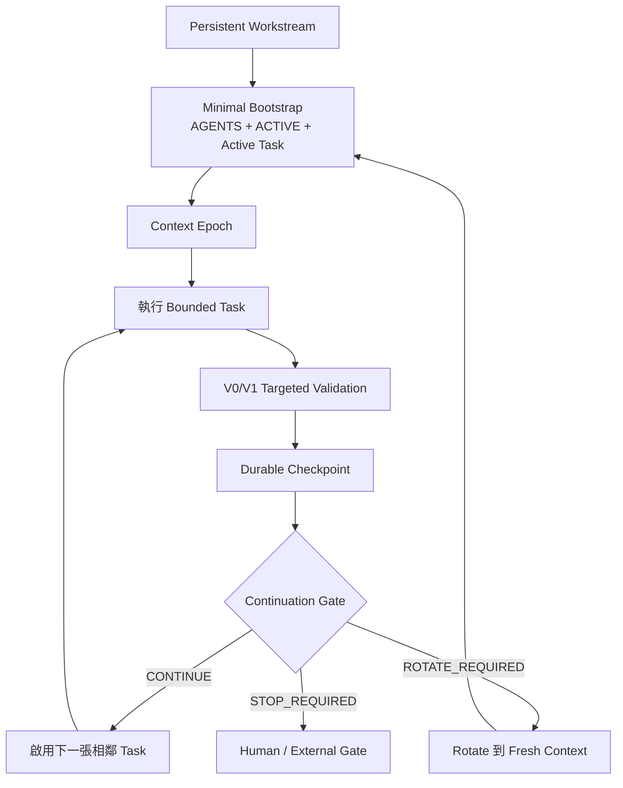

<p align="center">
  
</p>

<h1 align="center">Repository-State Agent Workflow</h1>

<p align="center">
  <strong>長期持續的 Workstream，有界的 Model Context。</strong>
</p>

<p align="center">
  把專案 continuity 留在 Git；高度相關的任務可以共享 Context，過時歷史累積前則明確 Rotate。
</p>

<p align="center">
  <a href="https://github.com/hanklin9188/repository-state-agent-workflow/actions/workflows/ci.yml"></a>
  <a href="LICENSE"></a>
  <a href="pyproject.toml"></a>
  
  
</p>

<p align="center">
  <a href="#60-秒開始使用">60 秒開始</a> ·
  <a href="#rsaw-02-怎麼運作">運作方式</a> ·
  <a href="#什麼時候繼續什麼時候-rotate">Continue / Rotate</a> ·
  <a href="#cli">CLI</a> ·
  <a href="#實測結果">實測結果</a> ·
  <a href="README.md">English</a>
</p>

---

## RSAW 是什麼？

**RSAW** 是一套以 Repository 為中心的 Coding / Research Agent 工作方式。

Repository 保存長期、可版本控制的專案記憶；Model Context 只負責當下工作。

RSAW 0.2 不再要求每完成一張小 Task 就一定開新 Session，也不允許一條 Conversation 無限成長。它新增：

- **Persistent Workstream**：可持續數天或數週的長期主線；
- **Context Epoch**：一個 Context 可完成數個高度相關的 Task；
- **Durable Checkpoint**：每張 Task 仍然先寫回 Repository；
- **Continuation Gate**：明確決定 `CONTINUE`、`ROTATE_REQUIRED` 或 `STOP_REQUIRED`。

```text
長期 Workstream
      ↓
Bounded Task
      ↓
Durable Checkpoint
      ↓
Continuation Gate
 ┌────────────┴────────────┐
CONTINUE              ROTATE / STOP
同一 Context          Fresh Context / Human Gate
```

> **專案 continuity 長期存在；Model Context 隨時可以丟棄。**

---

## 60 秒開始使用

不需要 Daemon、Database、Hosted Service、API Key 或特定模型設定。

### 1. 安裝

```bash
python -m pip install git+https://github.com/hanklin9188/repository-state-agent-workflow.git
```

開發者版本：

```bash
git clone https://github.com/hanklin9188/repository-state-agent-workflow.git
cd repository-state-agent-workflow
python -m pip install -e '.[dev]'
```

### 2. 套用到任何 Repository

```bash
cd /path/to/your-project
rsaw init .
```

Initializer 預設不覆蓋既有檔案；只有明確使用 `--force` 才會替換。

### 3. 驗證目前狀態

```bash
rsaw verify .
rsaw status .
rsaw footprint .
```

### 4. 產生 Agent Prompt

```bash
rsaw prompt .
```

把輸出貼給 Codex、Claude Code、Cursor、aider 或其他 Coding Agent 即可。

**設定到這裡就完成。**

<details>
<summary><strong><code>rsaw init .</code> 會建立什麼？</strong></summary>

```text
AGENTS.md
ACTIVE.md
docs/
├── agents/
│   └── repository-state-workflow.md
├── workstreams/
│   └── W-000-bootstrap.md
├── tasks/
│   └── T-000-bootstrap.md
├── checkpoints/
├── decisions/
└── handoffs/
    └── archive/
```

</details>

第一次套用可直接看 [Getting Started](docs/getting-started.md)。

---

## RSAW 0.2 怎麼運作？

| 層級 | 用途 | 典型生命週期 |
|---|---|---:|
| `AGENTS.md` | 穩定 Policy、安全、Validation、Rotation 規則 | 數月 |
| Workstream Spec | 長期 State Machine 與 Milestone | 數天到數週 |
| `ACTIVE.md` | 極小的當前 Frontier 與 Gate State | 每次 Checkpoint |
| Task Spec | 一個可以驗證的工作單位 | 數小時到數天 |

Agent 在 **Context Epoch** 裡工作：同一個 bounded context 可以完成一張或數張相鄰 Task。



### Workstream

長期 Roadmap，例如一條 Feature Line、Migration、Release Train、Research Program 或 Experiment Series。

### Task

Task 依然 bounded、可驗證。即使同一 Context 繼續，每張 Task 結束時仍必須建立 Durable Checkpoint。

### Context Epoch

只有當下一張 Task 共享以下條件時，才適合保留 Context：

- 相同 Role；
- 相同 Hypothesis / Objective；
- 相同 Subsystem；
- 相同 Evidence Domain；
- 相同 Safety Boundary。

### Continuation Gate

```bash
rsaw next .
```

| Gate 結果 | 意義 |
|---|---|
| `CONTINUE` | 下一張 Task 已準備好，且可留在同一 Context Epoch |
| `ROTATE_REQUIRED` | 先寫回 Repository，再開 Fresh Context |
| `STOP_REQUIRED` | Human Gate、External Job 或其他 Hard Stop |

---

## 什麼時候繼續？什麼時候 Rotate？

### 可以繼續同一 Context

- Role 不變；
- 下一張 Task 已經存在；
- Subsystem 與 Objective 高度相關；
- 不需要 Formal Independence；
- 沒有 Human Gate 或 Long-running-only wait；
- Context 壓力仍在 Budget 內。

例如：

```text
Feature Design
→ Implementation
→ Targeted Integration
→ Smoke Test
```

### 必須 Rotate

- Builder → Reviewer / Runner / Analyst / Decision；
- Preregistration → Formal Execution；
- Formal Execution → Scientific Analysis；
- 一次大型 Debugging Episode 結束；
- Hypothesis 或 Specification 改變；
- Long-running Job 成為唯一 Blocker；
- 需要 `sudo`、Credential、Formal Authorization 或 Destructive Action；
- Context 接近 Repository Budget。

建議預設：

```text
理想 Epoch：20K–40K tokens
建議 Rotate：50K–60K
Routine Hard Ceiling：約 80K
```

這些是 Workflow Guardrail，不是 Model 的通用極限。

詳見 [Context Epochs](docs/context-epochs.md) 與 [Continuation Gate](docs/continuation-gate.md)。

---

## `ACTIVE.md` 長什麼樣子？

```markdown
# Active Handoff

## Workstream
ID: W-042
Spec: docs/workstreams/W-042-checkout.md

## Context Epoch
ID: E-042-build
Role: Builder

## Active Task
ID: T-108
Spec: docs/tasks/T-108-checkout-smoke.md

## Current State
- Checkout API 已完成。
- Focused Tests 通過。

## Next Exact Action
執行 Integration Smoke，並凍結 Execution Commit。

## Continuation Gate
Decision: CONTINUE_ALLOWED
Reason: 下一張 Task 保持相同 Role 與 Checkout Subsystem。

## Next Task
ID: T-109
Spec: docs/tasks/T-109-checkout-readiness.md

## Next Session Role
Builder
```

每個 Checkpoint 執行：

```bash
rsaw verify .
rsaw next .
```

即使 `ACTIVE.md` 誤寫 `CONTINUE_ALLOWED`，只要下一個 Role 變成 Reviewer，CLI 仍會強制 `ROTATE_REQUIRED`。

---

## 兩種模式，共用同一套格式

### Classic Always-Fresh

```text
Decision: ROTATE_REQUIRED
```

維持 RSAW 0.1 的「一張 substantial task 一個 Fresh Context」。

### Persistent Workstream

```text
Decision: CONTINUE_ALLOWED
```

同時指定一張已準備完成的 Next Task；只有安全規則也通過時才會 `CONTINUE`。

舊版 0.1 Repository 仍然可用；Workstream / Epoch 欄位可以逐步 Migration。

---

## 通用 Prompt

初始化完成後，每個 Fresh Context 通常只需要：

```text
Work in this repository.

Resume the active RSAW workstream from repository state.
Read only:
1. AGENTS.md
2. ACTIVE.md
3. the active task referenced by ACTIVE.md

Use progressive disclosure.
At every task checkpoint, persist evidence, update ACTIVE.md, and run `rsaw next .`.
Continue only when the gate returns CONTINUE; otherwise stop or rotate.
Do not reconstruct conversation history.
```

也可以直接：

```bash
rsaw prompt .
```

---

## CLI

| 指令 | 功能 |
|---|---|
| `rsaw init .` | 不覆蓋既有檔案地建立 Plug-and-play Workstream Scaffold |
| `rsaw verify .` | 驗證 ACTIVE、Task、Workstream、Role、Path 與 Gate 一致性 |
| `rsaw status .` | 顯示目前 Workstream、Epoch、Task、Role 與 Human Gate |
| `rsaw next .` | 計算 Continue / Rotate / Stop |
| `rsaw prompt .` | 自動產生 Role-aware Prompt |
| `rsaw prompt . --mode fresh` | 強制產生 Fresh-context Prompt |
| `rsaw prompt . --role reviewer` | 產生 Fresh Reviewer Prompt |
| `rsaw checkpoint .` | Archive 目前 Handoff Checkpoint |
| `rsaw footprint .` | 估算 Bootstrap Context Footprint |
| `rsaw archive . --label ...` | 在重要邊界封存 `ACTIVE.md` |

CLI 是 deterministic guardrail，不是 Autonomous Orchestration Platform。

---

## 必要驗證，不進 Validation Rabbit Hole

| Tier | 時機 | 典型檢查 |
|---|---|---|
| `V0` | Edit Loop | Syntax、Lint、單一精確 Targeted Test |
| `V1` | Task Checkpoint | Focused Task / Integration Suite |
| `V2` | Context Epoch / Phase Closure | 一次 Full Relevant Closure Validation |
| `V3` | Critical Claim、Release、Major Fork | Fresh Independent Review |

> **Validation 是 Gate，不是 Product。**

只有實際威脅當前 Claim 的 observed failure，或明確 Contract，才值得新增 Validation。

詳見 [Validation Tiers](docs/validation-tiers.md)。

---

## Scientific / ML Workflow

Persistent Engineering Context 不會取消 Scientific Independence Boundary。

必須 Rotate：

```text
Preregistration
→ Fresh Formal Runner
→ Fresh Scientific Analyst
→ Fresh Decision / Follow-up Design
```

Long-running Training / Benchmark 應將 Job ID、Revision、Command、Artifact Location 與 Completion Condition 寫進 `ACTIVE.md`，不要讓 Agent Session 留著 Busy-wait。

詳見 [Scientific & ML Workflows](docs/scientific-and-ml-workflows.md)。

---

## 實測結果

### Desk Code Agent — RSAW 0.1 初步結果

| 指標 | 舊 Workflow | RSAW 0.1 | 變化 |
|---|---:|---:|---:|
| Fresh-session Bootstrap Estimate | 33,348 tokens | **2,967 tokens** | **−91.1%** |

> **Claim Boundary：**這是 `BOOTSTRAP_CONTEXT_ESTIMATE`，不是 Provider Billing Savings、Cached-input Savings、完整 Task Token Reduction，也不是品質提升 91.1% 的證據。

RSAW 0.2 研究的下一個問題是：**哪些相鄰 Task 應保留 Context，哪些邊界應該 Rotate？** 目前尚未宣稱 0.2 已有實測 Token Saving。

---

## 文件

| 快速理解 | 實際運作 | 評估與導入 |
|---|---|---|
| [Getting Started](docs/getting-started.md) | [Context Epochs](docs/context-epochs.md) | [Evaluation](docs/evaluation.md) |
| [Concepts](docs/concepts.md) | [Continuation Gate](docs/continuation-gate.md) | [Research Methodology](docs/research-methodology.md) |
| [Architecture](docs/architecture.md) | [Session Lifecycle](docs/session-lifecycle.md) | [Case Studies](docs/case-studies/README.md) |
| [Adoption Guide](docs/adoption-guide.md) | [Validation Tiers](docs/validation-tiers.md) | [Company Adoption](docs/company-adoption.md) |
| [0.1 → 0.2 Migration](docs/migration-v1-to-v2.md) | [Scientific Workflows](docs/scientific-and-ml-workflows.md) | [Token Economics](docs/token-economics.md) |
| [Anti-Patterns](docs/anti-patterns.md) | [Long-Running Work](docs/long-running-work.md) | [FAQ](docs/faq.md) |

---

## 狀態與 Non-goals

**狀態：** Alpha Reference Implementation，版本 0.2.0。

RSAW 不是：

- Autonomous Project Manager；
- Hosted Memory Service；
- Git、CI、Code Review、Issues、Linear 或 Jira 的替代品；
- 所有 Task 都應該留在同一 Context 的主張；
- 降低測試或 Human Review 的理由；
- 尚未重複驗證就宣稱 Universal Token Saving 的工具。

核心保持透明：Markdown、Git、小型 Deterministic Checks 與 Project-owned Evidence。

---

## Contributing、Citation、License

特別歡迎 Always-persistent、Always-fresh 與 Adaptive Context Epoch 的 matched evaluation。

詳見 [CONTRIBUTING.md](CONTRIBUTING.md)、[CITATION.cff](CITATION.cff) 與 [LICENSE](LICENSE)。
