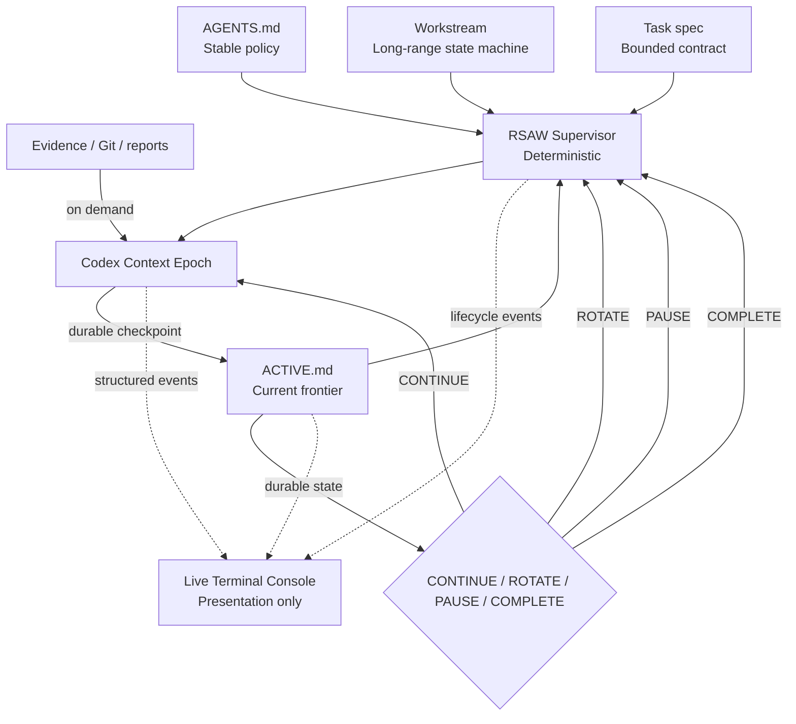

# Architecture

RSAW separates durable authority, deterministic supervision, replaceable model
workers, and operator-facing observability.

## Layers

### Repository authority

Markdown, schemas, tests, accepted decisions, Git, and evidence remain canonical.

### RSAW Core

Parses and verifies repository state, calculates context footprint, renders manual
prompts, and derives runtime actions.

### Runtime Supervisor

Owns the long-lived process, enforces limits, launches or resumes agent threads,
checks state advancement, records usage, and handles pause/complete semantics. It
contains no project reasoning.

### Agent adapter

The first adapter maps fresh and continued epochs to Codex CLI `exec` and `resume`,
parses JSONL events, and forwards optional presentation events. Adapters cannot
change repository authority.

### Presentation model

A thread-safe `DashboardModel` projects repository state, Supervisor events, and
Codex events into an immutable snapshot. It can observe lifecycle decisions but can
never make them.

### Terminal renderer

A Rich Live renderer selects compact or expanded layouts from the current terminal
size, renders in place, and applies restrained visual interpolation. Interactive
gates temporarily suspend rendering so the existing exact input path remains
authoritative.

## Failure boundaries

- Invalid repository state: Supervisor refuses to launch.
- Agent failure: terminal, no automatic retry.
- No state advancement: terminal failure.
- Human gate: PAUSE, not ROTATE.
- Context pressure: ROTATE, not PAUSE.
- Workstream completion: explicit COMPLETE only.
- TUI failure: ignored at the observability boundary; lifecycle continues.

## Data separation

Runtime telemetry is stored under `.rsaw/runtime` and ignored by default. Measured
provider usage is not mixed with `chars/4` repository-context estimates.

Dashboard strings remain local. They are not inserted into model prompts and do not
create additional model turns.
