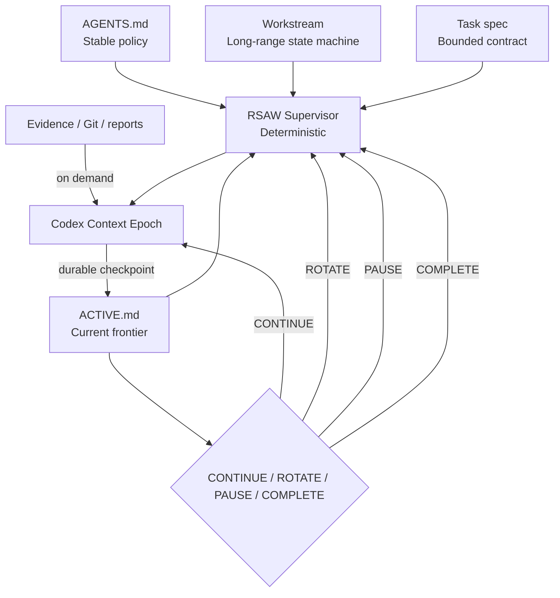

# Architecture

RSAW separates durable authority, deterministic supervision, and replaceable
model workers.

## Layers

### Repository authority

Markdown, schemas, tests, accepted decisions, Git, and evidence remain canonical.

### RSAW Core

Parses and verifies repository state, calculates context footprint, renders
manual prompts, and derives runtime actions.

### Runtime Supervisor

Owns the long-lived process, enforces limits, launches/resumes agent threads,
checks state advancement, records usage, and handles pause/complete semantics.
It contains no project reasoning.

### Agent adapter

The first adapter maps fresh/continued epochs to Codex CLI `exec` and `resume`
and parses JSONL events. Adapters cannot change repository authority.

## Failure boundaries

- Invalid repository state: supervisor refuses to launch.
- Agent failure: terminal, no automatic retry.
- No state advancement: terminal failure.
- Human gate: PAUSE, not ROTATE.
- Context pressure: ROTATE, not PAUSE.
- Workstream completion: explicit COMPLETE only.

## Data separation

Runtime telemetry is stored under `.rsaw/runtime` and ignored by default.
Measured provider usage is not mixed with `chars/4` repository-context estimates.
