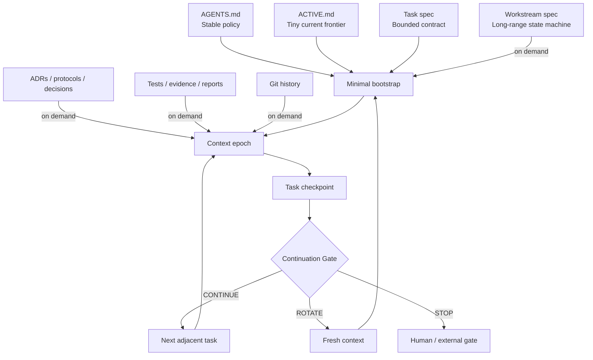

# Architecture

RSAW separates long-lived project state from bounded model context.



## Information classes

| Class | Canonical location | Fresh preload | Update frequency |
|---|---|---:|---:|
| Stable policy | `AGENTS.md` | Yes | Low |
| Current frontier | `ACTIVE.md` | Yes | Every checkpoint |
| Active task | `docs/tasks/` | Yes | Per task |
| Workstream roadmap | `docs/workstreams/` | On demand | Per milestone |
| Decisions / protocols | Project-defined | On demand | Major forks |
| Evidence / reports | Project-defined | On demand | Per validation/run |
| Historical handoffs | `docs/handoffs/archive/` | No | Occasionally |
| Raw artifacts | Project-defined | Never by default | Per run |

## Authority

A typical authority chain is:

```text
accepted contract / registered protocol / ADR
→ executable schema and tests
→ active task
→ ACTIVE.md
→ conversation history
```

## Design boundary

RSAW is deliberately not an orchestration engine. It creates an inspectable state contract and deterministic checks. Humans or external tools may start fresh contexts, schedule agents, or integrate task trackers without transferring authority away from the repository.
