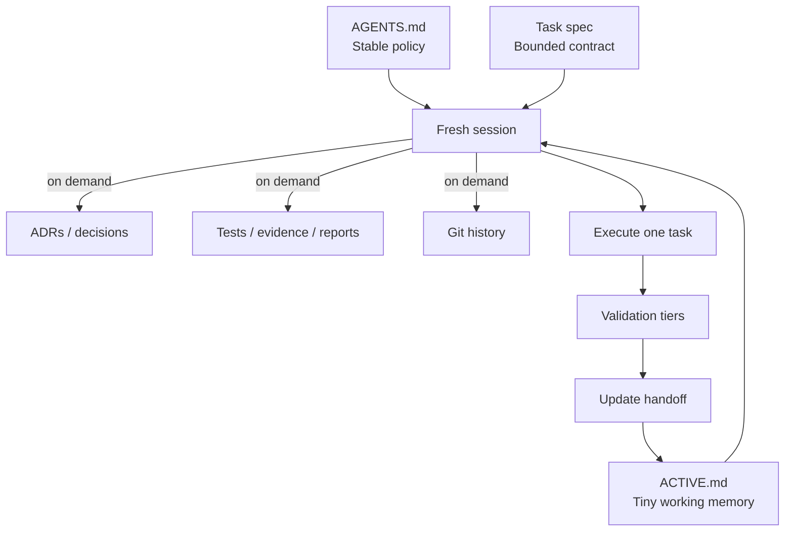

# Architecture



## Information classes

| Class | Canonical location | Update frequency | Fresh preload |
|---|---|---:|---:|
| Stable policy | `AGENTS.md` | Low | Yes |
| Current state | `ACTIVE.md` | Every meaningful boundary | Yes |
| Current task | `docs/tasks/` | Per task | Yes |
| Decisions | `docs/decisions/` | At major forks | On demand |
| Evidence/reports | project-defined | Per validation/experiment | On demand |
| Historical handoffs | `docs/handoffs/archive/` | Occasionally | No |
| Raw artifacts | project-defined | Per run | Never by default |

## Authority

A typical authority chain is:

```text
accepted contract / ADR
→ executable schema and tests
→ active task spec
→ ACTIVE.md
→ conversation history
```

Projects should adapt this hierarchy to their domain while avoiding duplicate sources of truth.
