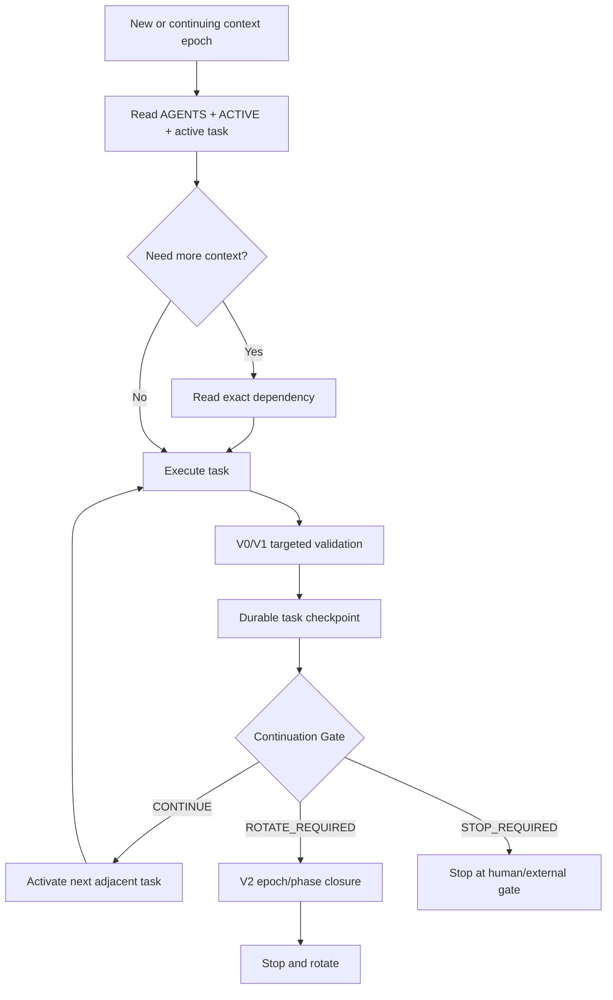

# Session Lifecycle

RSAW 0.2 separates task checkpoints from context rotation.

## Checkpoint after every task

Even when the context continues:

- accepted evidence is persisted;
- the current task is closed or updated;
- the next task is activated;
- `ACTIVE.md` is updated;
- `rsaw verify .` and `rsaw next .` run.

## Continue when

The next task shares the role, objective, subsystem, and evidence domain, and no independent review or human gate is required.

## Rotate when

- role changes;
- scientific phase changes;
- major debugging residue exists;
- the specification changed;
- long-running work is the only blocker;
- context pressure is high;
- a human gate is reached.

The boundary is both a quality mechanism and a context-cost mechanism.
