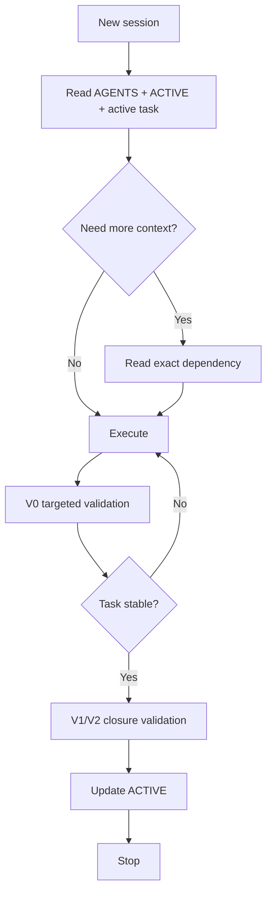

# Session Lifecycle

## Recommended session boundaries

Start a fresh session after:

- task completion;
- closure verification;
- a large debugging episode;
- builder-to-reviewer transition;
- a major design decision;
- long-running work handoff;
- a significant change in the governing hypothesis or specification.

The boundary is a quality mechanism, not merely a token-saving trick. It removes obsolete context and forces explicit handoff state.
